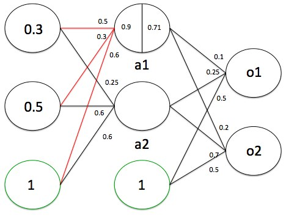

Back-Propagation [[Back](note_DeepLearning.md#Back-Propagation)]
---

當訓練資料又很難定義其特徵的時候, 就可以試著使用 Neural Networks.
因為 NN 的 Hidden Layer 代表著一層又一層的特徵抽取過程, 當 Hidden Layer 很多且設計的還不錯的時候,
就有可能對 raw data 萃取出, 更有物理意義的特徵來做學習.

神經元(Neuron)的基本構造如下:  
 
Fig. One_Neuron_Arch

從 `Fig. One_Neuron_Arch` 中, 可以推導

$$
Z = w_1 × x_1 + w_2 × x_2 + ... + w_n × x_n + bias
$$

再透過 activation function, 做非線性轉換得到輸出結果 $O$
> 當使用 sigmoid 當作一個神經元的 activation function 時, 神經元就會變成一個 logistic 分類器(NN 就會變成多個 logistic 分類器的組合).
而組合多個神經元, 可以達到 **特徵轉換(高階多項式, e.g. 2, 3, ... n 次方)** 的效果
>> **特徵轉換** 會遇到一些問題
>> + 要選用什麼樣的特徵轉換, 要多複雜
>> + 特徵數量爆炸, 轉換過後的特徵可能會變得非常複雜且難以理解, 尤其是運算量會暴增

sigmoid function 公式如下:

$
\begin{array}{l}
sigmoid = 1 / (1 + exp^{-Z})
\end{array}
$

當神經元可以看成一個 logistic 分類器時, N 個神經元就會有 N 個分類器, 每個分類器都各自有一組對應資料的權重,
如下圖神經元 a1 持有著 w1, w2, w3 個權重, 來對應著他的 input, 並期望 ($O_1$, $O_2$) = (0, 1)

 
Fig. Backpropagation_Example

如此就可以藉由 `Backpropagation` 及 `梯度下降法` 來逼近最佳的權重值 $w_i$

# Backpropagation 的基本流程

+ 初始化神經網路所有權重
+ 將資料由 input layer 往 output layer 向前傳遞運算(forward), 計算出所有神經元的 output
+ 計算誤差由 output layer 往 input layer 向後傳遞運算(backward), 算出每個神經元對誤差的影響
+ 用誤差影響去更新權重
+ 重複`向前傳遞 -> 向後傳遞 -> 更新權重` 直到誤差收斂到夠小

## 初始化神經網路所有權重

先將所有神經元做**隨機初始化**
> 需注意的是 bias 的權重, 在初始的時候, 會被同一層的神經元共享

## 向前傳遞運算

$a1$ 神經元

$
\begin{array}{l}
Z &= w_1 × x_1 + w_2 × x_2 + w_3 × bias\\
  &= 0.5 × 0.3 + 0.3 × 0.5 + 0.6 × 1\\
  &= 0.9\\

O &= 1 / (1 + exp^{-0.9})\\
  &= 0.71
\end{array}
$

+ $a2$ 神經元

    $
    \begin{array}{l}
    Z &= w_4 × x_1 + w_5 × x_2 + w_6 × bias\\
      &= 0.25 × 0.3 + 0.6 × 0.5 + 0.6 × 1\\
      &= 0.975\\

    O &= 1 / (1 + exp^{-0.975})\\
      &= 0.726
    \end{array}
    $

+ $O1$ 神經元

    $
    \begin{array}{l}
    Z &= w_7 × a1_{out} + w_8 × a2_{out} + w_9 × bias\\
      &= 0.1 × 0.71 + 0.25 × 0.726 + 0.5 × 1\\
      &= 0.7525\\

    O &= 1 / (1 + exp^{-0.7525})\\
      &= 0.679
    \end{array}
    $

+ 所有神經元的值

## 向後傳遞運算

計算真實 output 跟期望 output 的誤差 $\delta$, 以及每個神經元對於誤差的影響.

### 各層誤差影響的演算法

經數學推導, 若神經元並非屬於 output layer, 其造成的誤差影響, 可以由後面一層的誤差計算出.
若神經元屬於 output layer, 其誤差影響, 正好可以直接看成真實 output 跟期望 output 的差

+ Input Layer
    > 不持有權重, 不需要計算

+ Output Layer

    $
    \begin{array}{l}
    \delta_L = (Real_{output} − Expect_{output}) × g'(Z)
    \end{array}
    $

+ Hidden Layer
    > 用後面一層的誤差跟 activation function 的微分算出

    $
    \begin{array}{l}
    \delta_L = (W_{L+1} × \delta_{L+1}) × g'(Z)\\
    \text L: Current\ Layer\ Index\\
    \text W: 後一層被連接的權重總和\\
    \delta : 後一層誤差總和\\
    g'(Z) : sigmoid\ 的微分\\
    g'(Z) = O × (1 - O)
    \end{array}
    $

$O1$ 神經元, 期望輸出是 0, 但實際輸出是 0.679

$
\begin{array}{l}
\delta_{O1} &= (Real_{output} − Expect_{output}) × g'(Z) \\
         &= (Real_{output} − Expect_{output}) × O_1 × (1 - O_1) \\
         &= (0.679 - 0) × 0.679 × (1 - 0.679) \\
         &= 0.1479
\end{array}
$

$O2$ 神經元, 期望輸出是 1, 但實際輸出是 0.759

$
\begin{array}{l}
\delta_{O2} &= (Real_{output} − Expect_{output}) × g'(Z) \\
         &= (Real_{output} − Expect_{output}) × O_2 × (1 - O_2) \\
         &= (0.759 - 1) × 0.759 × (1 - 0.759) \\
         &= -0.044
\end{array}
$

有 $\delta_{O1}$ 及 $\delta_{O2}$ , 就可以回推 $\delta_{a1}$ 及 $\delta_{a2}$

## 更新權重

# Reference

+ [類神經網路跟Backpropagation一點筆記](http://terrence.logdown.com/posts/1132631-neural-networks-with-backpropagation-one-notes)
+ [A Step by Step Backpropagation Example](https://mattmazur.com/2015/03/17/a-step-by-step-backpropagation-example/)
+ [李宏毅 ML Lecture 7: Backpropagation](https://hackmd.io/@shaoeChen/B1CoXxvmm/https%3A%2F%2Fhackmd.io%2Fs%2Fr1cqatmI7#%E6%9D%8E%E5%AE%8F%E6%AF%85_ML_Lecture_7)

