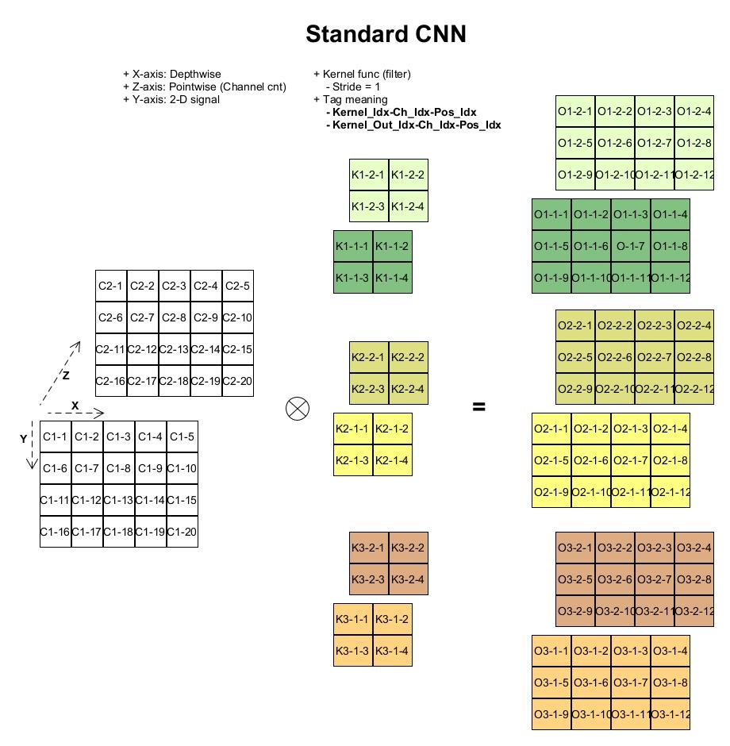
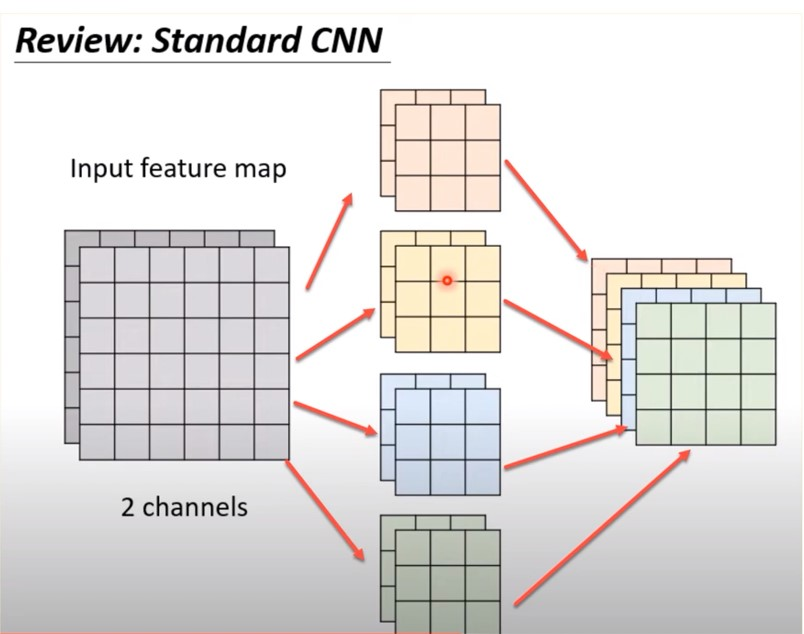
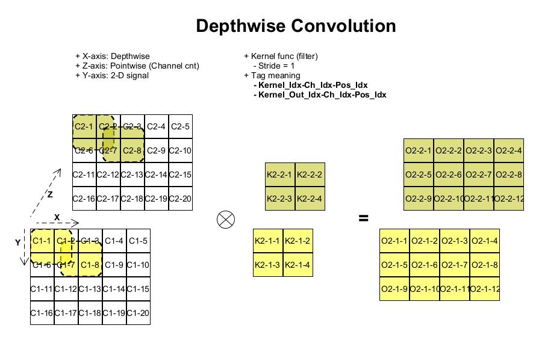
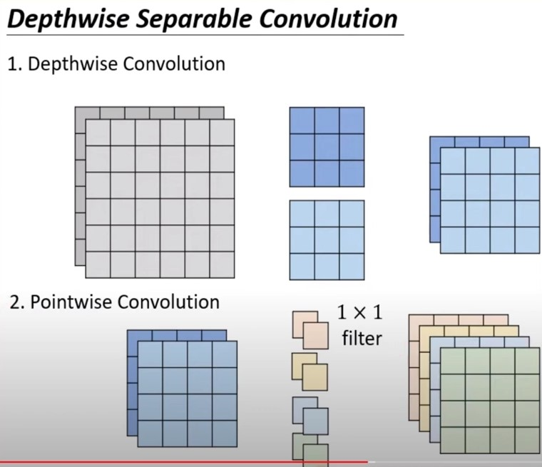

DS-CNN (Depthwise Separable CNN)
---

## Definitions

+ **Kernel Convolution (kernel function)** v.s. **filter weighting**
    > `Kernel Convolution` 由 Width/Hight 來指定, 是二維的觀念.
    而 `filter` 是由 Width/Hight 及 Depth (RGB channels) 來指定, 是三維的觀念
    >> 因此 filter 可以看做是 Kernel Convolution 的集合 (在 spatial domain 上, 同時對 RGB channels 處理)


## Standard CNN

標準的 CNN 是單一 sample 的所有 channels, 都一併做 convolution, 當**需要輸出 N 個維度, 就使用 N 個 filters**
> 下圖為 N = 3, channel = 2 (方便示意)



由上圖, 其參數的數量為 `2*2*2*3 = 24` (kernel_x * kernel_y * channels * N 維度)

+ Example
    > 常見的 Kernel Convolution 為 `3*3`

    

    ```
    上圖參數量 = 3*3 * 2 * 4 = 72 (所有 Kernel Convolution 的參數)
    運算量     = (3*3 + (3*3 - 1) + 1) * 2 * 4*4 * 4 = 2304
    ```

    - [計算公式](note_ML.md#Performance)

## Depthwise Convolution



對 Input 的每一個 Channel, 都建立一個 `K_w * K_h` 的 Kernel Convolution
> 每個 Channel 各自獨立做 Kernel Convolution (沿上圖 **X-axis 移動**)

## Pointwise Convolution

Pointwise Convolution 的運算與 Standard CNN 運算非常相似,
不同之處在於 Kernel Convolution 的大小為 `1*1*n` (n 為上一層的 N-Dimension)

## Depthwise-Separable Convolution

使用 `Depthwise + Pointwise` Convolution
> 先用 Depthwise 降低維度, 再用 Pointwise 提升到預期輸出的維度
>> `1*1*n` 這類的 kernel-Convolution, 主要是用來**升維度或降維度**

DS-CNN 可以減少 weighting 參數的數量(會導致準確率降低), 及計算的次數(乘法及加法).
> 在沒有 GPU (CUDA, Compute Unified Device Architecture) 的環境下, 可提升效率(預測速度加快).

但也因為 DS-CNN 做了分離的操作(一層分離成兩層), 這對 GPU 會產生 I/O Bound, 反而不利 GPU 的連續計算


+ Example

    

    ```
    上圖參數量 = 3*3 * 2 + 1*1 * 2 * 4 = 18 + 8 = 26 (所有 Kernel Convolution 的參數)
    運算量     = (3*3 + 3*3) * 2 * 4*4 * 2 + (1*1 + 1*1) * 2 * 4*4 * 4 = 1152 + 256 = 1408
    ```

# Reference

+ [摺積神經網路中的Separable Convolution](https://yinguobing.com/separable-convolution/)
+ [PyTorch中的逐深度可分離摺積-Depthwise Separable Convolutions](https://zhuanlan.zhihu.com/p/523641344)
+ [深度可分卷積（MobileNet中的depthwise separable convolutions）](https://www.twblogs.net/a/5ef157de33e47b02063c7f42)
+ [CNN 模型所需的計算力flops是什麼？怎麼計算？](https://zhuanlan.zhihu.com/p/137719986)
+ [逐深度可分离卷积 depthwise separable convolutions (Youtube)](https://www.youtube.com/watch?v=jNBfu_WmC6w&ab_channel=XianchaoWu)
