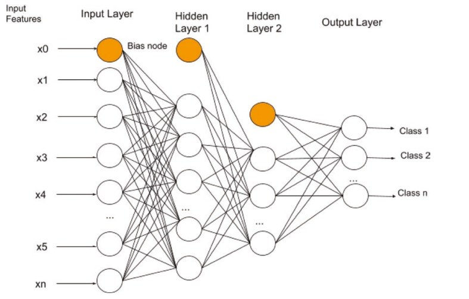

Deep Learning
----

Deep Learning 是機器學習的一種類別, 也是多層 Neural-Networks 或多層感知器的另一種稱呼.
> Deep 指的是多層 Neural

根據神經網路的根基以及運作準則, 可分為
> + 前饋神經網路(feed-forward neural)
> + 卷積網路(Convolutional Neural Networks, CNN)
>> 常用於影像處裡, 也就是 Filter
> + 遞歸神經網路(Recurrent Neural Networks, RNN)
>> 主要用於文字語意處理, 可以用來判斷前後文, 而使機器能理解一句話的意思
> + 自動編碼器(autoencoders)

一個多層感知器至少包含三種不同的layers
> + 輸入層(input layer)
> + 隱藏層(hidden layer)
> + 輸出層(output layer)

 
Fig. NerualNet_Base_Arch

+ 輸入層(input layer)
    > 在神經網路的第一層被稱作輸入層,  這層取得在外部的資源, 像是由感測機器傳來的圖片
    >> 在輸入層的節點不會做任何的運算, 只是單純傳送輸入至下一層

    - 輸入層 Neurons 的數量和傳入特徵值的數量相同
        > 假如輸入 `28*28` 的圖片, `Neurons 數量 = 28 * 28 = 784`

    - 有時會額外增加一個偏差節點(bias node)
        > 這個 bias node 是用來控制這一層的輸出, 在深度學習中 bias node 不一定會需要

+ 隱藏層(hidden layer)
    > 可以有多個隱藏層, 每層可以包含一個或多個 Neuron. 而上一層 Neurons 的輸出, 會是下一層 Neurons 的輸入
    >> `Fig. NerualNet_Base_Arch` 中, hidden layer 代表**上一層的特徵乘上權重後的結果**

     
    Fig. One_Neuron_Arch

    - 當隱藏層數越多, 計算的複雜度與計算時間也會隨之增加

    - 無法真正確定需要多少隱藏層, 也沒有相應的實際策略存在, 只能靠經驗
        > 通常會使用上一層 2/3 neuron 的總數 (約 66%)
        >> e.g. 1-st layer = 100, 2-nd layer = 66, 3-th layer = 43

+ 輸出層(output layer)
    > 輸出層的 Neurons 數量, 由使用者想要做多少類別的分類器來決定
    >> e.g. 分類 `0 ~ 9` 的數字, 輸入層就需要 10 個 Neurons

+ 權重Weight
    > 權重(weight)也被稱作係數或者輸入係數, Neuron 的每個輸入特徵都會乘上 weight, 然後輸出到下一層 Neuron.
    從輸入到 Neuron 的每個連接, 都有權重線(weighted line)所連接.
    >> 權重線代表著模型預測輸出特徵值的貢獻度

    > + 當 weight 越高, 他對特徵值的貢獻越大
    > + 當 weight 是負值, 那特徵就有負面的影響
    > + 當 weight 是 0, 那麼代表這個輸入特徵不重要且可以從訓練集中移除

    - **訓練神經網路的目標, 是為了能計算出, 每個輸入特徵(每個連結線)的最優化權重值**
        > 藉由 Back-Propagation(反向傳播演算法)及梯度下降法, 去逼近最優化的權重值. 通常會經過幾個步驟
        > + 前向傳播
        > + 反向傳播
        > + 權重更新

+ 簡易描述 NN 規模

    - `<input nodes>-<hidden 1 nodes>-<hidden 2-nodes>-...-<output nodes>` NN
        > + `2-2-2 NN` 代表 input/hidden/output 都各有 2 nodes, hidden 只有 1 層
        > + `2-5-5-2 NN` 代表 input/output 各有兩個 nodes, hidden 有 2 層都各自有 5 個 nodes

# Activation Function (啟動函數, 激勵函數)

在神經網路中, 每一層輸出都是上層輸入的線性函數, 無論神經網路有多少層, 輸出都是輸入的線性組合
當使用 Activation Function 時, 給神經元引入了非線性因素, 使得神經網路**可以任意逼近任何非線性函數**,
這樣神經網路就可以應用到眾多的非線性模型中

常見的啟動函數
+ `sigmoid()`
    > 也叫 Logistic 函數, 取值範圍為(0, 1), 在特徵相差比較複雜, 或是相差不是特別大時, 效果比較好
    >> 啟動函數計算量大, 反向傳播求誤差梯度時, 很容易就會出現梯度消失的情況(求導數涉及除法), 從而無法完成深層網路的訓練

求導涉及除法

+ `Tanh()`
    > 也稱為雙切正切函數, 取值範圍為 [-1,1], 在特徵相差明顯時, 效果會很好, 在循環過程中會不斷擴大特徵效果
    >> `tanh` 平均值是 0, 因此實際應用中 tanh 會比 sigmoid 更好

+ `ReLU()`
    > ReLU (Rectified Linear Unit) 得到的 SGD 的收斂速度, 會比 sigmoid/tanh 快很多
    >> 訓練的時候很**脆弱**, 當遇到一個非常大的梯度時, 更新過參數之後, 這個神經元很容易就再也不會對任何資料有啟動現象

+ `softmax()`
    > 用於多分類神經網路輸出
    >> clases 之間是互斥的, 即一個輸入只能被歸為一類, e.g. Apple 只能是`水果` 或是`科技公司`擇一

## Fully-Connected Layer(全連接層)

FC Layer 原則上就是最後的分類器, 將上一層所擷取出來的所有特徵,
經過權重的計算後, 來辨識出這個所輸入的圖像到底屬於哪一個分類

## [Back-Propagation(反向傳播演算法)](note_BackPropagation.md)

## [RNN(循環神經網路)](note_rnn.md)

# Reference

+ [常用啟動函數比較](https://www.cnblogs.com/codehome/p/9729349.html)

