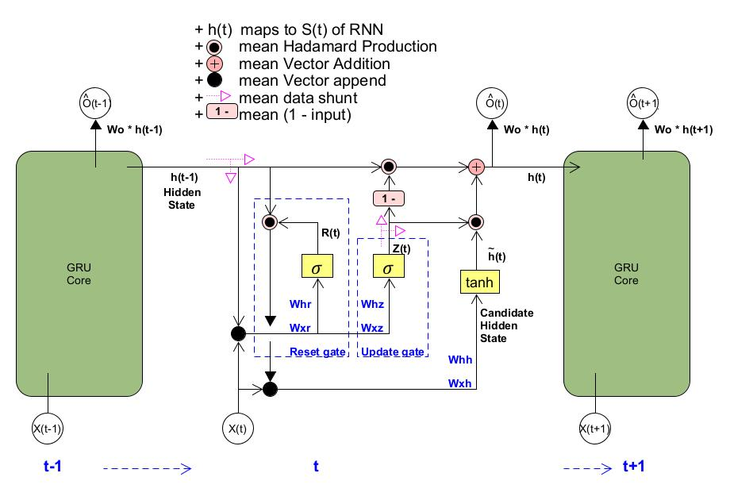
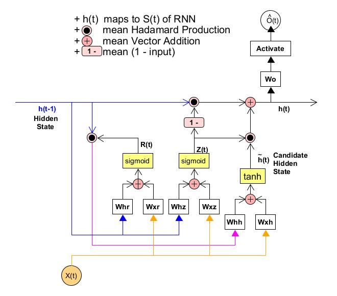
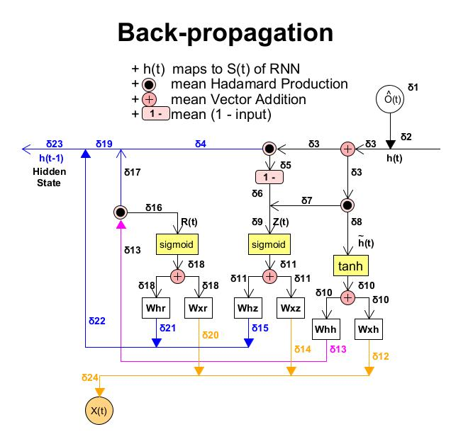

GRU (Gated Recurrent Unit, 門控循環單元) [[Back](note_RNN.md#GRU)]
---

GRU(Gate Recurrent Unit)是 RNN 的一種變體, 和 LSTM 一樣, 也是為瞭解決**長期記憶**和**反向傳播中的梯度**等問題而提出來的.
GRU 和 LSTM 在很多情況下, 實際表現上沒有太大差別, 但 GRU 更容易進行訓練, 能夠很大程度上提高訓練效率, 因此很多時候會更傾向於使用 GRU
> LSTM中含有 3-Gates 結構和 Cell State, 而 GRU 只有 2-Gates
>> GRU 把 LSTM 中的 forget gate 和 input gate 用 update gate 來替代, 並把 Cell state $C(t))$ 和 $h(t)$進行合併

 
Fig. GRU_Core_Arch
> + 黃色  ：表示一個 `全連接` 的 Neural Network Layer (並非啟動函數, 只是剛好使用相同的數學式)
>> $\sigma$ 為 sigmoid function, 用來將 input 轉換為 `0 ~ 1` 之間的數值, 進而描述有多少量的 input 可以通過
> + 粉色  ：表示按位操作或逐點操作(pointwise operation),
>> e.g. 向量相加 (Vector Addition), 向量乘積 (Hadamard production), ...etc.
> + 粗黑點：表示兩個訊號的連接(向量拼接)
>> $[h(t-1), X(t)]$ 表示將向量 $h(t-1)$ 和 $X(t)$ 拼接起來
> + $W_{hr}$: Hidden state 到 reset_gate 的輸入權重
> + $W_{xr}$: input data 到 reset_gate 的輸入權重
> + $W_{hz}$: Hidden state 到 update_gate 的輸入權重
> + $W_{xz}$: input data 到 update_gate 的輸入權重
> + $W_{hh}$: Hidden state 到 Candidate Hidden state 的輸入權重
> + $W_{xh}$: input data 到 Candidate Hidden state 的輸入權重
> + $W_o$: Hidden state 到 Output layer 的輸入權重

## reset gate (重設門)

reset gate $R(t)$ 允許我們控制, 長期記憶中, `可能還想記住`的資訊
> $R(t)$ 的值越小, 說明長期記憶忽略得越多

$R(t) = \sigma \left(W_{xr}X(t) + W_{hr}h(t-1) +  Bais\right)$

## update gate (更新門)

update gate $Z(t)$ 將允許我們控制, 長期記憶中有多少資訊需要被更新
> $Z(t)$ 的值越大, 說明前一時刻的 $h(t-1)$ 對 $h(t)$ 的影響越大

$Z(t) = \sigma \left(W_{xz}X(t) + W_{hz}h(t-1) +  Bais\right)$

## Candidate Hidden state
$\hat{h}(t) = tanh \left(W_{xh}X(t) + R(t) \cdot h(t-1) +  Bais\right)$

## Output

$h(t) = (1-Z(t)) \cdot h(t-1) + Z(t) \cdot \hat{h}(t) +  Bais$

$h(t) = (1-Z(t)) \cdot h(t-1) + Z(t) \cdot tanh \left(W_{xh}X(t) + R(t) \cdot h(t-1) \right) +  Bais$

$\hat{O}(t) = W_o h(t) +  Bais$

# BPTT of GRU

## GRU_Forward

  
Fig. GRU_Forward

## GRU_Backward

  
Fig. GRU_Backward

$\delta3 = \delta 1 + \delta 2$

$\delta4 = (1- Z(t)) + \delta3$

$\delta5 = \delta3 \cdot h(t-1)$

$\delta6 = 1 - \delta5$

$\delta7 = \delta3 \cdot \hat{h}(t)$

$\delta8 = \delta3 \cdot Z(t)$

$\delta9 = \delta7 + \delta8$

$\delta10 = \delta8 \cdot tanh^{'}(\hat{h}(t))$

$\delta11 = \delta9 \cdot sigmoid^{'}(Z(t))$

$\delta12 = \delta10 \otimes W_{xh}^{T}$

$\delta13 = \delta10 \otimes W_{hh}^{T}$

$\delta14 = \delta11 \otimes W_{xz}^{T}$

$\delta15 = \delta11 \otimes W_{hz}^{T}$

$\delta16 = \delta13 \cdot h(t-1)$

$\delta17 = \delta13 \cdot R(t)$

$\delta18 = \delta17 \cdot sigmoid^{'}(R(t))$

$\delta19 = \delta17 + \delta4$

$\delta20 = \delta18 \otimes W_{xr}^{T}$

$\delta21 = \delta18 \otimes W_{hr}^{T}$

$\delta22 = \delta21 + \delta15$

$\delta23 =\delta19 + \delta22 = \delta17 + \delta4 + \delta21 + \delta15$

$\delta24 = \delta12 + \delta14 + \delta20$

+ Weights of reset_gate

    $\delta W_{xr} = X^{T}(t) \cdot \delta18$

    $\delta W_{hr} = h^{T}(t-1) \cdot \delta18$

+ Weights of update_gate

    $\delta W_{xz} = X^{T}(t) \cdot \delta11$

    $\delta W_{hz} = h^{T}(t-1) \cdot \delta11$

+ Weights of Candidate Hidden state

    $\delta W_{xh} = X^{T}(t) \cdot \delta10$

    $\delta W_{hh} = h^{T}(t-1) \cdot \delta10$

# Referenct

+ [門控循環單元(GRU)](https://blog.csdn.net/weixin_55073640/article/details/128617170)
+ [9.1. 門控循環單元(GRU)](https://d2l-zh.djl.ai/chapter_recurrent-modern/gru.html)
+ [GRU units](https://cran.r-project.org/web/packages/rnn/vignettes/GRU_units.html)
+ [tt-s-t/Deep-Learning](https://github.com/tt-s-t/Deep-Learning/tree/main)

