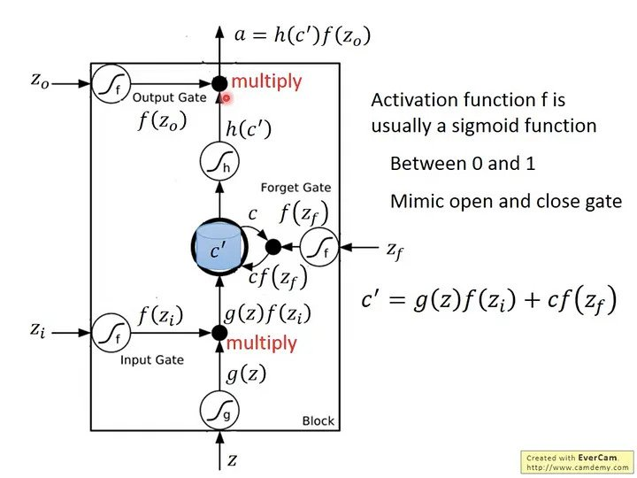

LSTM (Long Short-Term Memory networks) [[Back](note_RNN.md#LSTM)]
---

## LSTM Math

LSTM(長短期記憶網路)是基於 RNN 的一種時間循環神經網路, LSTM 有很多個版本, 其中一個重要的版本是 `GRU(Gated Recurrent Unit, 門控循環單元)`

 
Fig. LSTM 數學式

> + $z_i$ : 控制 input gate 的 signal
> + $z_o$ : 控制 output gate 的 signal
> + $z_f$ : 控制 forget gate 的 signal
> + $z$ : 要被存進 cell 的 input value
> + $a$ : output
> + $h()$ : hidden state (隱藏狀態)

$z$ 通過一個 activation function 得到 $g(z)$
> + $z_i$ 通過一個 activation function 得到 f($z_i$),
> + $z_o$ 通過一個 activation function 得到 f($z_o$)
> + $z_f$ 通過一個 activation function 得到 f($z_f$)

> $f()$ 通常用 sigmoid function, 因為 sigmoid function 值介在 0 ~ 1 之間, 代表 gate 被打開的程度,
>> 如果 f()$ 的 output 是 1 代表 gate 打開, 反之 output 是 0 代表 gate 被關閉

$c'$ 為新的存在 memory 裡面的值
> $c'$ = f($z_i$) * g(z) + c*f($z_f$)
>> 由上式可知, f($z_i$) 控制 input g(z) 是否可以進來,
>> + 當 f($z_i$) = 0 時，前面那一項就是 0
>> + 若 f($z_f$) = 1 時, 代表之前的 c 會被記得, 跟這回合的 input 值相加
>> + 若 f($z_f$) = 0 時, 代表之前的 c 會被遺忘, 後面那一項會是 0

所以 forget gate 的特性跟字面上的直覺剛好相反
> + 當 forget gate 打開時 f($z_f$) = 1, 之前的值會 **記得**
> + 當 forget gate 關閉時 f($z_f$) = 0, 之前的值會 **遺忘**

# Reference

+ [動手學深度學習](https://zh.d2l.ai/index.html)
+ [C語言實現LSTM演算法](https://zhuanlan.zhihu.com/p/262132576)
+ [長短期記憶網路(LSTM)](https://zh.d2l.ai/chapter_recurrent-modern/lstm.html)
+ [Github-C-LSTM](https://github.com/az13js-org/C-LSTM)
+ [Understanding LSTM Networks](http://colah.github.io/posts/2015-08-Understanding-LSTMs/)
+ [Day 15：『長短期記憶網路』(Long Short Term Memory Network, LSTM)](https://ithelp.ithome.com.tw/articles/10193678)

+ [CS224d筆記4續——RNN隱藏層計算之GRU和LSTM](https://wugh.github.io/posts/2016/03/cs224d-notes4-recurrent-neural-networks-continue/)
+ [*Evolution: from vanilla RNN to GRU & LSTMs](https://docs.google.com/presentation/d/1UHXrKL1oTdgMLoAHHPfMM_srDO0BCyJXPmhe4DNh_G8/pub?start=false&loop=false&delayms=3000&slide=id.g24de73a70b_0_0)