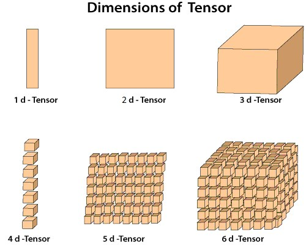
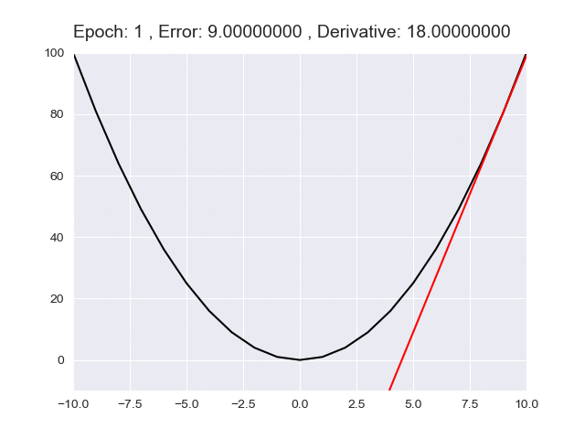
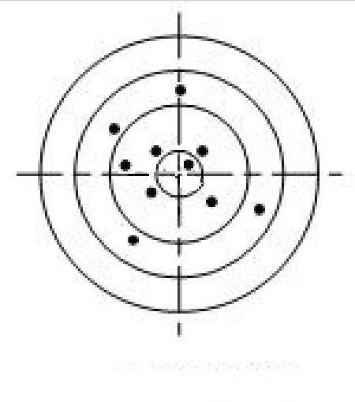
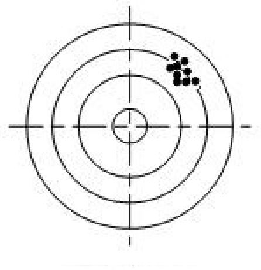
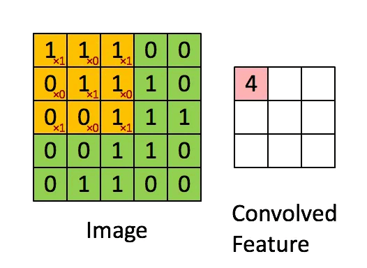

Machine Learning (ML)
---

# Inference (推論) v.s. Training

+ Training
    > 深度學習一開始並不知到要用什麼 kernel-Convolution (Weighting is unknown), 經由 `training` 反推出 Weighting values

+ Inference
    > 使用訓練過的 kernel-Convolution (已知的 Weighting values), `infer` 出資料走向, 並判定結果

# Tensor (張量)

Tensor 在物理上是指 Vector-Space 及其 Dual-Space (對偶空間) 上的多重線性對應(線性轉換), 目的是能夠創造更高維度的矩陣, 向量
> 在不同的向量基底, 可以描述相同的向量, e.g. Spatial v.s. frequency domain (空間域 轉換到 頻域)

而 Tensor 在工程上, 其實是描述一個多維陣列(multidimensional array)
> 多維度的 dataset 可當作是一個 tensor, e.g. 圖像(image)可以當作是一個 tensor (width * hight * RGB)
>> 通常會將 3-D 的 Tensor 用一個正方體表示

>> 


# Bias (偏移值)

為尋找最佳相關係數(Correlation Coefficient)時, 可調整的偏移值

```
y = WX + b

b: Bias offset
```

# Epoch(時期)

Epoch 這是指, 當所有資料都被用來訓練類神經網路一次, 就算 1 個 Epoch
> 舉例來說, 今天有 100 筆資料, 將它們全部丟進 NN 中訓練, 就算是 1 個 Epoch

# Batch size(批次)

Batch size 是把資料分成一堆堆, 分別丟入 NN 中訓練, 而非全部一起丟進去訓練
> 舉例來說, 今天有 100 筆資料, 設定 `Batch size=10`, 也就是一次只輸入 10 筆資料進 NN 中,
這動作進行 10 次後, 才會是 1 個 Epoch

# Iteration(迭代)

Iteration 表示要跑多少 round 才結束
> 舉例來說, 有 100 筆資料, 當 `Epoch=1, Batch_size=10` 時, 需要 Iteration 10 次

```
Iteration = (Dataset_size / Batch_size) * Epoch
```

# Learning-Rate(學習率)

Learning-Rate 為控制模型中, 梯度下降(Gradient Descent)的速度, 也有人稱為步長.

在微積分中, 函數上某一點附近的變化率稱作**導數(Derivative)**,
它會用極限的概念, 對一個非常微小的局部做線性逼近, 而其逼近後的結果, 其實就代表了**切線斜率**

假設我們有一條曲線的二次方程式, 若把曲線上的每個點當作**微小且連續的變化**來看, 我們可以透過微分來取得每個點的切線斜率

+ 二維迭代梯度下降逼近

    

高維度的情況下, 可以對其中一個變數, 進行偏微分得到偏導數(Partial derivative), 也就是當下的梯度(Gradient).
所以求梯度極小值的過程, 也就是逐漸逼近符合的變數值

+ 三維迭代梯度下降逼近

    

# Normalization

不同的類型的資料, 彼此會有一個級距的差異, 進而影響數據分析結果.
因此使用 Normalize (離差標準化歸一化) 來讓數據處於同一個量級

+ Min-Max Normalization (離差標準化)
    > 對原始資料做線性轉換, 使結果值對應到`[0 ~ 1]`之間
    >> 這種方法有個缺陷, 就是當有新資料加入時, 可能導致 max 和 min 的變化, 此時就需要重新轉換資料

$$
dat_{i}^{'}=\frac{dat_i - min(dat)}{max(dat) - min(dat)}
$$

# Cross-Validation

交叉驗證又稱為樣本外測試, 是資料科學中重要的一環. 透過資料間的重複採樣過程, 用於評估機器學習模型, 並驗證模型對獨立測試數據集的泛化能力

+ K-Fold Cross-Validation
    > 在 K-Fold 的方法中我們會將資料切分為 K 等份 (K 可自由調控).
    假設我們設定 `K=10`, 也就是將 Training set 切割為 10 等份, 這表示相同的模型要訓練 10 次,
    每一次的 Training 都會從這 10 等份挑選其中 9 等份作為訓練資料, 剩下 1 等份未參與訓練並作為 Validation set.

    - 訓練 10 回將會有 10 個不同驗證集的 error rate, 這個 error rate 通常我們會稱作 loss 也就是模型評估方式
        > 評估方式有很多種, 以線性回歸來說, 就有 MSE, MAE, RMSE, ...etc.

    - 最終把這 10 次的 loss **加總起來取平均**就可以當成最終結果
        > 透過這種方式, 不同分組訓練的結果, 進行平均來減少方差, 因此模型的性能, 對數據的劃分就不會那麼敏感

# Validation Index (驗證指標)

當評估訓練出來的模型, 其成效(performance)的好壞時, 依應用分為**分類指標**和**回歸指標**

+ 分類指標
    > 很多臨床研究, 或是統計研究都會用到
    > + 混淆矩陣(Confusion matrix)
    > + 準確率(Accuracy)
    > + 錯誤率(Error rate)
    > + 精密率(Precision)
    > + 召回率(Recall)
    > + F1 score
    > + ROC曲線
    > + AUC
    > + PR曲線
    > + 對數損失(log_loss)
    > + 分類指標的文字報告(classification_report)

    - 混淆矩陣(Confusion matrix)
        > 混淆矩陣是監督學習中的一種可視化工具, 主要用於比較**分類結果**和實例的**真實資訊**.
        >> 矩陣中的每一行代表預測類別, 每一列代表實際類別

        | -          | Prediction True | Prediction False |
        | -          | :-:             | :-:              |
        | Real True  |  TP             | FN               |
        | Real False |  FP             | TN               |

        1. True Positive(TP): 被模型預測為正的正樣本數量
        1. Fake Positive(FP): 被模型預測為正的負樣本數量
        1. Fake Negative(FN): 被模型預測為負的正樣本數量
        1. True Negative(TN): 被模型預測為負的負樣本數量

    - 準確率(Accuracy)
        > 在一定測量條件下, 測量值與預估值(靶心)的偏離程度
        >> 可在整體上, 相對客觀的衡量預測性能

        $
        Accuracy = (TP + TN)/(Total Samples)
        $

        <br>
        Fig. 高準確度(接近靶心), 低精密度

    - 精密率(Precision)
        > 在一定測量條件下, 各測量值間的離散程度(緊密度)
        >> 寧願漏掉, 不可錯殺 (e.g. E-mail 判別是否為垃圾郵件, 寧願將垃圾郵件判定為有用)

        $
        Precision = TP/(TP + FP)
        $

        <br>
        Fig. 低準確度, 高精密度(測量值很緊密)

    - 召回率(Recall)
        > 召回率表現出, 在實際正樣本中, 分類器能預測出多少 (可理解為查全率)
        >> 寧願錯殺, 不可漏掉 (e.g. 金融風險管控中, 寧可判定為有風險, 也不輕易放過)

        $
        Recall = TP/(TP+FN)
        $

+ 回歸指標
    > 線性回歸是預測一個連續的值, 會希望預測的值, 跟實際上的值越接近越好(誤差越小越好)
    > + 平均絕對誤差(Mean Absolute Error, MAE)
    > + 均方誤差(Mean Squared Error, MSE)
    > + 均方根誤差(Root Mean Squared Error, RMSE)
    > + 歸一化均方根誤差(Normalized Root Mean Squared Error, NRMSE)
    > + 標準差(Standard Deviation)
    > + 決定係數(R2)

    - [Numerical Analysis](note_Num_Aanalysis.md)


# ONNX (Open Neural Network Exchange)

是 Microsoft 和 Facebook 提出, 用來表示深度學習模型的 open-format
>> 所謂開放就是 ONNX 定義了一組, 和`environment`, `platform` 均無關的標準格式, 用來增強各種 AI module 的互動性

換句話說, 無論你使用何種訓練框架訓練模型(e.g. TensorFlow/Pytorch/OneFlow/Paddle), 在訓練完畢後,
你都可以將這些框架的模型, 轉換為 ONNX 這種統一的格式進行儲存
> ONNX file 不僅僅儲存了神經網路模型的 Weighting values, 同時也儲存了模型的結構資訊, 以及網路中每一層的輸入輸出和一些其它的輔助資訊

# **Kernel Convolution (kernel function)** v.s. **filter weighting**

`Kernel Convolution` 由 Width/Hight 來指定, 是二維的觀念.
而 `filter` 是由 Width/Hight 及 Depth (RGB channels) 來指定, 是三維的觀念
> 因此 filter 可以看做是 Kernel Convolution 的集合 (在 spatial domain 上, 同時對 RGB channels 處理)


# Performance

通常評估一個模型時, 首先看的是精確度, 當精確度未達門檻時, 基本就不需後續的評估. <br>

當模型已達到一定的精確度後, 就需要進一步的指標來評估模型
> + 前向傳播時, 所需的計算力,
>> 反應了對 H/w (e.g. GPU) 性能要求的高低
> + 參數(weighting)個數
>> 反應所 memory 大小

+ `FLOPS (Floating-point Operations Per-Second)`
    > 注意全大寫, 指每秒浮點運算次數, 理解為計算速度, 是一個**衡量 H/w 性能**的指標

+ `FLOPs (Floating-point Operations)`
    > 注意 `s` 是小寫(s 為 Operation 的複數), 指浮點運算數, 可理解為計算量, 用來**衡量演算法/模型的複雜度**

+ FLOPs of Convolution

    ```
    假設單一 Channel = 1 的 Kernel Convolution = K_w * K_h

    單點特徵輸出的運算量 = 乘法數量 + 加法數量

    operator multiply: K_w * K_h
    operator add     : K_w * K_h - 1 (如果有 Bias, 則為 K_w * K_h)

    假設單一維度 N = 1 的 Output features = O_w * O_h

    總運算量 = (OP-Multiply + OP-Add + OP-Add_Bias) * Channels * Output-Resolution * N-Dimensions
             = ((K_w * K_h) + (K_w * K_h - 1) + 1) * Channel * O_w * O_h * N

    參數量   = 所有 Kernel Convolution weightings
             = (K_w * K_h) * Channel * N
    ```

    - Example

        

        ```
        Kernel Convolution = 3*3
        Output features = 3*3
        Input Channel = 2
        Output N-Dimensions = 4

        總運算量 = (3*3 + 3*3) * 2 * 3*3 * 4 = 1296
        參數量   = 3*3 * 2 * 4 = 72
        ```

# Reference

+ [CNN 模型所需的計算力flops是什麼？怎麼計算？](https://zhuanlan.zhihu.com/p/137719986)
+ [[Day 26] 交叉驗證 K-Fold Cross-Validation](https://ithelp.ithome.com.tw/articles/10279240)
+ [機器學習\統計方法: 模型評估-驗證指標(validation index)](https://chih-sheng-huang821.medium.com/%E6%A9%9F%E5%99%A8%E5%AD%B8%E7%BF%92-%E7%B5%B1%E8%A8%88%E6%96%B9%E6%B3%95-%E6%A8%A1%E5%9E%8B%E8%A9%95%E4%BC%B0-%E9%A9%97%E8%AD%89%E6%8C%87%E6%A8%99-b03825ff0814)

