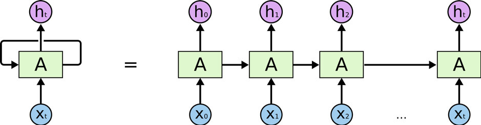
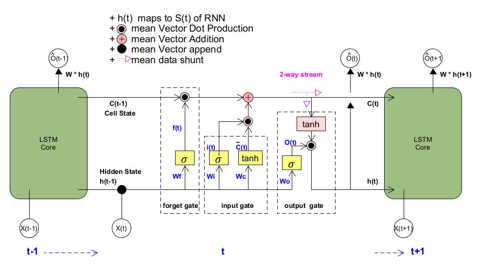
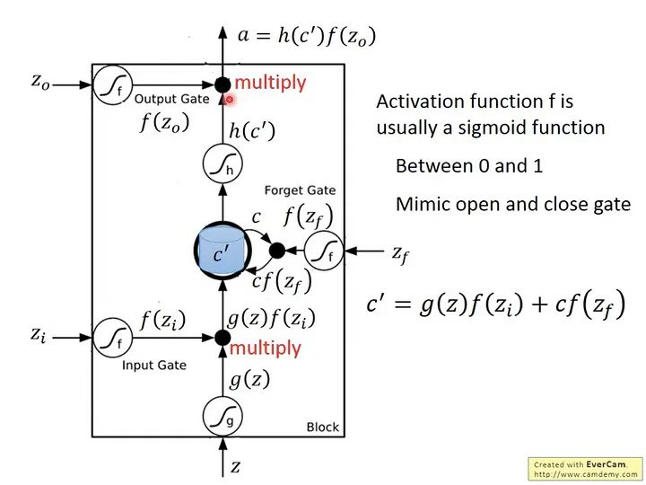

RNN (Recurrent Neural Network)
----

人的思維是連續的, 思考問題並不會從頭開始, 而是會**結合上下文**
> 傳統的神經網路並不能做到這點, 而 RNN 正是這一問題的解決方案

RNN(循環神經網路)中的神經元, 可以把輸出值, 作為下一個神經元的輸入值的一部分, 進而保證神經網路能夠連續**思考**

 
Fig. RNN Concept

然而 RNN 並不完美, 它存在`長依賴`的問題.
> 比方說, 假設想讓 RNN 根據一段不完整的句子來預測缺失的單詞,
> e.g. `I grew up in France... I speak fluent ________. (缺失的單詞為 French)`, 有用的資訊主要集中在前半句. 然而要預測的單詞, 卻和前面有用的資訊距離較遠, 這會導致 RNN 很難學習到有用的資訊

而 LSTM(Long Short-Term Memory networks) 解決了 RNN 的長依賴問題
如圖所示, LSTM也是鏈狀結構, 但它和 RNN 的不同之處, 在於中間的神經元, 變成了一個較為複雜的細胞, 而這個部分正是 LSTM 的核心
> 其主要有 4 個部分
> + Forget gate (遺忘門)
> + Input gate (輸入門)
> + Output gate (輸出門)
> + Memory Cell (將計算出的值儲存起來, 以利下個階段拿出來使用)

 
Fig. LSTM Core Arch

## LSTM (Long Short-Term Memory networks)

LSTM(長短期記憶網路)是基於 RNN 的一種時間循環神經網路, LSTM 有很多個版本, 其中一個重要的版本是 `GRU(Gated Recurrent Unit, 門控循環單元)`

 
Fig. LSTM 數學式

> + $\{z_i\}$ : 控制 input gate 的 signal
> + $\{z_o\}$ : 控制 output gate 的 signal
> + $\{z_f\}$ : 控制 forget gate 的 signal
> + $z$ : 要被存進 cell 的 input value
> + $a$ : output
> + $h()$ : hidden state (隱藏狀態)

$z$ 通過一個 activation function 得到 $g(z)$
> + $\{z_i\}$ 通過一個 activation function 得到 f($\{z_i\}$),
> + $\{z_o\}$ 通過一個 activation function 得到 f($\{z_o\}$)
> + $\{z_f\}$ 通過一個 activation function 得到 f($\{z_f\}$)

> $f()$ 通常用 sigmoid function, 因為 sigmoid function 值介在 0 ~ 1 之間, 代表 gate 被打開的程度,
>> 如果 f()$ 的 output 是 1 代表 gate 打開, 反之 output 是 0 代表 gate 被關閉

$c’$ 為新的存在 memory 裡面的值
> $c’$ = f($\{z_i\}$) * g(z) + c*f($\{z_f\}$)
>> 由上式可知, f($\{z_i\}$) 控制 input g(z) 是否可以進來,
>> + 當 f($\{z_i\}$) = 0 時，前面那一項就是 0
>> + 若 f($\{z_f\}$) = 1 時, 代表之前的 c 會被記得, 跟這回合的 input 值相加
>> + 若 f($\{z_f\}$) = 0 時, 代表之前的 c 會被遺忘, 後面那一項會是 0

所以 forget gate 的特性跟字面上的直覺剛好相反
> + 當 forget gate 打開時 f($\{z_f\}$) = 1, 之前的值會 **記得**
> + 當 forget gate 關閉時 f($\{z_f\}$) = 0, 之前的值會 **遺忘**

# Reference

+ [C語言實現LSTM演算法](https://zhuanlan.zhihu.com/p/262132576)
+ [Github-C-LSTM](https://github.com/az13js-org/C-LSTM)
+ [Github- C-machine-learning](https://github.com/Jianx-Gao/C-machine-learning)
+ [Understanding LSTM Networks](http://colah.github.io/posts/2015-08-Understanding-LSTMs/)
+ [ML Lecture 25: Recurrent Neural Network (Part I)](http://violin-tao.blogspot.com/2017/12/ml-recurrent-neural-network-rnn-part-i.html)
