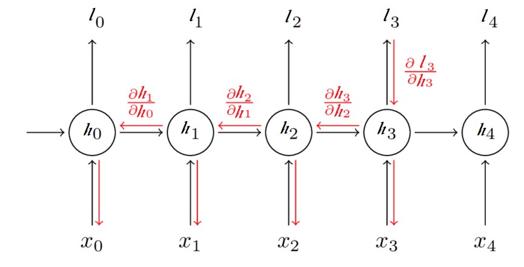
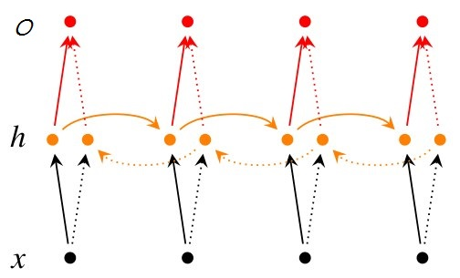
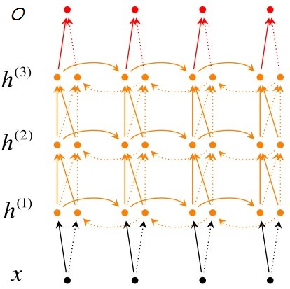

RNN (Recurrent Neural Network)
----

CNN 可以有效地處理空間資訊, 因此對於圖像上的 pixels 位置, 可以有很優秀的處理效果, 但在**序列資料**中, CNN 就不盡人意.
> CNN 是假設元素之間是相互獨立的, 輸入與輸出也是獨立的

在現實生活中, 大多數的資料都是有順序性的, 像是
> + 文章中的單詞是按順序寫的
> + Video 中的 image frames 是有連貫性的
> + 對話中的音訊訊號, 單詞是是有連續性 (單詞構成語意)
> + 網站上的瀏覽行為是有邏輯順序的
> + 股票隨時間的變化

由於人的思維是連續的, 思考問題並不會從頭開始, 而是會**結合上下文**
> 傳統的神經網路並不能做到這點, 而 RNN 通過引入**狀態變數**, 儲存過去的資訊和當前的輸入, 從而可以確定當前的輸出
>> RNN(循環神經網路)中的神經元, 可以把輸出值, 作為下一個神經元的輸入值的一部分, 進而保證神經網路能夠**連續思考**

 
Fig. The-Standard-RNN

上圖的右側圖為實際展開的形式, 因為每一級都做相同的事, 因此可以呈現左側圖
> 左側圖代表一個單元結構, 將會循環使用; 在 `Fig. The-Standard-RNN` 中
> + $X_t$ 表示連續時間 $t$ 的 input
> + $O_t$ 表示連續時間 $t$ 的 output
> + $h_t$ 表示 hidden layers 連續時間 $t$ 的 記憶
> + $W$ 表示 hidden layers 權重
> + $U$ 表示 input layers 權重
> + $V$ 表示 output layers 權重

`Fig. The-Standard-RNN` 可定義 RNN 的公式
> 每個 cell 都共享了一組參數(U, V, W), 這樣就能極大的降低計算量
>> $O_t$ 在很多情況下都是不需要的, 因為大部分的情況, 都只關注最後的結果的, 因此使用 softmax()

$$
\begin{array}{l}
H_t &= tanh(U × X_t + W × H_{t-1} + bias)\\
O_t &= softmax(V × H_t + bias)
\end{array}
$$

## RNN 訓練

希望藉由 training 來找到 (U, V, W) 參數值, 這過程中需要幾個步驟
> + BPTT (BackPropagation Through Time, 時序反向傳播) 來獲得模型變數和參數之間的依賴關係
>> 是 BackPropagation 演算法的一個特定應用
> + SGD(Stochastic Gradient Descent, 梯度下降) 來逼近最佳值
> + 梯度截斷機制
>> 加速計算並且避免發生梯度爆炸

RNN 是循環計算, 誤差也會一級一級的傳播下去, 因此需要把**所有時刻**造成的損失都加起來. 
定義 Loss-function
> 分類問題, 常用`交叉熵(cross-entropy)`作為損失函數, 

$
\begin{array}{l}
L &= \sum_{t=1}^T l(\hat{O}_t, O_t)\\
  &= \sum_{t=1}^T -\hat{O}_t × log(\hat{O}_t)\\

\hat{O}_t &: Expected\ output\\
O_t &: Real\ output
\end{array}
$

  
Fig. BPTT_Concept

# RNN 結構改進

然而 RNN 並不完美, 它存在`長依賴`的問題.
> 比方說, 假設想讓 RNN 根據一段不完整的句子來預測缺失的單詞,
> e.g. `I grew up in France... I speak fluent ________. (缺失的單詞為 French)`, 有用的資訊主要集中在前半句.
然而要預測的單詞, 卻和前面有用的資訊距離較遠, 這會導致 RNN 很難學習到有用的資訊

可以從廣度及深度兩方向改進
> + Bidirectional RNN (廣度)
>> 依前後文來判定, 因此需要後面的時間的資料
> + Deep-Bidirectional RNN (深度)
>> 使用多個 hidden layers, 同時加入前後文 (很多資訊無法一次記下來, 就需要多次記憶)

## Bidirectional RNN

  
Fig. Bi-directional-rnn.jpg

## Deep-Bidirectional RNN

  
Fig. Deep-bi-directional-rnn

## [LSTM(Long Short-Term Memory networks)](note_LSTM.md)

時序反向傳播演算法(BPTT)會按照時間的逆序, 將錯誤資訊一步步地往前傳遞的過程, 容易發生梯度消失或梯度爆;
為了解決 RNN 層內梯度消失的問題, 使用 LSTM 結構, 它導入了
> + 有選擇地保存和遺忘記憶資訊
> + 可以學習長的依賴關係
>> 因為線性相加，不單單取決於啟動函數

GRU (Gated Recurrent Units, 門控單元) 是一個 LSTM 稍微簡化的變體, 通常能夠提供同等的效果, 並且計算的速度更快

## Examples

+ [Tensorflow 實現 RNN - Github](https://github.com/hzy46/Char-RNN-TensorFlow)

## `CNN + RNN`

在圖像處理中, 目前做的最好的是 CNN, 而自然語言處理中, 表現比較好的是 RNN, 將兩者結合起來, 已獲得更好的效果.

+ 使用 CNN 取出最終的圖像特徵,

+ 用 RNN 取代 CNN 中的分類器
    > 將圖像特徵輸入到 RNN 中 ($X$ 為圖像特徵)
    >> $X$ 應該為一個 `n * 1` 的向量

    $
    \begin{array}{l}
    h_t = tanh(U × X_t + W × H_{t-1} + V × X)
    \end{array}
    $

# Reference

+ [循環神經網路(RNN)原理通俗解釋](https://blog.csdn.net/qq_39422642/article/details/78676567)
+ [Github- C-machine-learning](https://github.com/Jianx-Gao/C-machine-learning)
+ [ML Lecture 25: Recurrent Neural Network (Part I)](http://violin-tao.blogspot.com/2017/12/ml-recurrent-neural-network-rnn-part-i.html)

+ [機器/深度學習: 基礎介紹-損失函數(loss function)](https://chih-sheng-huang821.medium.com/%E6%A9%9F%E5%99%A8-%E6%B7%B1%E5%BA%A6%E5%AD%B8%E7%BF%92-%E5%9F%BA%E7%A4%8E%E4%BB%8B%E7%B4%B9-%E6%90%8D%E5%A4%B1%E5%87%BD%E6%95%B8-loss-function-2dcac5ebb6cb)

+ [Day 14：循環神經網路(Recurrent Neural Network, RNN)](https://ithelp.ithome.com.tw/articles/10193469)
+ [Day 15：『長短期記憶網路』(Long Short Term Memory Network, LSTM)](https://ithelp.ithome.com.tw/articles/10193678)
