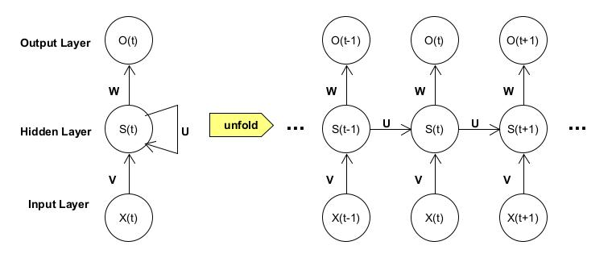
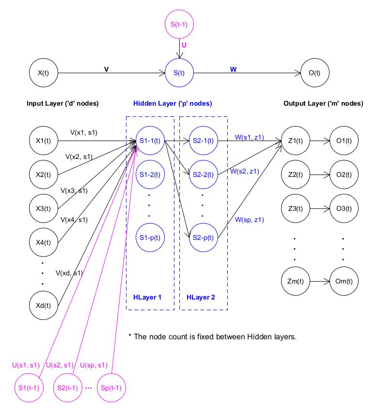
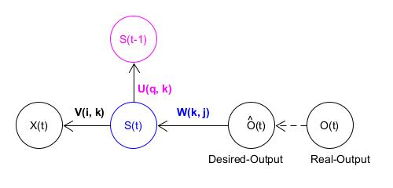
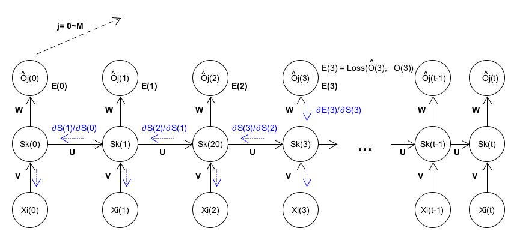

RNN (Recurrent Neural Network)
----

CNN 可以有效地處理空間資訊, 因此對於圖像上的 pixels 位置, 可以有很優秀的處理效果, 但在**序列資料**中, CNN 就不盡人意.
> CNN 是假設元素之間是相互獨立的, 輸入與輸出也是獨立的

在現實生活中, 大多數的資料都是有順序性的, 像是
> + 文章中的單詞是按順序寫的
> + Video 中的 image frames 是有連貫性的
> + 對話中的音訊訊號, 單詞是是有連續性 (單詞構成語意)
> + 網站上的瀏覽行為是有邏輯順序的
> + 股票隨時間的變化

由於人的思維是連續的, 思考問題並不會從頭開始, 而是會**結合上下文**
> 傳統的神經網路並不能做到這點, 而 RNN 通過引入**狀態變數**, 儲存過去的資訊和當前的輸入, 從而可以確定當前的輸出
>> RNN(循環神經網路)中的神經元, 可以把輸出值, 作為下一個神經元的輸入值的一部分, 進而保證神經網路能夠**連續思考**

簡單來說, RNN 的輸入不再是單純的透過 fully connection 或是 convolution 來計算得到輸出,
而是先算出一個 State, 再透過這個 State 得到 Output, 然而這個 State 具有記憶功能,
可以影響到下一個, 下兩個或是下 n 個 State, 讓不同的State之間產生關聯性.
> 利用 State 幫 RNN 進行`記憶`功能, 幫忙網路記憶之前看過樣本的訊息, 並結合最新樣本所帶來的訊息進行得到 Output

 
Fig. The-Standard-RNN

上圖的右側圖為實際展開的形式, 因為每一級都做相同的事, 因此可以呈現左側圖
> 左側圖代表一個單元結構, 將會循環使用; 在 `Fig. The-Standard-RNN` 中
> + $X(t)$ 表示連續時間 $t$ 的 input
> + $O(t)$ 表示連續時間 $t$ 的 output
> + $S(t)$ 表示 hidden layers中, 連續時間 $t$ 的**狀態變數**
> + $U(q, k)$ 表示 Previous hidden layer(q) 到 Hidden layer(k) 權重矩陣
> + $V(i, k)$ 表示 Input layers(i) 到 Hidden layer(k) 權重矩陣
> + $W(k, j)$ 表示 Hidden layer(k) 到 Output layers(j)) 權重矩陣

`Fig. The-Standard-RNN` 可定義 RNN 的公式
> 每個 cell 都共享了一組參數矩陣(U, V, W), 這樣就能極大的降低計算量
>> $O(t)$ 在很多情況下都是不需要的, 因為大部分的情況, 都只關注最後的結果的, 因此使用 softmax()

$$
\begin{array}{l}
h(t) &= V × X(t) + U × S(t-1) + bias\\
S(t) &= f_1(h(t))\\
     &= tanh(V × X(t) + U × S(t-1) + bias)\\
O(t) &= f_2(Z_t)\\
     &= softmax(Z_t)\\
     &= softmax(W × S(t) + bias)
\end{array}
$$

$$
\begin{array}{l}
f_1()\ and\ f_2(): Activation\ function\\
\end{array}
$$

RNN 基本上, 就是 (U, V, W) 三個權重和對應的 activation 來進行運算
> 藉由 NN 及梯度下降來找到最佳的 (U, V, W)

## RNN Forward propagation (向前傳遞)

 
Fig. RNN_Advance_Arch

由 `Fig. RNN_Advance_Arch` 可看到, BPTT 比 BP 多了一個時間軸上的 $S(t-1)$ 輸入

+ Input to Hidden layer

    假設有 $N$ 個 data, 每次使用 $D$ 個 Input 到 RNN, 單一層 hidden layer 共有 $P$ 個 nodes, 則第 $k$ 個 node

    $
    \begin{array}{l}
    S_k(t) &= f_1(h_k(t))\\
    h_k(t) &=\sum_{i=1}^{D}V(i, k) × X_i(t) + \sum_{q=1}^{P} U(q, k) × S_q(t-1)
    \end{array}
    $

    $
    \begin{array}{l}
    f_1(): Activation\ function
    \end{array}
    $

+ Hidden layer to Output

    假設 Output layer 共有 $M$ 個 nodes, 則第 $j$ 個 node

    $
    \begin{array}{l}
    O_j(t) &= f_2(Z_j(t))\\
    Z_j(t) &=\sum_{k=1}^{P}W(k, j) × S_k(t)
    \end{array}
    $

    $
    \begin{array}{l}
    f_2(): Activation\ function
    \end{array}
    $

## RNN Backpropagation Through TIme (BPTT, 時間反向傳播)

 
Fig. BPTT

由於誤差是從前一層的 Neurons 經過權重比例後, Propagate 到目前 layer.
BP 則利用 Error Propagation 的方程式, 經由梯度下降 (偏微分) 來逼近最小誤差, 再將誤差跟新到權重.
同樣的 BPTT 也是使用相同的方式, 由於 BPTT 比 BP 多了一個時軸上的輸入, 因此多了一個 $U$ 權重矩陣要逼近

定義 $E(t)$ 為 Loss-Function, 也就是誤差函數
> Loss-Function 可選擇
> + Cross-entropy loss (交叉熵)
> + MSE (Mean-Square Error)

在 RNN 結構中, 時軸上 $t$ 會有 error propagation 的情況發生, 因此需將每個 cell 所產生的誤差累加起來

 
Fig. BPTT_Err_Propagation, e.g. $T'=3$

+ Cross-entropy loss

    $
    \begin{array}{l}
    E(\hat{O}, O)       &= \sum_{t=0}^{T'} E\left(\hat{O}(t), O(t)\right)\\
    E(\hat{O}(t), O(t)) &= \sum_{j=0}^M L\left(\hat{O_j}(t), O_j(t)\right)\\
                        &= \frac{-1}{M} \sum_{j=0}^M \left(\overbrace{O_j(t) \cdot log\left(\hat{O_j}(t)\right)}^{Positive\ term} + \overbrace{(1 - O_j(t)) \cdot log\left(1 - \hat{O}_j(t)\right)}^{(Negative\ term)}\right)\\
    \end{array}
    $

    $
    \begin{array}{l}
    \hat{O}_t &: RNN\ prediction\ output\\
    O_t &: Target\ output (The\ truly\ correct)\\
    Positive\ term &: 當結果是1時, 有反應\\
    Negative\ term &: 當結果是0時, 有反應
    \end{array}
    $

### 梯度推導 $(\nabla_U, \nabla_V, \nabla_W)$

+ $\nabla_V$

    $
    \begin{array}{l}
    \nabla_V(i,k) &= \frac{\partial E^{(i)}(t)}{\partial V(i,k)}\\
                  &= \frac{\partial E^{(i)}(t)}{\partial Z_j(t))} \cdot
                     \frac{\partial Z_j(t)}{\partial h_k(t))} \cdot
                     \frac{\partial h_k(t)}{\partial V(i,k))}\\
                  &= \left[ \sum_{j=0}^M \left(\hat{O_j}^{(i)}(t) - O_j^{(i)}(t) \right) \cdot f_2^{'} \left(Z_j^{(i)}(t) \right)  \right]
                        \otimes
                     \left[ W(i,k) \cdot f_1^{'}(S_k(t)) \cdot X_i(t)\right]
    \\
    \\
    \frac{\partial Z_j(t)}{\partial h_k(t)} &= \frac{\partial \sum_{k=1}^{p} W(k,j) \cdot S_k(t)}{\partial h_k(t)}\\
                                            &= \frac{\partial \sum_{k=1}^{p} W_(k,j) \cdot f_1(h_k(t))}{\partial h_k(t)}\\
                                            &= W(k,j) \cdot f_1^{'}(h_k(t))
    \\
    \\
    \frac{\partial h_k(t)}{\partial V(i,k)} &= \frac{\partial \left(\sum_{i=1}^{d} V(i,k)X_i(t) + \sum_{q=1}^{p} U(q,k)S_k(t-1)\right)}{\partial V(i,k)}\\
                                            &= X_i(t)
    \\
    \\
    \delta_V(i,k) &= \sum_{i=0}^{T'} \frac{\partial E^{(i)}(t)}{\partial V(i,k)}\\
                  &= \sum_{i=0}^{T'} \left(
                        \left[ \sum_{j=0}^M \left(\hat{O_j}^{(i)}(t) - O_j^{(i)}(t) \right) \cdot f_2^{'} \left(Z_j^{(i)}(t) \right)  \right]
                            \otimes
                        \left[ W(i,k) \cdot f_1^{'}(S_k(t)) \cdot X_i(t)\right]
                     \right)
    \\
    f_1^{'}() : f_1()的導數\\
    f_2^{'}() : f_2()的導數\\
    \otimes   : 外積
    \end{array}
    $

+ $\nabla_W$

    $
    \begin{array}{l}
    \nabla_W(k,j) &= \frac{\partial E^{(i)}(t)}{\partial W(k,j)}\\
                  &= \frac{\partial E^{(i)}(t)}{\partial Z_j(t)} \cdot
                     \frac{\partial Z_j(t)}{\partial W(k,j)}\\
                  &= \sum_{j=0}^{m} \left(\hat{O_j}^{(i)}(t) - O_j^{(i)}(t) \right) \cdot
                        f_2^{'} \left(Z_j^{(i)}(t) \right) \cdot
                        S_k(t)
    \\
    \\
    \frac{\partial E^{(i)}(t)}{\partial Z_j(t)} &= \sum_{j=0}^{m} \left(\hat{O_j}^{(i)}(t) - O_j^{(i)}(t) \right) \cdot
                                                        f_2^{'} \left(Z_j^{(i)}(t) \right)
    \\
    \\
    \frac{\partial Z_j(t)}{\partial W(k,j)} &= \frac{\partial \sum_{k=1}^{p} W(k,j)S_k(t)}{\partial W(k,j)}\\
                                            &= S_k(t)
    \\
    \\
    \delta_W(k,j) &= \sum_{i=1}^{T'} \frac{\partial E^{(i)}(t)}{\partial W(k,j)}\\
                  &= \sum_{i=1}^{T'} \sum_{j=0}^{m} \left(\hat{O_j}^{(i)}(t) - O_j^{(i)}(t) \right) \cdot
                        f_2^{'} \left(Z_j^{(i)}(t) \right) \cdot
                        S_k(t)
    \end{array}
    $

+ $\nabla_U$

    $
    \begin{array}{l}
    \nabla_U(q,k) &= \frac{\partial E^{(i)}(t)}{\partial U(q,k)}\\
                  &= \frac{\partial E^{(i)}(t)}{\partial Z_j(t)} \cdot
                     \frac{\partial Z_j(t)}{\partial h_k(t)} \cdot
                     \frac{\partial h_k(t)}{\partial U(q,k)}\\
                  &= \left[\sum_{j=0}^{m} \left(\hat{O_j}^{(i)}(t) - O_j^{(i)}(t) \right) \cdot f_2^{'}\left(Z_j^{(i)}(t) \right) \right]
                        \otimes
                     \left[W(k,j) \cdot f_1^{'}(h_k(t)) \cdot S_k(t-1) \right]

    \\
    \\
    \frac{\partial Z_j(t)}{\partial h_k(t)} &= \frac{\partial \sum_{k=1}^{p} W(k,j) \cdot S_k(t)}{\partial h_k(t)}\\
                                            &= \frac{\partial \sum_{k=1}^{p} W_(k,j) \cdot f_1(h_k(t))}{\partial h_k(t)}\\
                                            &= W(k,j) \cdot f_1^{'}(h_k(t))
    \\
    \\
    \frac{\partial h_k(t)}{\partial U(q,k)} &= \frac{\partial \left(\sum_{i=1}^{d} V(i,k)X_i(t) + \sum_{q=1}^{p} U(q,k)S_k(t-1)\right)}{\partial U(q,k)}\\
                                            &= S_k(t-1)
    \\
    \\
    \delta_U(q,k) &= \sum_{i=1}^{T'} \frac{\partial E^{(i)}(t)}{\partial U(q,k)}\\
                  &= \sum_{i=1}^{T'}
                     \left(
                        \left[\sum_{j=0}^{m} \left(\hat{O_j}^{(i)}(t) - O_t^{(i)}(t) \right) \cdot f_2^{(i)} \left(Z_j^{(i)}(t) \right) \right]
                            \otimes
                        \left[W(k,j) \cdot f_1^{'} \left(h_k(t) \right) \cdot S_k(t-1) \right]
                     \right)

    \end{array}
    $

# RNN 結構改進

根據 RNN 模型會有些不同, 自然前向/反向傳播的公式會有些不一樣, 但是原理基本類似.
需要特別指出的是, 理論上 RNN 可以支援任意長度的序列, 然而在實際訓練過程中, 如果序列過長
> + 可能會導致最佳化時, 出現`梯度消散`和`梯度爆炸`的問題
> + 同時展開後的前饋神經網路, 會`佔用過大的記憶體`

所以實際中一般會規定一個最大長度, 當序列長度超過規定長度之後會對序列進行截斷

## [LSTM(Long Short-Term Memory networks)](note_LSTM.md)

時序反向傳播演算法(BPTT)會按照時間的逆序, 將錯誤資訊一步步地往前傳遞的過程, 容易發生梯度消失或梯度爆炸;
為了解決 RNN 層內梯度消失的問題, 使用 LSTM 結構, 它導入了
> + 有選擇地保存和遺忘記憶資訊
> + 可以學習長的依賴關係
>> 因為線性相加, 不單單取決於啟動函數

## GRU (Gated Recurrent Units, 門控單元)

GRU 是一個 LSTM 稍微簡化的變體, 通常能夠提供同等的效果, 並且計算的速度更快

## Examples

+ [Tensorflow 實現 RNN - Github](https://github.com/hzy46/Char-RNN-TensorFlow)

## `CNN + RNN`

在圖像處理中, 目前做的最好的是 CNN, 而自然語言處理中, 表現比較好的是 RNN, 將兩者結合起來, 已獲得更好的效果.

+ 使用 CNN 取出最終的圖像特徵,

+ 用 RNN 取代 CNN 中的分類器
    > 將圖像特徵輸入到 RNN 中 ($X$ 為圖像特徵)
    >> $X$ 應該為一個 `n * 1` 的向量

    $
    \begin{array}{l}
    h_t = tanh(U × X_t + W × H_{t-1} + V × X)
    \end{array}
    $

# Reference

+ [遞歸神經網路(Recurrent Neural Network): Back-propagation Through Time](https://chih-sheng-huang821.medium.com/%E9%81%9E%E6%AD%B8%E7%A5%9E%E7%B6%93%E7%B6%B2%E8%B7%AF-recurrent-neural-network-back-propagation-through-time-8d49ebf04b77)
+ [Paper-BackPropagation Through Time](http://ir.hit.edu.cn/~jguo/docs/notes/bptt.pdf)

+ Recurrent Neural Networks Tutorial
    - [Recurrent Neural Networks Tutorial, Part 1 – Introduction to RNN](https://dennybritz.com/posts/wildml/recurrent-neural-networks-tutorial-part-1/)
    - [Recurrent Neural Networks Tutorial, Part 2 – Implementing a RNN with Python, Numpy and Theano](https://dennybritz.com/posts/wildml/recurrent-neural-networks-tutorial-part-2/)
    - [Recurrent Neural Networks Tutorial, Part 3 – Backpropagation Through Time and Vanishing Gradients](https://dennybritz.com/posts/wildml/recurrent-neural-networks-tutorial-part-3/)

+ [循環神經網路(RNN)原理通俗解釋](https://blog.csdn.net/qq_39422642/article/details/78676567)
+ [Github- C-machine-learning](https://github.com/Jianx-Gao/C-machine-learning)
+ [ML Lecture 25: Recurrent Neural Network (Part I)](http://violin-tao.blogspot.com/2017/12/ml-recurrent-neural-network-rnn-part-i.html)

+ [機器/深度學習: 基礎介紹-損失函數(loss function)](https://chih-sheng-huang821.medium.com/%E6%A9%9F%E5%99%A8-%E6%B7%B1%E5%BA%A6%E5%AD%B8%E7%BF%92-%E5%9F%BA%E7%A4%8E%E4%BB%8B%E7%B4%B9-%E6%90%8D%E5%A4%B1%E5%87%BD%E6%95%B8-loss-function-2dcac5ebb6cb)

+ [Day 14：循環神經網路(Recurrent Neural Network, RNN)](https://ithelp.ithome.com.tw/articles/10193469)
+ [Day 15：『長短期記憶網路』(Long Short Term Memory Network, LSTM)](https://ithelp.ithome.com.tw/articles/10193678)
