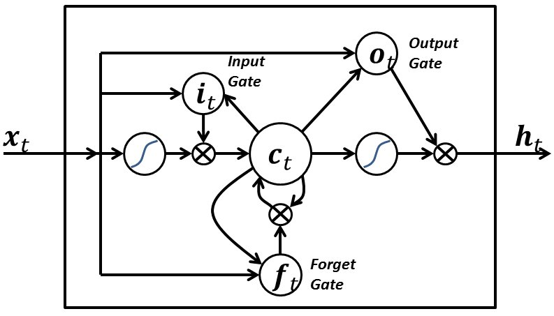

RNN (Recurrent Neural Network)
----

人的思維是連續的, 思考問題並不會從頭開始, 而是會**結合上下文**
> 傳統的神經網路並不能做到這點, 而 RNN 正是這一問題的解決方案

RNN(循環神經網路)中的神經元, 可以把輸出值, 作為下一個神經元的輸入值的一部分, 進而保證神經網路能夠連續**思考**

Fig. RNN Concept

然而 RNN 並不完美, 它存在`長依賴`的問題.
> 比方說, 假設想讓 RNN 根據一段不完整的句子來預測缺失的單詞,
> e.g. `I grew up in France... I speak fluent ________. (缺失的單詞為 French)`, 有用的資訊主要集中在前半句. 然而要預測的單詞, 卻和前面有用的資訊距離較遠, 這會導致 RNN 很難學習到有用的資訊

而 LSTM(Long Short-Term Memory networks) 解決了 RNN 的長依賴問題
如圖所示, LSTM也是鏈狀結構, 但它和 RNN 的不同之處, 在於中間的神經元, 變成了一個較為複雜的細胞, 而這個部分正是 LSTM 的核心
> 其主要有 4 個部分
> + Forget gate (遺忘門)
> + Input gate (輸入門)
> + Output gate (輸出門)
> + `記憶部分`

Fig. LSTM Core Arch

## LSTM (Long Short-Term Memory networks)

LSTM(長短期記憶網路)是基於 RNN 的一種時間循環神經網路, LSTM 有很多個版本, 其中一個重要的版本是 `GRU(Gated Recurrent Unit, 門控循環單元)`

Variables defintions
> + $\{x_t\}$: LSTM 的 input (輸入)
> + $\{f_t\}$: forget gate (遺忘閥)
> + $\{i_t\}$: input gate (輸入閥)
> + $\{o_t\}$: output gate (輸出閥)
> + $\{h_t\}$: hidden state (隱藏狀態)
> + $\{c_t\}$: cell state (單元狀態)

 
Fig. 簡單 LSTM 的結構

# Reference

+ [C語言實現LSTM演算法](https://zhuanlan.zhihu.com/p/262132576)
+ [Github-C-LSTM](https://github.com/az13js-org/C-LSTM)
+ [Github- C-machine-learning](https://github.com/Jianx-Gao/C-machine-learning)