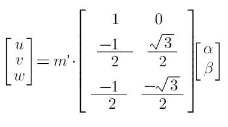

Brushless Motor(無刷馬達) [[Back](note_Motor.md)]
---

Brushless Motor 可以分為無刷直流電機(BLDC)和永磁同步電機(PMSM), 結構大同小異,
主要區別在於製造方式(e.g. 線圈繞組方式)不同, 導致的一些特性差異(比如反電動勢的波形)


Brushless Motor 的常用控制策略, 可分為 120° 開/關控制和向量控制
> + 120° 開/關控制方式
>> Brushless Motor 的三個線圈中, 有兩個會通電, 並且會輪流切換六種通電模式, 以支援任一方向的旋轉
>>  <br>
>> 在此模式下, 定子線圈會透過開/關電流(PWM)通電, 產生梯形加速曲線, 即馬達會逐漸加速或維持速度, 然後在線圈斷電時逐漸減速. 此作法的優勢在於非常簡便且操作直覺. <br>
但容易因負載變化和其他變化, 而發生效能波動, 而且對某些應用來說, 精確度和效率也不夠高.
此問題可透過調整 IGBT or MOSFET 的開/關時序, 以及使用`比例-積分-微分 (PID)` 或`比例-積分 (PI)` 控制, Motor Controller 中的精密演算法可在一定程度上克服

> + 向量控制也稱為磁場導向控制(FOC)
>> 此法將三個線圈, 都透過持續**控制磁場**而進行通電, 相較於 120° 控制, 運作更加順暢<br>
在 FOC 中, 每個定子線圈的電流, 均由進階演算法測量和控制, 且需要進行複雜的數值處理. <br>
此演算法也必須持續將三相 AC 值轉換成雙相 DC 值 (座標相位轉換), 以簡化控制所需的後續方程式和運算. <br>
>>  <br>
若執行妥當, FOC 可達到非常準確且有效的控制

從上述的無刷電機控制方式, 可以發現到, 轉子在磁場中只有 6 個穩定的狀態, 因此旋轉過程中其實是不平滑的, 存在扭矩的抖動
> 可以用手轉一下無刷電機, 會感受到頓挫感


因此為解決這個問題, 可從 H/w 或 S/w 出發, 這就衍生出了`BLDC`和`PMSM`的區別
> + BLDC 由於反電動勢接近梯形波, 所以必定會有上面說的抖動問題的. 但如果增加極對數(也就是磁鐵對數, 增加穩定狀態數量), 就可降低頓挫感.
BLDC 也可以結合抗齒槽演算法的FOC, 進行力矩補償實現平滑控制
>> 實際上的BLDC 電機基本都是多極對, 都是使用三相輸入訊號,
> + PMSM 設計的反電動勢為正弦波, 我們用 S/w 和演算法並結合 PWM,
將方波轉變成等效的 SPWM(Sinusoidal PWM) 正弦波或者 SVPWM (Space Vector PWM) 梯形波, 再用來驅動電機, 其控制效果很理想

> 
>> 藍色: SPWM, 黃色: SVPWM (近似梯形波, 呈現馬鞍狀)

當然為了產生更好的波形, 更好的旋轉磁場, Controller 及演算法, 就變得非常複雜, 這也是 FOC 的實現原理


再者要控制 Brushless Motor, 首先要知道轉子角度位置 ([相位角](note_Phase.md)), Controller 利用相位角來協調與磁場相關的轉子線圈之供電,
以確保 Motor 提供所需的回應
> 回應包括如下, 具體取決於應用和操作條件
> + 保持速度, 加速, 減速
> + 改變方向
> + 減小或增加扭矩
> + 緊急停止
> + 其他回應


偵測轉子角度方式, 可以分為 sensor 及 sensorless

+ Sensor
    > Sensor 類型豐富, 大致分為偵測相對和絕對位置兩種.
    >> 通常有**線圈旋轉變壓器**, **霍爾感測器**, **光學或電容感測器**. 可根據解析度, 耐用程度, 或成本等要求來挑選

    

+ Sensorless
    > 透過測量每個轉子繞組中的反電動勢, 來計算轉子位置.
    同時使用磁場導向控制(FOC), 將轉子電流分解為 D-軸 和 Q-軸分量, 因為 DC 變化緩慢, 可以簡化控制方式
    >> 適合低成本, 精準度需求較低的應用

    

    >> 測量相電流的最常用方法是, 在逆變器(Invertor)級中, 使用分流電阻器(Shunt Resistor), 在每個低側 MOSFET 的源極和地之間進行**低側檢測**. <br>
    由於分流器的共模電壓降低, 可使用低成本電流檢測放大器.

## Hall Sensor

Hall Sensor 大致上可分為兩種, 霍爾元件及霍爾 IC
+ Hall 元件, 會固定輸入一電流值後, 再依照外在磁場強弱與極性的變化, 輸出一 Hall Voltage
    > 需要由 Analog 模組去偵測 Hall Voltage

+ Hall IC
    > 整合 Hall 元件及 Analog 模組, 並輸出數位訊號, e.g. Hall Voltage 為正, 輸出 Vcc(High), Hall Voltage 為負值時, 則輸出 0V(Low)

## IGBT(Insulated Gate Bipolar Transistor, 絕緣柵雙極晶體管)

IGBT是一種半導體元件, 其特點為
> + 驅動電流小
> + 導通電阻也很低
> + 高效率切換速度快
> + 耐高壓 (10 VA ~ 100M VA)
>> VA: Volt-Ampere

由於可用大功率快速做切換, 因此常應用於馬達驅動器, 大瓦特輸出音響放大器的音源驅動元件, 一般都配合 PWM 與 Low-pass Filters


## 反電動勢 (Back ElectroMotive Force, Back-EMF)

馬達在送電的運轉過程中, 在啟動的當下, Motor 從靜態(靜平衡)進入到動態(動平衡)的過程, 電流會持續上升, 再隨著轉速上升而逐漸下降;
當馬達達到穩速(達到動態平衡)運轉時, 電流值會下降到最低點


但依照電壓電流公式 `V = IR`, 馬達內部的電阻值 R 為恆定值.
而馬達隨著轉速變化, 電流值會逐漸下降, 表示有一個**反電動勢**在降低電壓值.

+ 反電動勢發生的原因
    > 馬達運作是送電給了線圈, 產生電磁場後與磁鐵作用, 最後轉化為動能旋轉輸出.
    但**沒送電的線圈**也會感受到磁場的變化, 依照法拉第定律在線圈上生成**渦電流**, 這就是反電動勢的來源.
    >> 事實上不僅是空的線圈會受到旋轉磁場變化的影響, 正在送電的線圈也會有反應

    > 所以反電動勢是個一體兩面的存在
    > + 當輸入電壓 12V, 馬達穩態轉速為 1200轉(RPM)
    > + 若用外部力量(水力, 火力)帶動馬達旋轉達到 1200轉時, 就會產生 12V 的反電動勢


反電動勢對馬達造成的影響
> + 抑制工作電流
> + 限制最高轉速(RPM)


## 弗萊明左/右手定則

弗萊明右手定則(Generator 定則)用於識別發電機的場域方向 (從磁生電)
> `拇指`是導體**移動方向**, `食指`是**磁場方向**, `中指`為生成的**電流方向**

弗萊明左手定則(Motor 定則), 為弗萊明右手定則的變形, 用於識別 Motor 的受力方向 (從電生磁)
> `拇指`是導體**移動方向**, `食指`是**磁場方向**, `中指`為生成的**電流方向**
>> 其中電流方向會與右手定則方向相反

## 安培右手定則

+ 當磁生電時, 右手的拇指指向電流方向, 其它四根手指彎曲決定磁場的方向

+ 當電生磁時, 右手拇指指向 N 極, 其它四指彎向決定電流電流方向

## 3-Phase Inverter


每相 Inverter 會分為上橋臂(橙色)及下橋臂(藍色), 上圖電流從正極經上橋臂流至 U 相, 再分流到 V 相與 W 相, 最後經下橋臂到負極
> 三相都導通, 會比只用兩相導通, 產生更大的扭矩
> + `上橋開, 下橋關` 定義為狀態 1
> + `上橋關, 下橋開` 定義為狀態 0

+ 3-Phase Inverter 依照上下橋臂的狀態, 總共可以有 8 (2^3) 種狀態, 扣除掉完全不導通的狀態 (000, 111), 可以在 α-β 平面(Clark Transform)區分出 6 個區域(如下)

    

    - 週期為相位平面一圈 `∠0° <= wt < ∠360°`
        > 使用中間對稱三角波的形式來作為參考載波 (理想上的 Vδ 所產生的波形), 當使用響應後的電壓,
        經計算後所得的實際值大於載波值時, 輸出 low, 否則輸出 high
        > + 黑: 參考載波
        > + 紅藍綠: 3 個繞組反饋的實際值

        

# BLDC (Brushless DC Motor, 無刷直流馬達)

# PMSM (Permanent-Magnet Synchronous Motor, 永磁同步馬達)

# FOC Control Principle

FOC 驅動無刷電機的基本手段, 即通過`計算所需電壓向量`, 使用 `SVPWM 訊號(開關上下橋 MOS)來驅動三相逆變電路`, 合成出等效的三相正弦電壓驅動 Motor

**FOC Motor Components**


+ Three-phase Invertor (三相逆變器)
    > 三相AC/DC逆變器, 為永磁同步馬達(PMSM)及直流無刷馬達(BLDC)馬達, 提供三相電壓以進行驅動.
    它從空間向量調變(Space Vector Modulation, SVM)模組中, 獲取 SVPWM 訊號

+ QEP interface
    > 正交編碼器脈衝(Quadrature Encoder Pulse, QEP)介面連接編碼器, 以取得轉子的機械位置, 並將其傳遞至其他模組

+ Speed/Position Estimation (速度/位置評估模組)
    > 在此模組中執行計算, 以獲取轉子的位置和速度

+ PID (Proportional Integral Derivative, 比例/積分/微分) control
    > PID是一種控制迴路, 它有賴於馬達以扭力形式的 feedback,
    透過計算 `所需的扭力`, 以及從`派克變換(Park Transform)模組接收到的扭力`, 兩者間之差異, 從而進行校正

+ Clark Transform
    > 克拉克變換(Clarke transform)模組使用 Clarke 變換公式, 將定子的三相電流(Ia, Ib, Ic) 降維度到二維 α-β 平面, 以降低複雜度

+ Park Transform 和 Inverse Park Transform
    > 該模組將定子角色所觀察到的資訊, 轉換到轉子角色的分量, 轉子的正交分量是直軸(d)和正交軸(q).
    當轉子分量轉移到定子時, 就會使用 Park 逆變換

+ Space Vector Modulation (空間向量調變, SVM)
    > SVM 技術用於確定適於馬達的 SVPWM 訊號. SVM 以定子電壓向量 (PWM) 作為輸入, 並產生三相輸出電壓作為輸出
    >> SVPWM 實際上計算的是, 三相逆變器六個開關, 在何時導通, 何時切斷

## FOC 參數

使用到 3 個 PI control 閉迴路 (電流的採樣率非常高, 因此不需要使用到微分項)
> 主要參數 Position/Speed/Current
> + 通過 response current (Iq/Id) 來控制扭矩 (Vu/Vv/Vw 三相力矩)
> + 藉由控制扭矩來改變轉速(ω)
> + 藉由控制轉速來改變轉子位置 (θ)


> `xxx_ref` 表示預期達到的值, user 經由 `PID` 調校

+ 當 `Position control`時, 轉速會變慢 (為了將轉子固定到某個位置), 因此會產生非常大的誤差.
為了避免誤差, 去除 `Speed control`, 並將 `Position control`改用完整的 PID control
    > Position 的微分就是速度, 可以減小`Position control`的震盪並加快收斂.
    而積分項的作用則是為了消除靜態誤差

    


## Sensorless

+ flow chart

    

+ Arch

    

## IFOC v.s. DFOC

FOC 可分為 IFOC (Indirect FOC)及 DFOC (Direct FOC)

+ DFOC
    > 利用電壓型或電流型的磁通模型, 計算磁通大小及角度

+ IFOC
    > 先量測定子電流及轉子速度, 再利用轉子速度及轉差率的計算值, 推導轉子角度, 進而得到磁通的角度

    

## Clark Transform

Clark Transform 是將三相相位平面轉換到 α-β 正交平面(為了簡化控制複雜度), 反之, α-β 正交平面轉換回三相相位平面, 則稱為反轉換(Inverse Clark Transform)
>  <br>
> 左側為相位平面(Phase, Space Vector), 右側則為 Time domain 波形
>> 相位平面有三軸 (U/V/W 軸), 可產生出 3 個 Phasors (紅/藍/綠), 因為各軸相差 120°, 可將 3 個 Phasors 合成為一個固定長度的 Phasos (黑).
此 Phasos (黑) 可以轉換基底, 拆成 α-β 正交分量


+ Clark formula
    > `m` 為幅值大小

    

+ Inverse Clark formula
    > `m'` 為幅值大小

    

+ Formula

    ```
    # Clark Transform
    Iα = Iu - Iv * cos(π/3) - Iw * cos(π/3) = Iu - (Iv/2) - (Iw/2)
    Iβ = Iv * sin(π/3) - Iw * sin(π/3)      = (Iv - Iw) * √3/2

    # Inverse Clark Transform
    Iu = Iα
    Iv = Iα * cos(2π/3) + Iβ * sin(π/3) = (-1 * Iα/2) + (Iβ * √3/2)
    Im = Iα * cos(2π/3) - Iβ * sin(π/3) = (-1 * Iα/2) - (Iβ * √3/2)
    ```

## Park Transform

Park Transform 將定子的電流, 投影到**隨著轉子旋轉**的直軸(Direct 軸)與正交軸(Quadrature 軸)平面上
> 物理上來說, Park Transform 是從觀察定子的視野, 轉移到動態旋轉的轉子視野. <br>

>> dq 平面相對於定子來說是旋轉的坐標系, 其轉動的角速度和轉子的角速度相同, 因此相對於轉子來說，dq 平面坐標就是靜止的坐標.
而 Id 及 Iq 分量為常量, 只需改變 θ 即可改變轉矩


+ 物理特性
    > D 軸會與磁力線平行, Q 軸則會與磁力線正交, 也就是說, D 軸會對應到磁力最強的方向, Q 軸則是磁力最弱的方向

    

+ 目的
    > Park Transform 的目的是
    > + 為了減少運算量
    > + 為了方便描述最大與最小磁力的差別

+ Formula

    

    ```
    # Park Transform
    Id = Iα * cos(θ) + Iβ * sin(θ)
    Iq = -Iα * sin(θ) + Iβ * cos(θ)

    # Inverse Park Transform
    Iα = Id * cos(θ) - Iq * sin(θ)
    Iβ = Id * sin(θ) + Iq * cos(θ)
    ```

    - C code

        ```
        /**
         *  Use 48 samples
         *  (2 * pi) / 48 =  0.130899
         */
        #define CONFIG_ANGULAR_VELOCITY     0.130899f   // ω
        #define SQRT3_DIV2                  0.866025f   // √3/2

        typedef struct foc_param
        {
            uint16_t    u;
            uint16_t    v;
            uint16_t    w;
            uint16_t    d;
            uint16_t    q;
        } foc_param_t;

        void phases_to_dq(foc_param_t *pFoc, uint16_t t)
        {
            float   x_alpha, x_beta, seta;

            // Clark Transform
            x_alpha = pFoc->u - (pFoc->v >> 1) - (pFoc->w >> 1);
            x_beta  = SQRT3_DIV2 * (pFoc->v - pFoc->w);

            // Park Transform
            seta    = CONFIG_ANGULAR_VELOCITY * t; // θ
            pFoc->d = x_alpha * cos(seta) + x_beta * sin(seta);
            pFoc->q = -1 * (x_alpha * sin(seta)) + x_beta * cos(seta);
        }

        void dq_to_phases(foc_param_t *pFoc, uint16_t t)
        {
            float   x_alpha, x_beta, seta;

            // Inverse Park Transform
            seta    = CONFIG_ANGULAR_VELOCITY * t; // θ
            x_alpha = pFoc->d * cos(seta) - pFoc->q * sin(seta);
            x_beta  = pFoc->d * sin(seta) + pFoc->q * cos(seta);

            // Inverse Clark Transform
            pFoc->u = x_alpha;
            pFoc->v = -0.5 * x_alpha + SQRT3_DIV2 * x_beta;
            pFoc->w = -0.5 * x_alpha - SQRT3_DIV2 * x_beta;
        }
        ```


## [SVPWM](note_SVPWM.md)

希望將複雜的控制, 簡化成**增減常量**的方式來控制
> 藉由 Clark 及 Park 轉換來達到目的
> + Clark Transform
>> 降低維度, 為後續的 Park Transform 做前處理
> + Park Transform
>> 從 **Stator (定子) domain** 轉移到 **Rotor (轉子) domain**, 也就是 d-q domain. <br>
改變 D-Q 常量值, 再逆轉換到 3-Phase domain, 即可知道要輸入到 Motor 的電壓值


+ 閉迴路(Current close loop)可使 Motor 產生恆定的力矩 (電流量固定)


# Reference
+ [*相位角、頻率](https://www.geogebra.org/m/wthz4bhr)
+ [*徹底吃透SVPWM如此簡單](https://zhuanlan.zhihu.com/p/414721065?utm_id=0)
+ [*【自制FOC驅動器】深入淺出講解FOC演算法與SVPWM技術](https://zhuanlan.zhihu.com/p/147659820)
+ [ZhuYanzhen1/miniFOC](https://github.com/ZhuYanzhen1/miniFOC)
+ [FOC發展與原理概論](https://blog.udn.com/hal9678/6714149)
+ [FOC演算法穩定EV動力傳動性能](https://www.edntaiwan.com/20210825ta31-foc-algorithm-enhances-ev-powertrain-performance/)
+ [變頻器- Wiki](https://zh.m.wikipedia.org/zh-hant/%E5%8F%98%E9%A2%91%E5%99%A8)
+ [向量控制- Wiki](https://zh.m.wikipedia.org/zh-hant/%E5%90%91%E9%87%8F%E6%8E%A7%E5%88%B6)
+ [BLDC  with  Hall Sensor簡易控制說明手冊](https://lutron1980.pixnet.net/blog/post/23531227-bldc-with-hall-sensor%E7%B0%A1-%E6%98%93-%E6%8E%A7-%E5%88%B6-%E8%AA%AA-%E6%98%8E-%E6%89%8B-%E5%86%8A)
+ [如何使用高度整合的 IC 快速開始無刷直流馬達控制設計](https://www.digikey.tw/zh/articles/how-to-quickly-start-a-brushless-dc-motor-control-design-using-highly-integrated-ics)
+ [三相電機的磁場定向控制 (FOC)](https://www.onsemi.cn/company/news-media/blog/industrial-cloud-power/Field-Oriented-Control-FOC-for-3-Phase-Motors)
+ [無刷直流馬達的梯形控制](https://www.edntaiwan.com/20221031ta71-trapezoidal-control-of-bldc-motors/)
+ [如何深入理解SVPWM？](https://zhuanlan.zhihu.com/p/47766452)
+ [什麼是過零檢測信號, 如何設計過零電路, 有哪幾種方法可實現](https://twgreatdaily.com/pnJMp2wBvvf6VcSZUWGL.html)


