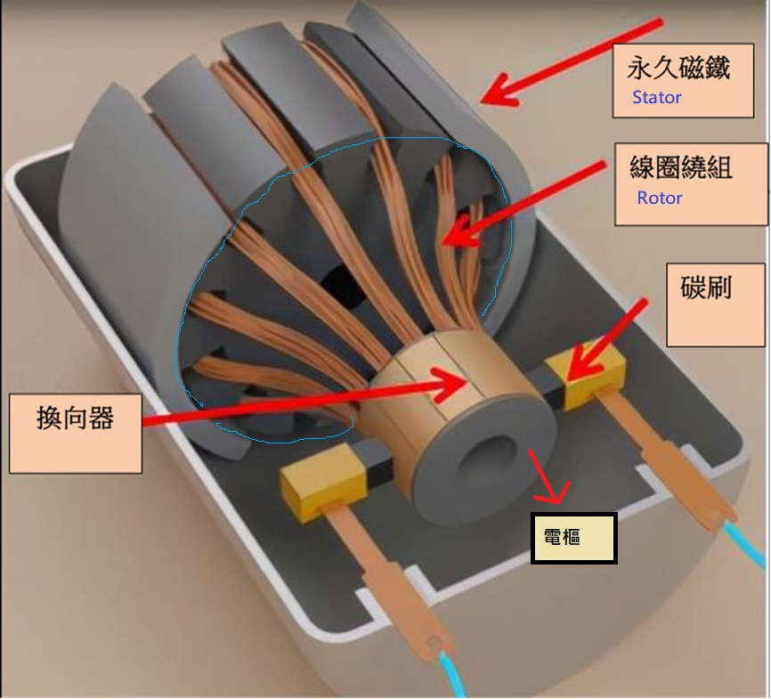
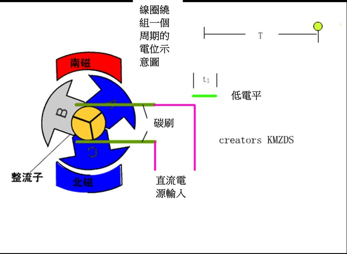
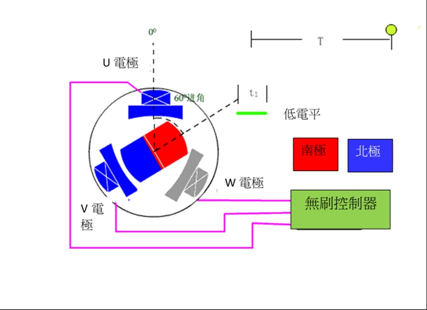

Motor
---

Motor 原理是依據右手定則, 當電流進入特定模式的線圈時, 會產生電磁效應, 進而與磁鐵形成互斥或相吸的特性, 互斥與相吸可促使裝置連續轉動而產生動能

Motor 主要由 stator(定子) 及 rotor(轉子) 構成

**傳統 Motor 示意**

+ Stator
    > Motor 中保持固定不動的部分
    >> 傳統會安裝**永久磁鐵**或者**激磁(勵磁)線圈**在其上 (通常有閉合磁路的設計).

+ Rotor
    > 繞固定中心轉動的部分

+ Commutator (整流子 or 換向器)
    > 整流子是由許多銅片(換向片)組成圓筒形或盤形結構, 每一銅片均與電樞(Armature)繞組元件相連接. 當電樞轉動時, 銅片相繼與固定的電刷接觸.

    > + 在 DC Motor 中, 整流子將電樞繞組內的**交流電**變為電刷間的**直流電**.
    >> 每個電樞繞組元件兩端連接的換向片經過碳刷時, 這一電流改變方向或改變大小的過程, 稱為換向.
    >> 在換向過程中, 如果碳刷與整流子表面接觸不良, 碳刷和換向片的接觸面上可能出現火花, 甚至發生環火現象引起繞組的燒損

    > + 在 AC Motor 中, 整流子的作用是使電刷間**交流電的頻率**符合工作要求。

# 各領域的 Motor 驅動系統

各種 Motor 的性能比較與驅動控制技術
> + `O+`: 代表表現特別出色
> + `X` : 代表表現較差

| Motor驅動結構       |  有刷 DC Motor(DCM)  |步進Motor(STM)  永磁型(PM) | 步進Motor(STM)  混合型(HB)| 感應Motor(IM) | 表面永磁同步 Motor (BLDCM/SPMSM) | 內嵌式永磁同步Motor  永磁磁阻Motor  (IPMSM/PRMSM) | 磁阻同步Motor  開關式磁阻Motor  (SynRM/SRM)|
| :-                 | :-                   | :-                          | :-                          | :-           | :-                             | :-                                                    | :-                                             |
| 轉矩產生原理         |  磁鐵(吸/斥)         |  磁鐵(吸/斥)                 | 磁鐵(吸/斥)                  | 渦電流(吸/斥) |  磁鐵(吸/斥)                    |  磁鐵+鐵芯(吸引)                                       |  鐵芯(吸引)                                     |
| 高轉矩              |    O                |    △                        |  △                         |  △          |    O                          |    O+                                                  | O                                             |
| 高速旋轉            |    O                 |   △                        |  △                         |  O+          |    O                          |    O+                                                  | O+                                             |
| 高效率              |    △                |    X                        |  △                         |  △          |    O                           |   O+                                                 |  △                                            |
| 高速響應特性         |    △                |   O+                        |  O+                        |  O           |    O+                           |   O+                                                 |  O                                             |
| 高旋轉精度          |     O                |    O                        |   O+                        |   △         |    O+                          |    △                                                 | △                                            |
| 靜音/低振動         |     O                |    △                       |   △                        |   O          |    O+                           |   △                                                 |  X                                            |
| 價格/轉矩           |     O                |    O                        |   O                         |   O+         |   △                           |    △                                                 | O ~ O+                                         |
| 功率元件數          |  單相半/單相全         |  單極/雙極驅動               |  單極/雙極驅動               |   逆變器      | 兩相半/三相半/單相全/三相全/兩相全 |   三相全                                              | 三相                                           |
| 主要驅動控制方式     | H 橋驅動/PWM 旋轉控制  |  H 橋雙極/單極驅動/全步/半步/微步/開環/閉環(無失步)三相、五相微步 |  H 橋雙極/單極驅動/全步/半步/微步/開環/閉環(無失步)三相、五相微步 |  V/F控制, 電流矢量控制     | 三相120度/150度/正弦波FG速度相位控制/超前角控制/無傳感器/電流矢量控制(id=0)/無傳感器/低噪聲   |  電流矢量控制(最大轉矩, 弱磁)/無傳感器/低噪聲/Motor常數可調控制 |   電源再生/電容再生(硬開關,軟開關)/磁能再生/電阻消耗方式/電流矢量控制/轉矩紋波控制/各種觀測器|

## 工業設備(通用逆變器, AC伺服, 功率調節器 etc.)

+ 設備
    > 風扇, 泵, 紡織設備, 搬運設備, 食品加工設備, 土木工程設備, 化工設備,
    包裝設備, 木材加工設備, 金屬加工設備, 造紙/印刷設備, 半導體裝置, 健康/醫療設備,
    福利護理相關設備, 環境/生活相關設備, 新能源相關設備

+ 主要 Motor
    - 單相感應 Motor
        1. 驅動方式
            > 三端雙向交流開關 ON/OF F控制電壓可調
    - 永磁同步 Motor (IPMSM or SPMSM)
        1. 驅動方式
            > 同三相感應 Motor
    - 三相感應 Motor (效率規格制定: 標準IE1, 高效率IE2, 超高效率IE3, 超超高效率IE4)
        1. 驅動方式
            > 可變速變頻器控制: 120° 矩形波, 180° 正弦波無傳感器電流矢量控制(PWM/PAM)
            > + id=0 控制
            > + 最大轉矩控制
            > + 弱磁控制,
            > + 繞組切換, 極數切換控制或非變頻器控制 (V/F Control)

+ 性能需求
    > 高效化, 小型化, 支持海外標準, 支持規範規制, 低噪音化, 高啟動轉矩化, 低振動化, 輕量化

## 車用驅動系統

+ 設備
    > HEV/EV 主機 Motor, 小型電動 Motor

+ 主要 Motor
    - 永磁同步 Motor
        1. 驅動方式
            > 同三相感應 Motor

    - 三相感應 Motor
        1. 驅動方式
            > 180° 正弦波無傳感器電流矢量控制
            > + 最大轉矩控制
            > + 弱磁控制
            > + 繞組切換, 極數切換控制(PWM/PAM), 發電再生控制, 繞組切換

    - 無刷直流 Motor
        1. 驅動方式
            > 120° 梯形波PWM驅動, 兩相/三相調製正弦波 PWM 驅動

+ 性能需求
    > 小型高輸出, 可變速運轉範圍廣, 高效率

## 家電

+ 設備
    > 空調(壓縮機, 風扇), 電冰箱(壓縮機), 洗衣機

+ 主要 Motor
    - 永磁同步 Motor (IPMSM or SPMSM)
        1. 驅動方式
            > 120° 矩形波, 180° 正弦波無感測器, 電流向量控制(PWM/PAM)
            > + id=0 控制
            > + 最大扭矩控制
            > + 弱磁控制等容量(輸出)控制

    - 單相感應馬達
        1. 驅動方式
            > 三端雙向交流開關 ON/OFF 控制電壓可變

    - 萬向馬達
        1. 驅動方式
            > 同單相感應馬達

    - 三相感應 Motor
        1. 驅動方式
            > V/F Control, 180° 正弦波 PWM 控制

+ 性能需求
    > 運轉全域高效率回轉數控制, 低噪音, 低振動

    1. 洗衣機性能需求
        > 運轉全域高效率回轉數控制, 低噪音, 低振動, 正逆回轉控制

## AV, OA

+ 設備
    > ODD, CD, LBP, PPC, MFP, HDD

+ 主要 Motor
    - 無刷直流馬達
        > LBP, PPC, MFP, HDD
        >> 多邊形, 送紙, 鼓輪, 風扇

        1. 驅動方式
            > + 無感測器 PWM 驅動
            > + 速度/相位控制, 梯形波 PWM 驅動
            > + 2相/3相調制正弦波 PWM 驅動
            > + 單感測器, 無感測器正弦波 PWM 驅動
            > + 單相全波

    - 有刷直流馬達 (ODD, CD)
        1. 驅動方式
            > 線性 BTL 驅動, 編碼器速度位置控制

    - 步進馬達
        1. 驅動方式
            > + 微步 PWM 驅動
            > + 單極, 雙極驅動, 全步, 半步, 微步

+ 性能需求
    > 高速回轉, 低振動, 低噪音, 起動安定性

    - LBP, PPC, MFP, HDD
        > 低回轉不均勻回轉數控制

## Vendor

+ STMicroelectronics 1200V S series
    - [STGW40M120DF3](https://www.st.com/en/power-transistors/stgw40m120df3.html)

+ [Infineon CoolSiC™ MOSFETs](https://www.infineon.com/cms/en/product/power/mosfet/silicon-carbide/)

# Motor Control

Motor 的控制方法大致上可簡單分為
> + Scalar Control (純量控制法)
> + Vector Control (向量控制法)

## Scalar Control

傳統的永磁同步馬達為 Scalar Control, 也就是 V/F Control(Voltage/Frequency Control, 電壓頻率控制), 也稱為 VVVF(Variable Voltage Variable Frequency Control, 變壓變頻控制),
> 根據轉速命令, 調整輸出頻率, 為獲得最高運轉效率(保持馬達磁通量), 也必需同時調整輸出電壓大小

此控制方法雖然可以達到轉速與轉矩控制的目的, 但有啟動轉矩小, 響應速度慢, 精確度差, 容易受負載所影響等問題的產生

## Vector Control

Vector Control 包含了 FOC (Field Orient Control, 磁場導向控製), 可以更精確更有效率, 同時也解決了傳統 Scalar Control 的缺點,
使得交流馬達伺服系統, 得以擺脫傳統的 V/F Control, 使得 AC Motor 等同 DC Motor 控制方式,
因此獲得如同 DC Motor  一般簡易的操控概念

# 依電源可分類

+ 直流(DC)馬達
    > 使用永久磁鐵或電磁鐵, 電刷, 整流子等元件
    電刷和整流子將外部所供應的直流電源, 持續地供應給轉子的線圈, 並適時地改變電流的方向, 使轉子能依同一方向持續旋轉

    >> 不宜在高溫, 易燃等環境下操作

+ 交流(AC)馬達
    > 將交流電通過馬達的定子線圈, 設計讓周圍磁場在不同時間, 及不同的位置推動轉子, 使其持續運轉
    >> 可以在高溫, 易燃等環境下操作, 而且不用定期清理碳刷的污物 (Brushless)

    > 在控制轉速上比較困難, 若要控制 AC Motor 轉速, 需要調整交流電的頻率, 控制其電壓只會影響電動機的扭力
    >> + Current frequency 控制**轉速**
    >> + Voltage 控制**扭力**

    - Synchronous Motor (同步 Motor)
        > 轉動週期與電源的頻率同步(通常為三相或 3*N 相), 不受電壓的影響, 只能使用變頻器去調整電源頻率來進行調速

        1. 永磁同步電動馬達
            > 永磁在前而同步在後, 轉子使用永久磁鐵製作而成, 而在外圈的定子進行通電產生磁性後, 內部的永磁轉子便會開始同步驅動(因而便以**永磁同步電動馬達**稱之).
            >> 因為是同步驅動的特性, **反應較為即時**, 損耗較低等優點, 體積更小, 重量更輕

    - Asynchronous Motor (非同步 Motor), 又稱為 Induction Motor (感應馬達)
        > 其轉數與 50/60Hz 頻率不成正比

        1. 具有更高的運行效率和更好的運行特性, 從滿載範圍接近恆速運行
            > 它們還能滿足工農業機械中的大部份傳動要求

        1. 感應式在前, 非同步在後的主從關係; 轉子使用高導材料繞制而成, 當外部定子通電產生磁場的同時, 便會開始影響內部轉子進行驅動
            > 由於是一層一層相互感應和影響的路徑, 因而**轉子總是在追趕著定子旋轉磁場的速度**, 也得到**感應式非同步電動馬達**之名

        1. Tesla (2019年以前車款為感應式非同步, 之後 Model /X 改為永磁同步+感應式非同步) 使用了感應式非同步電動馬達的結構設計
            > 感應式非同步電動馬達(定子通電-轉子再感應)效率絕對不比永磁同步馬達高, 且高導材料的轉子, 減重效果也絕對比不過永久磁鐵(還需要更為複雜的冷卻系統),
            但由於**功率提升速度較快(加速性能強)**和**易於控制**的優勢, 並且不需稀土資源(釹, 鐵, 硼等), 有**較低的製造成本**

+ 脈衝馬達
    > 電源經過數位IC 處理, 變成脈衝電流以控制馬達, 步進馬達就是脈衝馬達的一種

    - 步進馬達
        > 是一種帶無刷電子管理的同步脈衝直流馬達, 可將其旋轉分步, 透過簡單的控制系統, 實現非常精確的定位. 主要用於自動化, 機器人和電腦週邊(印表機, 繪圖器等)
        >> 步進馬達的目標是將軸保持在穩定位置(如果只是對其簡單地通電, 步進馬達只會停在一個非常精確的位置)

        > 步進馬達在**低角速度**下具有**高扭矩**, 這對於以最大速度加速有效負載就很有用

        > 步進馬達有兩種類型, 區別在於電磁鐵的連接方式:
        > + 5~6 線的單極
        > + 4 線的雙極

        > 還有混合動力引擎可以使用不同的馬達電纜, 以單極和雙極兩種模式工作

# Brush v.s. Brushless

Brush (電刷) 多用石墨製成, 故也稱碳刷, 負責在旋轉部件與靜止部件之間傳導電流, 多裝配於換向器

## Brush (有電刷) motor

用機械換向, 磁極(磁鐵)為固定體不動, 轉動線圈繞組部件; 線圈電流方向的交替變化, 是隨 Motor 轉動的換相器和電刷來完成的, 而電源只需正負接線
> 隨著 Motor 轉動, 不同時刻給不同線圈或同一個線圈的不同兩極通電, 使得線圈產生磁場的 N-S 極,
與最靠近的 Stator (永久磁鐵)的 N-S 極, 有一個適合的角度差, 藉由相吸相斥特性, 產生動能推動 Motor 轉動

+ 使用變壓調速, 藉由調整後的電壓電流, 通過整流子及電刷轉換, 改變電極產生的磁場強弱, 達到改變轉速的目的

+ Brush motor 的優點
    - Motor 結構簡單, 且相關製程成熟
    - 運行平穩, 起動/制動效果好
    - 電磁力回應速度快, 起動扭矩大
    - 僅需控制電壓即可控制轉速, Controller 技術門檻低

+ Brush motor 的缺點
    - 碳刷摩擦聲因大, 換向器損耗大
    - 效率低, 無效功轉換為熱能, 電機容易發熱使用壽命短
    - 因其為接觸式換向, 換向過程會產生火花, 對電網干擾大
    - 因其效率低, 故於同一輸入功率所轉換的輸出動能較小
        > 效能約略為 55%
    - 只能連續工作約 5000 小時, 正常使用壽命為 2-3 年, 壽命低

## [Brushless (無電刷) motor](note_BLDC.md)

採取電子換向(由 MCU 中的控制電路完成), 線圈繞組部件固定不動, 轉動磁鐵, 而電源需要 U/V/W 三線接線
> + 通過**霍爾元件**偵測永久磁鐵**磁極的位置**, 再適時切換線圈中電流的方向, 進而產生正確方向的磁力來驅動 Motor, 消除了 Brush Motor 的缺點
>> 若裝有傳感器的無刷電機, 還需要一條五芯的霍爾感應線

+ 使用變頻調速, 在電壓不變下, 通過 MCU 改變控制信號, 再改變大功率 MOS 管的開關速率, 來實現轉速的改變

+ 可以實現一些 Brush Motor 無法能實現的功能
    > + 整電源切換角度, 使 Motor 反轉或是鎖住 Motor
    > + 不需在轉子上另加啟動繞組
    > + 不會在負載突變時, 產生振盪和失去同步

+ Brushless motor 的優點
    - 無電刷接觸火花, 電磁干擾低
    - 運轉噪音低, 運轉順暢
    - 沒有接觸性耗損零件, 使用壽命長, 可以連續工作約 20,000 小時, 常規使用壽命為 7-10 年
    - 沒有碳刷及換向片接觸碳化問題, 電機免保養
    - 三相換相之控制, 爆衝零風險
    - 無刷電機的效能可達 85% 以上, 無刷系統更節能

+ Brushless motor 的缺點
    - 無刷電機繞線為三相式接法, 電機設計較複雜
    - 控制演算法技術要求高, 驅動電路複雜
    - Brushless Controller 成本比 Brush Controller 高
    - 對相位偵測精度要求高, 電機量產設備要求高
    - 啟動和制動時不平穩, 較難精準讓 Rotor 停在特定的角度

# Reference
+ [關於馬達](https://www.nidec.com/cn/technology/motor/)
+ [有刷與無刷馬達控制系統簡介](https://www.sunrise-tech.com.tw/faq/detail/9)
+ [各領域的馬達驅動系統概述](https://techweb.rohm.com.tw/knowledge/motor/basics/basics-01/38)

