Phase (相位) [[Back](note_BLDC.md)]
---

相位(相位角)投影到時間座標平面(波形)時, 使用三角函數來表達波形, 過於抽象難以理解, 為了便於分析, 導入複數平面的相量圖(Phasor)的概念

**三角函數**
```
s1(t) = A * sin(ωt+0°)
s2(t) = A * sin(ωt+θ)
```

**Phasor (是 Phase Vector 的混成詞)**

```
s1 = A * ∠0°
s2 = A * ∠θ°
```

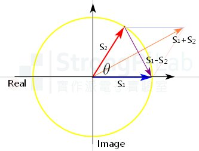


相量 S1 與 S2 的加減, 完全就是 Vector 運算, 算完的結果最後只要投影在水平的實數軸上, 就幾乎能想像最後的波形長甚麼樣子了
> 訊號波形都是實數(Real), 為了要幫助分析採用複數運算, 虛數(imaginary)不會出現在生活中, 它只是數學上創造出來的東西而已
>> Phasor 一定是個 Vector, 但是 Vector 不見得是個 Phasor

**實數(X-軸)投影量**

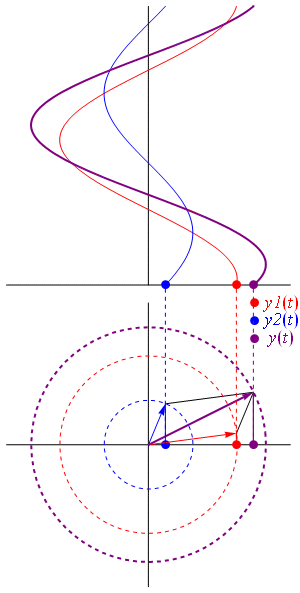

## Euler formula (歐拉公式)

18 世紀的數學家兼工程師Euler, 他發現三角函數與複數之間的關係, 可以用指數的複數次方來表示

```
Euler formula:

e^(jθ) = cosθ + j * sinθ
```

所以任何一個弦波我們都能寫成

```
s(t) = A * ∠θ°                           => 相量式
     = A * e^(j(ωt+θ))                   => Euler formula
     = A * cos(ωt+θ) + j * A * sin(ωt+θ) => 展開式
```

# 正弦波 (Sin)

**相位投影到座標系統**
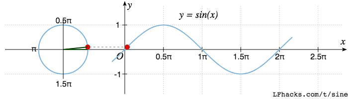

```
y = A * sin(x)
  = A * sin(wt + θ)
A 為最大振幅(半徑大小), w 為角速度(改變 frequency), t 為單位時間, θ 為相位偏移
```

## Complex Sin

```
z =    x     + i * y
  = A * (cos(θ) + i * sin(θ))
  = A*cos(θ) + i * A*sin(θ)

x = A*cos(θ)  => 實數投影量(波形變化)
y = A*sin(θ)  => 若複數呈現, 變成螺旋波形
θ = wt
```
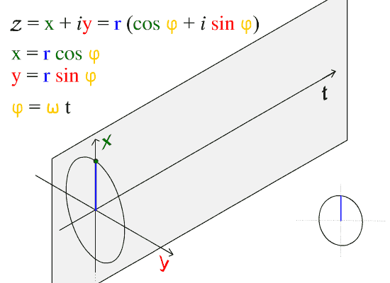


# Phase Lead and Phase Lag

綠點領先紅點 90 度, 反過來說紅點落後綠點 90 度
> 在數學式上, 落後相位的波形相位角為**負數**

```
Y_green(t) = A * sin(ωt)        -> Green waveform
Y_red(t)   = A * sin(ωt – 90°)  -> Red waveform
```

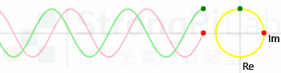


# Fourier 轉換

訊號在 Time/Frequency domain 間的關係

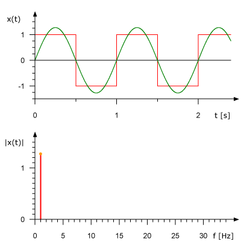

**概念圖**

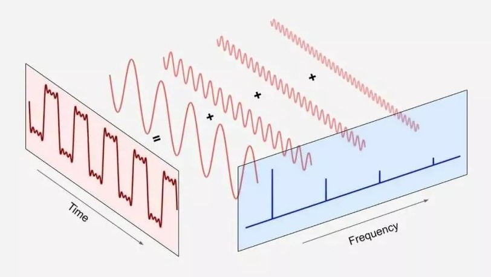

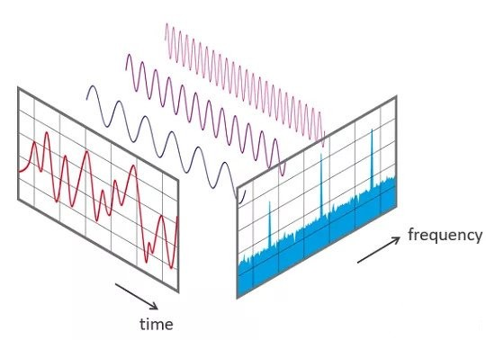

+ 當多個弦波混合在一個 Phasor 平面上時
    > 多個弦波 convolute 在一起時, 高頻訊號會乘載在低頻訊號的圓周上

    - [合成鋸齒波 High Resolution](https://upload.wikimedia.org/wikipedia/commons/1/1e/Fourier_series_sawtooth_wave_circles_animation.svg)

        

    - [合成方波 High Resolution](https://upload.wikimedia.org/wikipedia/commons/b/bd/Fourier_series_square_wave_circles_animation.svg)

        

    - [合成三角波 High Resolution](https://upload.wikimedia.org/wikipedia/commons/b/b2/Fourier_series_triangle_wave_circles_animation.svg)

        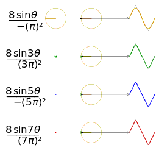

# 三相交流電

所謂三相交流電, 就是供電方式需要用到三個相位, 因此物理結構上需要三組線圈(或繞組), 目前三相發電最經濟, 因此世界各國普遍使用三相
> 三相交流電, 每組線圈間隔 120°, 產生出來的電壓電流, 彼此也就相差 120°

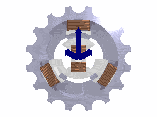

+ Phase sequence (相序)
    > 三相電有相序的分別, 任兩條接反了馬達會反轉(不像一般家裡的單相電, 正反插電風扇都轉同一邊), 所以相序很重要.
    > + **正相序(Positive)**
    >> 以相量圖**逆時針旋轉**, 固定某一點依序通過`線圈R` -> `線圈S` -> `線圈T` (標示為 `R-S-T`)

    > + **負相序(Negative)**
    >> 以相量圖**順時針旋轉**, 固定某一點依序通過`線圈R` -> `線圈T` -> `線圈S` (標示為 `R-T-S`)

    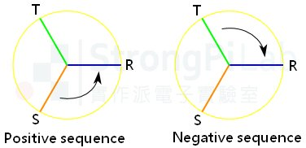

# Reference

+ [正弦曲線](https://zh.wikipedia.org/wiki/%E6%AD%A3%E5%BC%A6%E6%9B%B2%E7%B7%9A)
+ [相位 領先-落後-單相-三相-原來是這樣](https://www.strongpilab.com/phase-lead-lag-single-phase-and-three-phase/)


