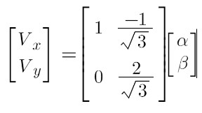
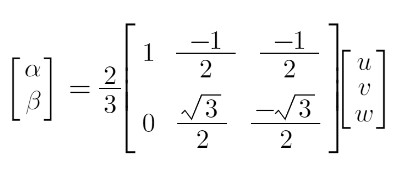
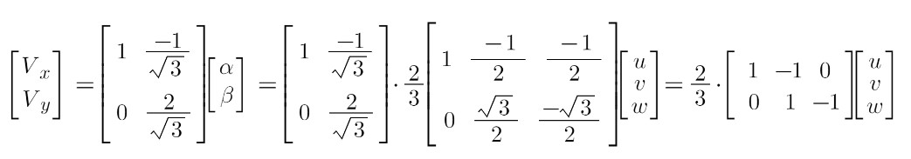
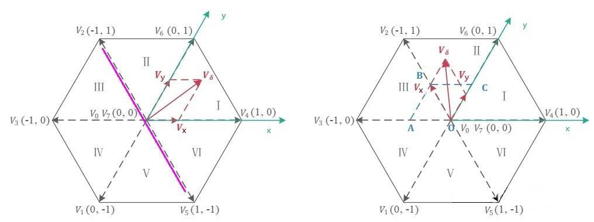
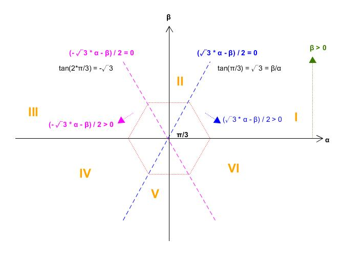

SVPWM (Space Vector PWM) [[Back](note_Brushless.md)]
---

只有在空間按正弦分佈的物理量, 才可以用空間向量表示, 而 Voltage/Current 只是相量, 時間域上才有物理意義, 空間域並沒有意義.

但各相繞組所產生的的空間磁動勢, 是以三相繞組為軸線, 沿圓周正弦分佈的空間向量 (既然是空間向量, 就可以滿足向量合成規則合成); 而各自幅值是取決於各相繞組電流的瞬時值
> 三相繞組合成的磁動勢, 是三相電流通過三相繞組共同作用結果, 當三相電流時間對稱和三相繞組空間對稱同時滿足時,
合成磁動勢幅值不變, 以角速度為電頻率旋轉的一個圓

當 Motor 穩定後, 定子每相繞組磁動勢幅值和相電流僅存比例關係 (即相電流瞬時值, 完全確定了每軸的磁動勢向量),
而磁動勢在空間又是空間正弦分佈的, 每相軸線空間位置又確定, 這樣原本是時間變數的電流就具有空間物理含義
> Current 只在各自軸線上一個時間變數, 並不在空間正弦分佈, 只是 Current 激勵出的磁動勢, 的確為空間正弦分佈.<br>
從這個意義來說, Current可以理解為空間向量.

> 對於三相電壓來說, 可以通過調節相電壓改變相電流, 進而控制磁動勢和空間磁場, 以實現對 Motor 物理量的向量控制.<br>
從這個角度來說, 電壓同樣也可以理解空間向量

整體來說, 由 Voltage 激勵出 Current, Current 產生磁動勢, 而磁動勢又具有空間向量屬性 (符合空間向量合成條件),
因此 Motor 上的時間變數 Voltage/Current 才有了空間物理意義

## 3-Phase Inverter 相電壓


U/V/W 為三個相繞組, Ru, Rv, Rw 則為其相電組, 且 `Ru = Rv = Rw`, Vun 表示 U to N 的相電壓 <br>
Rv 和 Rw 為並聯, 則 N to G 的 等效電阻 `Rng = Ru / 2`, 則

```
Vun = 2 * Vng = 2 * Vnv = 2 * Vnw (串聯分壓定理)
ps. Vnv = Vnw

Vdc = Vun + Vng = Vun + (Vun / 2)
則
    Vun = (2 * Vdc) / 3
    Vng = Vnv = Vnw = Vdc / 3
```


3-Phase Inverter 依照上下橋臂的狀態, 其相電壓 `Vun / Vvn / Vwn`
> V0/V7 (零向量) 用來調整責任比, 以及做為當象限變換時的轉移向量 (transition vector)

| state (UVW) | Vector | Vun       | Vvn       | Vwn       |
| :-:         |  :-:   | :-:       | :-:       | :-:       |
| 000 (UVW)   |  V0    |  0        |  0        |  0        |
| 100 (UVW)   |  V4    | 2Vdc / 3  |  -Vdc / 3 | -Vdc / 3  |
| 110 (UVW)   |  V6    | Vdc / 3   |   Vdc / 3 | -2Vdc / 3 |
| 010 (UVW)   |  V2    | -Vdc / 3  |  2Vdc / 3 | -Vdc / 3  |
| 011 (UVW)   |  V3    | -2Vdc / 3 |   Vdc / 3 |  Vdc / 3  |
| 001 (UVW)   |  V1    | -Vdc / 3  |  -Vdc / 3 | 2Vdc / 3  |
| 101 (UVW)   |  V5    |  Vdc / 3  | -2Vdc / 3 |  Vdc / 3  |
| 111 (UVW)   |  V7    |  0        |  0        |  0        |


+ 3 個相電壓可合成**三相逆變器電壓向量平面** (實際三相逆變器的輸出結果)
    > 
    >> 三相正弦相位平面, 可經由 Clark Transform 轉換到 α-β 正交平面, 而其投影量 `Uα/Uβ` 可直接對應到**三相逆變器電壓向量平面**

+ 三相逆變器電壓向量公式
    > + 最外層的 `2/3` 倍率, 是因為三相正弦電壓合成會增幅 3/2 倍, 為了讓兩個平面增幅匹配, 在空間電壓向量乘上 2/3 倍率. <br>
    > + `e^(j*π/3)` 表示 Phase 位移 60°

    


## **正弦相位平面**對應到**三相逆變器電壓向量平面**

三相正弦相位平面 (理想中的三相逆變器輸出結果)
> + A 軸對應 U 相繞組, B 軸對應 V 相繞組, C 軸對應 W 相繞組. <br>
> + 角速度和**三相逆變器電壓向量平面**相同
> + 黑色合成電壓向量可叫做**參考電壓向量(Vδ)**


當**正弦相位平面**要對應到**三相逆變器電壓向量平面**時, 需使用相電壓向量(V0 ~ V7), 並依照**參考電壓向量(Vδ)**, 來合成**輸出電壓相量(Vout)**
> 

Vδ 是理想上的電壓相量, 其相量頂點軌跡會是一個圓形, Vout 則是 MCU 控制所生成的相量. 為了讓 Vout 逼近 Vδ, 可在圓周上取樣, 當取樣率越高, 兩者就越相似.

```
Ts 是取樣週期, 以 10KHz 取樣頻率
    Ts = 1000ms/10k = 0.1 ms

50 Hz 的 sin 參考訊號 (0 ~ 2π 為 50Hz)
    samples = (1000ms/50) / Ts = 20ms / 0.1ms = 200

因此可以將圓形等分切成 200 個扇形區域, 每個扇形區域週期即為 Ts
多個 Ts 組成一個 Section, 並對應到 Section I ~ VI
```

### 基底轉換 (α-β axis to Space-Vector axis)


+ Vδ 從 α-β 轉換到 Vx/Vy, 其關係式
    > Vx/Vy 分別為 V0 ~ V7 中任意 2 個基底

    

+  Clark formula

    

+ 從 UVW domain 轉換 Space-Vector domain

    

### 判定 Section

為了標幺化, 將 V0 ~ V7 除以 `2Vdc / 3`(排除震幅的變動), 讓其範圍落在 0 ~ 1 之間, 進而以坐標的形式來表示
> 標幺值 (Per-unit value) = 實際值 / 基準值



```
V2 boundary (粉紅線): Vx + Vy = 0 => 當 (Vx, Vy) = (-1, 1) 代入線性方程式
```

| Phase of Vout             | condition                |
| :-                        | :-                       |
| Section I   (0° ~ 60°)    |   Vx >= 0, Vy >= 0       |
| Section II  (60° ~ 120°)  |   Vx + Vy >= 0, Vy >= 0  |
| Section III (120° ~ 180°) |   Vx + Vy <= 0, Vy >= 0  |
| Section IV  (180° ~ 240°) |   Vx <= 0, Vy <= 0       |
| Section V   (240° ~ 300°) |   Vx + Vy <= 0, Vx >= 0  |
| Section VI  (300° ~ 360°) |   Vx + Vy >= 0, Vx >= 0  |


### 作用時間

當 Vδ 位於 `Section II ~ VI` 時, 可將其轉換到 `Section I`, 以進一步簡化計算

以 Section-I 為例, Vδ 可用 V0/V4/V6/V7 來合成
> Uα/Uβ 為 Vδ 在 α-β 正交平面的投影量, 由三角函數可獲得 Vδ 的分量 `Vα/Vβ`
> 
>> 一個 Ts 中, 逆變器執行一次演算法(計算目前落在哪一個 Section, 以求得對應的 PWM 參數), 並更新一次 PWM 訊號
>> + T4 是在一個 PWM 開關週期 Ts 內, 電壓向量 V4 持續的時間. 同理,
>> + T6 是在一個 PWM 開關週期 Ts 內, 電壓向量 V6 持續的時間 <br>

> 按照伏秒平衡原則來合成每個磁區內的任意電壓向量
>> Volt-Second_balance (伏秒平衡)指處於穩定狀態的電感, 電感兩端的正伏秒積等於負伏秒積, 也就是電感兩端的伏秒積在一個開關週期內必須相等
>  <br>
> 離散化後, 可等效為 `Ts * Vout = T4 * V4 + T6 * V6 + T0 * V0 + T7 * V7`

```
Ts * Vout = T4 * V4 + T6 * V6 + T0 * V0 且 Ts = T4 + T6 + T0
=> Vout = (T4 * V4 / Ts)  + (T6 * V6 / Ts) + (T0 * V0 / Ts)
   Vout = (T4/Ts) * V4 + (T6/Ts) * V6 + (T0/Ts) * V0
    Vα = (T4/Ts) * V4   --- (1)
    Vβ = (T6/Ts) * V6   --- (2)

由三角函數 (Vβ 可平移到藍色虛線, V6 與 V4 相位差 π/3)
Uβ                   = |Vout| * sin(θ) = |Vβ| * sin(π/3)        --- (3)
紅色虛線(與 Vout 正交) = |Vα| * sin(θ) = |Vβ| * sin((π/3) - θ)    --- (4)

    由 (4)
    |Vβ| = |Vα| * sin(θ) / sin((π/3) - θ)  --- 代入 (3)
    => |Vout| = |Vα| * sin(π/3) / sin((π/3) - θ)

    由 (4) 亦可得
    |Vβ| / sin(θ)  = |Vα| / sin((π/3) - θ)

    Vout 與分量 Vα/Vβ 的關係式

     |Vout|           |Vα|           |Vβ|
    ________  = ________________ = ________     --- (5)
    sin(π/3)     sin((π/3) - θ)     sin(θ)
```

結合 3-Phase Inverter 狀態相電壓

```
|V4| = |V6| = 2 * Vdc / 3
|Vout| = Um  ---> (Vδ 量級)

|Vα| = (T4/Ts) * |V4|                           --- from (1)
     = (|Vout| * sin((π/3) - θ)) / sin(π/3)     --- from (5)
     = (|Vout| * sin((π/3) - θ)) / (√3/2)
     = 2 * (|Vout| * sin((π/3) - θ)) / √3

|Vβ| = (T6/Ts) * |V6|                           --- from (1)
     = (|Vout| * sin(θ)) / sin(π/3)             --- from (5)
     = 2 * (|Vout| * sin(θ)) / √3


T4 = (|Vα| * Ts) / |V4|
   = ((2 * (|Vout| * sin((π/3) - θ)) / √3) * Ts) / |V4|
   = ((2 * (|Vout| * sin((π/3) - θ)) / √3) * Ts) / (2 * Vdc / 3)
   = (3 * Um * sin((π/3) - θ) * Ts) / (√3 * Vdc)
   = (√3 * Um * sin((π/3) - θ) * Ts) / Vdc

T6 = (|Vβ| * Ts) / |V6|
   = ((2 * (|Vout| * sin(θ)) / √3) * Ts) / |V6|
   = ((2 * (|Vout| * sin(θ)) / √3) * Ts) / (2 * Vdc / 3)
   = (3 * (|Vout| * sin(θ)) * Ts) / (√3 * Vdc)
   = (√3 * Um * sin(θ) * Ts) / Vdc

其中 '(√3 * Um) / Vdc', 可視為一個 modulation index (M), 可以當作是調整力矩的大小

T0 = T7 = (Ts - T4 - T6) / 2

其他 Section area case,

θ' = ((θ - (π/3)) * (section_id - 1))

Tx = (√3 * Um * sin((π/3) - θ') * Ts) / Vdc
Ty = (√3 * Um * sin(θ') * Ts) / Vdc

ps. Tx/Ty 分別代表, 不同 Section 各自基底向量的作用時間

```

### 狀態切換的順序

因為 Volt-Second_balance (伏秒平衡) 是做積分, 重要的是持續時間(面積)而不是順序, 一個週期內可以任意切換順序.<br>
為了儘量減少 MOS 管的開關次數, 會以最大限度減少開關損耗為目的, 來安排狀態切換順序
> 角速度 ω 固定, 只有時間 t 是變量, 因此只要維持當前三相繞組的磁場, 隨時間的改變, 就能產生推力. <br>
V0 ~ V7 的切換, 是藉由改變 3 個繞組的電壓, 來維持磁場的穩定, 因此只要能保持磁場狀態, 改變 3 個繞組電壓的順序, 就可以有許多變化

+ 7 段式 SVPWM
    > 電壓向量對應著不同的逆變器開關狀態, 則在電壓向量間的切換, 就對應著不同的逆變器開關狀態間的切換.
    理想上, 在切換電壓向量的時候, 只更動逆變器一個相上的開關狀態, 其損耗會是最小,
    通過引入零向量 (V0/V7), 使產生的 PWM 對稱(有效地降低 PWM 的諧波份量), 就可以輕鬆實現這一目標
    >> 將兩個零向量, 平均分配到中間和兩端 `V0 -> V4 -> V6 -> V7 -> V7 -> V6 -> V4 -> V0` <br>
    >> 

    >> 當轉到了下一個 Section 時, 電壓向量合成過程, 都是從一個零向量開始, 這可保障**參考電壓向量(Vδ)**的連續性
    


    | Phase of Vout             | Vector  order                                 |
    | :-:                       | :-:                                           |
    | Section I   (0° ~ 60°)    | V0 -> V4 -> V6 -> V7 -> V7 -> V6 -> V4 -> V0  |
    | Section II  (60° ~ 120°)  | V0 -> V2 -> V6 -> V7 -> V7 -> V6 -> V2 -> V0  |
    | Section III (120° ~ 180°) | V0 -> V2 -> V3 -> V7 -> V7 -> V3 -> V2 -> V0  |
    | Section IV  (180° ~ 240°) | V0 -> V1 -> V3 -> V7 -> V7 -> V3 -> V1 -> V0  |
    | Section V   (240° ~ 300°) | V0 -> V1 -> V5 -> V7 -> V7 -> V5 -> V1 -> V0  |
    | Section VI  (300° ~ 360°) | V0 -> V4 -> V5 -> V7 -> V7 -> V5 -> V4 -> V0  |

    - 7 段式而言, 諧波含量較小, 每個開關週期(section), 有 6 次開關切換

    - **判斷 Vout(Vδ) 所處的磁區**
        > 藉由分量 `Vα/Vβ` 經反三角函數 `arctan()`, 可計算出所成的相位角 θ', 從 θ' 就可知道所處的 Section

        ```
        tan(60°) = √3

        Section I   : 0°   < arctan(Vβ/Vα) < 60°    => Vα > 0, Vβ > 0 且 (Vβ/Va) < √3
        Section II  : 60°  < arctan(Vβ/Vα) < 120°   => Vα > 0         且 (Vβ/Vα) > √3
        Section III : 120° < arctan(Vβ/Vα) < 180°   => Vα < 0, Vβ > 0 且 (-Vβ/Vα) < √3
        Section IV  : 180° < arctan(Vβ/Vα) < 240°   => Vα < 0, Vβ < 0 且 (Vβ/Vα) < √3
        Section V   : 240° < arctan(Vβ/Vα) < 300°   =>         Vβ < 0 且 (-Vβ/Vα) > √3
        Section VI  : 300° < arctan(Vβ/Vα) < 360°   => Vα > 0, Vβ < 0 且 (-Vβ/Vα) < √3
        ```

        1. 邊界線性方程式
            > + `β = 0`
            > + `tan(π/3) = (β/α)`
            > + `tan(2π/3) = (β/α)`

            

+ 5 段式 SVPWM
    > 為了進一步減少開關次數, 採用每相開關在每個扇區狀態維持不變的序列安排, 使得每個開關週期(section), 只有 3 次開關切換, 但是會增大諧波含量

    | Phase of Vout             | Vector  order                                 |
    | :-:                       | :-:                                           |
    | Section I   (0° ~ 60°)    | V4 -> V6 -> V7 -> V7 -> V6 -> V4  |
    | Section II  (60° ~ 120°)  | V2 -> V6 -> V7 -> V7 -> V6 -> V2  |
    | Section III (120° ~ 180°) | V2 -> V3 -> V7 -> V7 -> V3 -> V2  |
    | Section IV  (180° ~ 240°) | V1 -> V3 -> V7 -> V7 -> V3 -> V1  |
    | Section V   (240° ~ 300°) | V1 -> V5 -> V7 -> V7 -> V5 -> V1  |
    | Section VI  (300° ~ 360°) | V4 -> V5 -> V7 -> V7 -> V5 -> V4  |


## Volt-Ampere balance (伏安平衡)

為使系統穩態, 就會使用電力變換中兩大儲能元件**電容**與**電感**, 而伏安平衡就為此提供了理論依據.

伏安平衡是一種以電壓或電流其相量(phasor)型式為基礎的數學陳述, 一般用在開關電路.
當開關電路穩定工作的時候, 其電感在一個開關週期內的**電流變化量**最終為 0, 也就是流入電流與流出電流是相等
> 在開關電路中, 一個週期因開關作用被分為兩段, 其中一段時間內電感電流在增加, 另一段時間內電感電流在減少.
當穩定狀態下, 在一個開關週期內, 電流的增加量與電流的減少量是相等

伏安平衡又可以電壓電流來分為
> + 伏秒平衡原則 (Volt-Second balance)
>> 在穩態工作的開關電源中, 電感兩端的正伏秒值等於負伏秒值
> + 安秒平衡原則 (Ampere-Second balance)
>> 在穩態工作的開關電源中, 電容兩端的正安秒值等於負安秒值

+ 伏秒平衡原則 (Volt-Second balance)
    > 也叫電感伏秒平衡, 為維持電感電流穩定, 只需要電感兩端電壓, 在一個開關週期內積分為 0 即可.
    >> 其一個開關週期內, 電感兩端電壓平均值為 0, 當電感兩端電壓為負, 電流反向上升.
    電感兩端電壓為正, 電流反向下降, 從而維持平衡

    > 那麼基於這樣的原理, 我們就可以通過控制佔空比, 來控制電感的電流, 最終達到控制輸出電流的目的

    - 伏秒值通常也稱作**伏秒積**, 即電感兩端的電壓 V 和這段時間 T 的積分
        > 物理學中並沒有這麼一個物理量, 但它就相當於電容中電流對時間的積分, 也就是電量, 單位是庫侖
        >> 積分結果並不是電流, 而是在 0~T 這段時間內, 通過電感電流的增量, 也就是這段時間內電感中**電流的變化量**

    - 伏秒平衡主要應用在電感等磁性元件上, 可以通過電磁理論來分析理解 (法拉第電磁感應定律)
        > 理想電感(不考慮內阻)的端電壓, 其來源是電感的感應電動勢, 電動勢等於磁鏈的變化,
        同樣也是電感電流的變化, 要維持電感電路開關週期內電流穩定, 就只需要磁鏈平衡即可.
        >> 電流上升, 磁鏈上升; 電流下降, 磁鏈下降; 這樣形成了磁鏈平衡

     那麼電流上升，磁鏈上升，電流下降，磁鏈下降，這樣形成了磁鏈平衡。


+ 安秒平衡原則 (Ampere-Second balance)
    > 也叫電容電荷平衡原理, 主要應用在對電容的穩態分析上.
    同樣當電容處於穩態過程中, 在一個開關週期內, 其開始時的電容電壓值, 應該等於結束時的電容電壓值

    - 安秒值也叫**安秒積**, 是電容電壓對時間的積分
        > 電流對時間積分, 便得到了電荷(電量),


# Reference

+ [*徹底吃透SVPWM如此簡單](https://zhuanlan.zhihu.com/p/414721065?utm_id=0)
+ [*手撕系列（2）：Clark變換與Park變換](https://zhuanlan.zhihu.com/p/293470912)
+ [*手撕系列（4）：空間向量調製（SVPWM）](https://zhuanlan.zhihu.com/p/303998608)
+ [【自制FOC驅動器】深入淺出講解FOC演算法與SVPWM技術](https://zhuanlan.zhihu.com/p/147659820)
+ [【數字電源】數字電源核心理論-"伏妙平衡"與"安秒平衡"](https://blog.csdn.net/qq_33471732/article/details/109089209?utm_medium=distribute.pc_relevant.none-task-blog-2~default~baidujs_baidulandingword~default-0-109089209-blog-24369903.pc_relevant_multi_platform_whitelistv3&spm=1001.2101.3001.4242.1&utm_relevant_index=3)
+ [FOC中的Clarke變換和Park變換詳解（動圖+推導+模擬+附件程式碼）](https://zhuanlan.zhihu.com/p/172484981)
