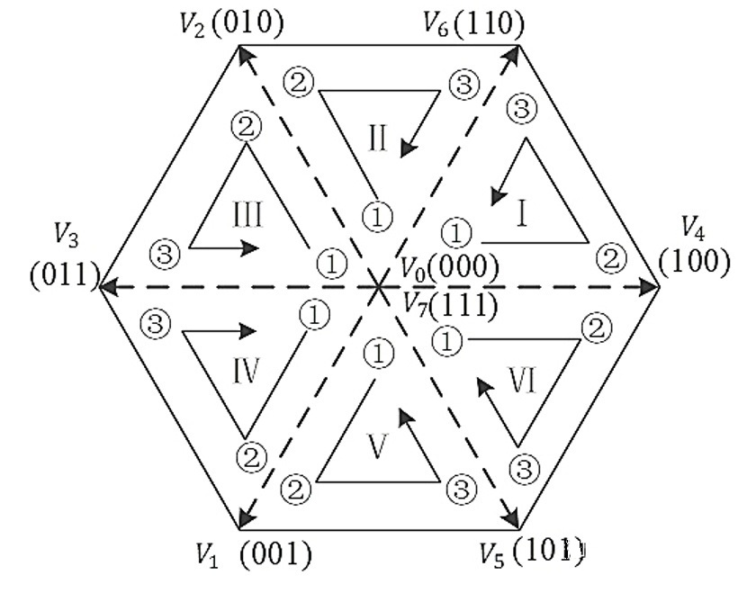

SVPWM [[Back](note_Brushless.md)]
---

## 3-Phase Inverter 相電壓


U/V/W 為三個相繞組, Ru, Rv, Rw 則為其相電組, 且 `Ru = Rv = Rw`, Vun 表示 U to N 的相電壓 <br>
Rv 和 Rw 為並聯, 則 N to G 的 等效電阻 `Rng = Ru / 2`, 則

```
Vun = 2 * Vng = 2 * Vnv = 2 * Vnw (串聯分壓定理)
ps. Vnv = Vnw

Vdc = Vun + Vng = Vun + (Vun / 2)
則
    Vun = (2 * Vdc) / 3
    Vng = Vnv = Vnw = Vdc / 3
```


3-Phase Inverter 依照上下橋臂的狀態, 其相電壓 `Vun / Vvn / Vwn`
> V0/V7 (零向量) 用來調整責任比, 以及做為當象限變換時的轉移向量 (transition vector)

| state (UVW) | Vector | Vun       | Vvn       | Vwn       |
| :-:         |  :-:   | :-:       | :-:       | :-:       |
| 000 (UVW)   |  V0    |  0        |  0        |  0        |
| 100 (UVW)   |  V4    | 2Vdc / 3  |  -Vdc / 3 | -Vdc / 3  |
| 110 (UVW)   |  V6    | Vdc / 3   |   Vdc / 3 | -2Vdc / 3 |
| 010 (UVW)   |  V2    | -Vdc / 3  |  2Vdc / 3 | -Vdc / 3  |
| 011 (UVW)   |  V3    | -2Vdc / 3 |   Vdc / 3 |  Vdc / 3  |
| 001 (UVW)   |  V1    | -Vdc / 3  |  -Vdc / 3 | 2Vdc / 3  |
| 101 (UVW)   |  V5    |  Vdc / 3  | -2Vdc / 3 |  Vdc / 3  |
| 111 (UVW)   |  V7    |  0        |  0        |  0        |


+ 3 個相電壓可合成**三相逆變器電壓向量平面** (實際三相逆變器的輸出結果)
    > 
    >> 三相正弦相位平面, 可經由 Clark Transform 轉換到 α-β 正交平面, 而其投影量 `Uα/Uβ` 可直接對應到**三相逆變器電壓向量平面**

+ 三相逆變器電壓向量公式
    > + 最外層的 `2/3` 倍率, 是因為三相正弦電壓合成會增幅 3/2 倍, 為了讓兩個平面增幅匹配, 在空間電壓向量乘上 2/3 倍率. <br>
    > + `e^(j*π/3)` 表示 Phase 位移 60°

    


## **正弦相位平面**對應到**三相逆變器電壓向量平面**

三相正弦相位平面 (理想中的三相逆變器輸出結果)
> + A 軸對應 U 相繞組, B 軸對應 V 相繞組, C 軸對應 W 相繞組. <br>
> + 角速度和**三相逆變器電壓向量平面**相同
> + 黑色合成電壓向量可叫做**參考電壓向量(Vδ)**


當**正弦相位平面**要對應到**三相逆變器電壓向量平面**時, 需使用相電壓向量(V0 ~ V7)來合成**參考電壓向量(Vδ)**
> 

以 Section-I 為例, Vδ 可用 V0/V4/V6/V7 來合成
> Uα/Uβ 為 Vδ 在 α-β 正交平面的投影量, 由三角函數可獲得 Vδ 的分量 `Vα/Vβ`
> 
>> Ts 是每一個 section (I ~ VI), 執行一輪 PWM 開關的週期 <br>
>> + T4 是在一個 PWM 開關週期 Ts 內, 電壓向量 V4 持續的時間. 同理,
>> + T6 是在一個 PWM 開關週期 Ts 內, 電壓向量 V6 持續的時間 <br>

> 按照伏秒平衡原則來合成每個磁區內的任意電壓向量
>> Volt-Second_balance (伏秒平衡)指處於穩定狀態的電感, 電感兩端的正伏秒積等於負伏秒積, 也就是電感兩端的伏秒積在一個開關週期內必須相等
>  <br>
> 離散化後, 可等效為 `Ts * Vout = T4 * V4 + T6 * V6 + T0 * V0 + T7 * V7`

```
Ts * Vout = T4 * V4 + T6 * V6 + T0 * V0 且 Ts = T4 + T6 + T0
=> Vout = (T4 * V4 / Ts)  + (T6 * V6 / Ts) + (T0 * V0 / Ts)
   Vout = (T4/Ts) * V4 + (T6/Ts) * V6 + (T0/Ts) * V0
    Vα = (T4/Ts) * V4   --- (1)
    Vβ = (T6/Ts) * V6   --- (2)

由三角函數 (Vβ 可平移到藍色虛線, V6 與 V4 相位差 π/3)
Uβ                   = |Vout| * sin(θ) = |Vβ| * sin(π/3)        --- (3)
紅色虛線(與 Vout 正交) = |Vα| * sin(θ) = |Vβ| * sin((π/3) - θ)    --- (4)

    由 (4)
    |Vβ| = |Vα| * sin(θ) / sin((π/3) - θ)  --- 代入 (3)
    => |Vout| = |Vα| * sin(π/3) / sin((π/3) - θ)

    由 (4) 亦可得
    |Vβ| / sin(θ)  = |Vα| / sin((π/3) - θ)

    Vout 與分量 Vα/Vβ 的關係式

     |Vout|           |Vα|           |Vβ|
    ________  = ________________ = ________     --- (5)
    sin(π/3)     sin((π/3) - θ)     sin(θ)
```

結合 3-Phase Inverter 狀態相電壓

```
|V4| = |V6| = 2 * Vdc / 3
|Vout| = Um  ---> (Vδ 量級)

|Vα| = (T4/Ts) * |V4|                           --- from (1)
     = (|Vout| * sin((π/3) - θ)) / sin(π/3)     --- from (5)
     = (|Vout| * sin((π/3) - θ)) / (√3/2)
     = 2 * (|Vout| * sin((π/3) - θ)) / √3

|Vβ| = (T6/Ts) * |V6|                           --- from (1)
     = (|Vout| * sin(θ)) / sin(π/3)             --- from (5)
     = 2 * (|Vout| * sin(θ)) / √3


T4 = (|Vα| * Ts) / |V4|
   = ((2 * (|Vout| * sin((π/3) - θ)) / √3) * Ts) / |V4|
   = ((2 * (|Vout| * sin((π/3) - θ)) / √3) * Ts) / (2 * Vdc / 3)
   = (3 * Um * sin((π/3) - θ) * Ts) / (√3 * Vdc)
   = (√3 * Um * sin((π/3) - θ) * Ts) / Vdc

T6 = (|Vβ| * Ts) / |V6|
   = ((2 * (|Vout| * sin(θ)) / √3) * Ts) / |V6|
   = ((2 * (|Vout| * sin(θ)) / √3) * Ts) / (2 * Vdc / 3)
   = (3 * (|Vout| * sin(θ)) * Ts) / (√3 * Vdc)
   = (√3 * Um * sin(θ) * Ts) / Vdc

其中 '(√3 * Um) / Vdc', 可視為一個 modulation index (M), 可以當作是調整力矩的大小

T0 = T7 = (Ts - T4 - T6) / 2
```

狀態切換的順序
> 因位 Volt-Second_balance (伏秒平衡) 是做積分, 重要的是持續時間(面積)而不是順序, 一個週期內可以任意切換順序.<br>
為了儘量減少 MOS 管的開關次數, 會以最大限度減少開關損耗為目的, 來安排狀態切換順序

+ 7 段式 SVPWM
    > 電壓向量對應著不同的逆變器開關狀態, 則在電壓向量間的切換, 就對應著不同的逆變器開關狀態間的切換.
    理想上, 在切換電壓向量的時候, 只更動逆變器一個相上的開關狀態, 其損耗會是最小,
    通過引入零向量 (V0/V7), 使產生的 PWM 對稱(有效地降低 PWM 的諧波份量), 就可以輕鬆實現這一目標
    >> 將兩個零向量, 平均分配到中間和兩端 `V0 -> V4 -> V6 -> V7 -> V7 -> V6 -> V4 -> V0` <br>
    >> 

    >> 當轉到了下一個 Section 時, 電壓向量合成過程, 都是從一個零向量開始, 這可保障**參考電壓向量(Vδ)**的連續性
    


    | Phase of Vout             | Vector  order                                 |
    | :-:                       | :-:                                           |
    | Section I   (0° ~ 60°)    | V0 -> V4 -> V6 -> V7 -> V7 -> V6 -> V4 -> V0  |
    | Section II  (60° ~ 120°)  | V0 -> V2 -> V6 -> V7 -> V7 -> V6 -> V2 -> V0  |
    | Section III (120° ~ 180°) | V0 -> V2 -> V3 -> V7 -> V7 -> V3 -> V2 -> V0  |
    | Section IV  (180° ~ 240°) | V0 -> V1 -> V3 -> V7 -> V7 -> V3 -> V1 -> V0  |
    | Section V   (240° ~ 300°) | V0 -> V1 -> V5 -> V7 -> V7 -> V5 -> V1 -> V0  |
    | Section VI  (300° ~ 360°) | V0 -> V4 -> V5 -> V7 -> V7 -> V5 -> V4 -> V0  |


# Reference

+ [*徹底吃透SVPWM如此簡單](https://zhuanlan.zhihu.com/p/414721065?utm_id=0)
+ [*【自制FOC驅動器】深入淺出講解FOC演算法與SVPWM技術](https://zhuanlan.zhihu.com/p/147659820)

