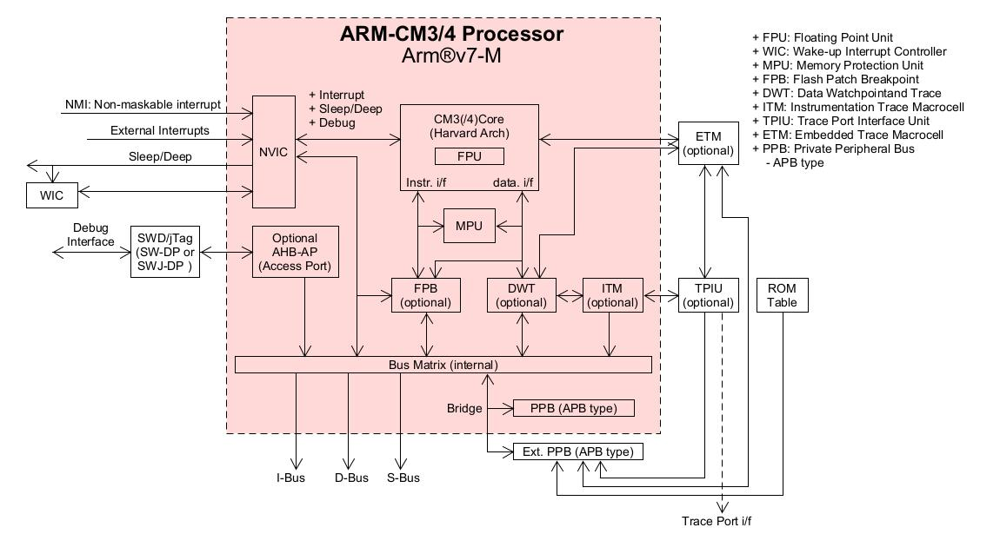
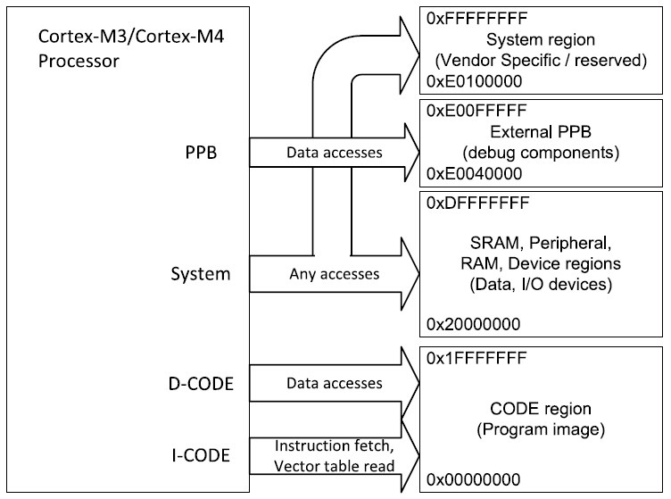
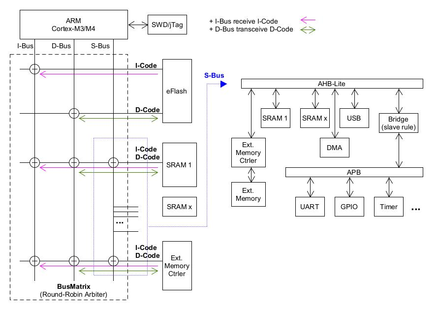

STM32 AMBA
---

# AMBA (Advanced Microcontroller Bus Architecture)

由 ARM 於 1996 年開發並發布

## AHB (Advanced High Performance Bus)

+ AHB/APB (AMBA 2.0 1999)
    > + 需先送 Address Ctrl (1T), 才能獲得 WDATA 或 RDATA (1T)
    >> 從發起到獲得資料需要 2T 時間 (效率不夠高)
    > + WDATA 和 RDATA 是無法同時工作, 近似於一個`半雙工`的 Bus 傳輸

    - 有較低的功耗和面積, 適合用於低階 MCU

+ AHB-Lite (AMBA 3.0)
    > 簡化 AHB, 採用 `1 * master 對 n * slaves`

## AXI (Advanced eXtensible Interface)

AXI 相比 AHB 最大的改變在於`讀寫通道分離`, 相當於有兩路可以傳輸了(全雙工),
同時 AXI 協議是基於 burst 的傳輸, 其定義了以下 5 個獨立的傳輸通道,
> + Read-Address channel
> + Read-Data channel
> + Write-Address channel
> + Write-Date channel
> + Write-Response channel

AXI 也引入了 handshake 的機制, 不限制 data 必須在 command 的 1T 以後 (多少 T 以後都可以, 類似 TCP 封包的方式)

+ AXI-3 (AMBA 3.0)
+ AXI-4 (AMBA 4.0)
    - AXI4-Full
        > 用於滿足高性能儲存器對應需求
    - AXI4-Lite
        > 用於簡單的低吞吐量儲存器對應通訊(e.g. 往來於狀態暫存器的通訊)

    - AXI4-Stream
        > 用於高速流傳輸資料

## Cortex-M3 Architecture

ARM Cortex-M3 由 CM3Core 和**核內外設**組成
> + CM3Core
>> CPU state machine
> + **核內外設**
>> 為支援不同功能, ARM 設計不同的周邊模組(e.g. Trace/Debug Module)

+ CM3Core
    > Cortex-M3 Processor 的中央處理核心

+ NVIC (Nested Vectored Interrupt Controller)
    > NVIC 採用了 Vector Interrupt 的機制.
    當中斷發生時, 它會自動取出對應的 ISR Address, 並且直接呼叫(無需S/w 介入), 提升效率並大幅縮短中斷延時

+ MPU (Memory Protection Unit)
    > 可以把 memory 分成一些 regions, 並分別予以保護
    (e.g. 它可以讓某些 regions 在 user space 下變成 read-only, 從而阻止了一些 user-app 破壞關鍵資料)

+ BusMatrix
    > BusMatrix 是一個 AHB 互聯的網路, 它可以讓資料在不同的 Buses 之間, 平行傳送(只要兩個 AHB masters 沒有訪問同一塊 memory 區域).

    > BusMatrix 還提供了附加的**資料傳送管理**, 包括一個 Write-Buffer (write-through, write-back) 及一個 Bit-Band

+ Bridge

+ SW-DP/SWJ-DP, Serial Wire (JTAG) Debug Port
    > 與 AHB-AP 協同工作, 使外部偵錯程式可以發起 AHB 上的資料傳送, 從而執行調試行為
    >> 大多數偵錯功能, 都是通過在 NVIC 控制下的 AHB 訪問, 來實現的

+ PPB (Private Peripheral Bus)
    > PPB 是一條基於 APB 協議的 32-bits 匯流排, PPB 負責 `0xE004_0000 ~ 0xE00F_FFFF` 之間的私有外設訪問.
    由於此 PPB 儲存空間的一部分已經被 TPIU, ETM 以及 ROM table 用掉了, 就只留下了 `0xE004_2000 ~ 0xE00F_F000` 這個區間用於配接附加的(私有)外設

    > CM3/CM4 還允許 vendor, 把附加的 APB device 掛在 `Ext. PPS`

### Bus access memroy range

+ CM3Core 通過不同的 Bus 訪問不同的 Regions (如上圖)
    > 前 0.5GB 的 CODE Region (0x0000_0000 ~ 0x1FFF_FFFF), 由 I-CODE Bus 和 D-CODE Bus 訪問,
    >> 它們是哈佛架構的實現, 可同時獲取指令和資料, 因此在 CODE Region 中, 程式碼的執行速度, 要比其它 Region 中的程式碼要快

+ I-CODE Bus 還用於觸發中斷時, 查詢中斷向量
    > 這一動作可以和 Context-Switch Push/Pop (D-CODE Bus) 同時進行, 以提高了中斷的響應速率

基於以上兩點的考慮, 一般會把程式碼放在 CODE Region 中執行, 當然我們也可以在 SRAM 和 Ext. RAM 中載入程式碼, 只是由 S-Bus 訪問會相對慢一些
> 在 Peripheral (Register Area), Bit-Band, System/Vector Regions 中, 是不能執行程式碼的

## STM32-MCU base on AHB/APB

Fig. STM32_Bus_Architecture
 

+ I-Bus (Instruction Bus)
    > I-Bus 作用是讀取 Instruction 指令 (I-Code)給 CPU 執行, 只和指令有關.
    I-Bus 是一條基於 AHB-Lite 協議的 32-bits 匯流排, 負責在 `0x0000_0000 ~ 0x1FFF_FFFF` 之間的取指令操作.
    >> 取指令是以 word (32-bits) 的長度執行, 即使是 16-bits Thumb 指令, CPU 可以一次取出兩筆 16-bits Thumb 指令.

+ D-Bus (Data Bus)
    > D-Bus 的作用是對資料讀寫訪問, 只和資料有關.
    D-Bus 也是一條基於 AHB-Lite 協議的 32-bits 匯流排, 負責在 `0x0000_0000 – 0x1FFF_FFFF`(與I-Code相同) 之間的資料訪問操作
    >> D-Bus 主要是訪問 flash 中, 編譯後生成的`常數資料(RO-data)`

    > STM32F4 設置 `0x1000_0000 ~ 0x1000_FFFF` 為 CCM(Core Coupled Memory),
    可用於 stack, heap, global variables, critical OS data 或做高速運算的資料緩衝

    > 儘管 CM3 支援 non-alignment 訪問, 但你絕不會在該 Bus 上看到任何 non-align address,
    這是因為 CPU 的 Bus interface 會把 non-align 的資料傳送, 都轉換成 align 的資料傳送,
    因此, 連接到 D-Bus 上的任何 device, 都只需支援 AHB-Lite 的對齊訪問, 不需要支援非對齊訪問

+ S-Bus (System Bus)
    > S-Bus 也是一條基於 AHB-Lite 協議的 32-bits 匯流排,
    負責在 `0x2000_0000 ~ 0xDFFF_FFFF` 和 `0xE010_0000 ~ 0xFFFF_FFFF` 之間的所有資料 align 傳送 (包含取指令及資料訪問)
    >> S-Bus 是訪問程式執行過程中, 在 SRAM 產生的動態資料(e.g. ZI-data, RW-data).
    `RW-data` 在程序復位啟動時, 先由 D-Bus 訪問並將 `RW-data` 複製到 SRAM 中, 之後通過 S-Bus 訪問

    - S-Bus accesses
        > + Data accesses
        > + Vector fetches
        > + Pipelined instruction fetches
        > + Debug
        > + Unaligned accesses
        > + FPB remapped accesses
        > + Bit-band accesses

# Reference

+ [Cortex-M3 I-Code,D-Code,系統匯流排及其他匯流排介面](https://blog.csdn.net/weixin_42672920/article/details/117848341)
+ [stm32啟動過程、cortex-m3架構、堆疊程式碼位置、編譯彙編連結分析](https://blog.csdn.net/weixin_42224577/article/details/119494577)
+ [深入解析stm32f407參考手冊——匯流排架構](https://zhuanlan.zhihu.com/p/368923466?utm_id=0)

