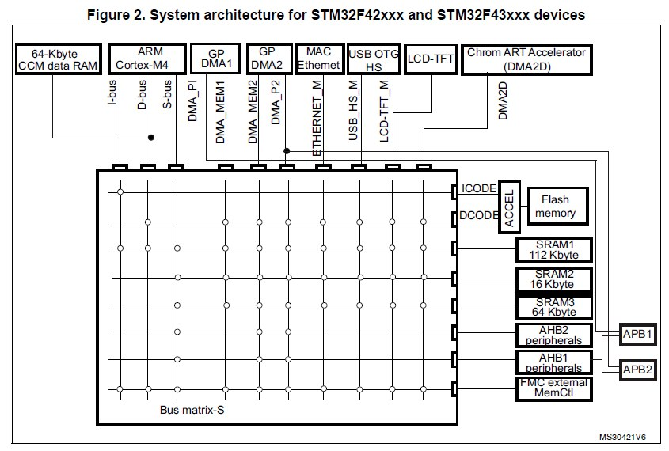
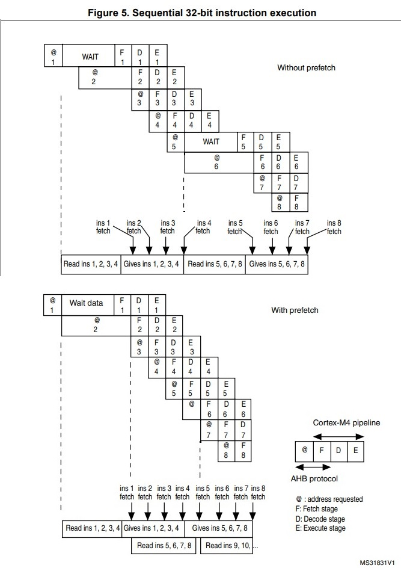

# STM32F103 Timer [[Back](note_stm32F103.md#Flash)]
---

## Flash

Embedded Flash is mapped to `0x0800_0000`

### Flash Organization


+ Main memory
    > STM32 Embedded flash 通常都是指 Main memory, 它是儲存App img 的區域

+ System memory
    > System memory 是 user 不能訪問的區域, 它在 IC 出廠時, 就已經燒入 ISP (In-System Program),
    負責實現 SerialPort/USB/SPI/I2C 或其他 communication protocol 的燒錄功能

+ OTP (One Time Program)
    > 指的是只能寫入一次的儲存區域, 寫入後資料就無法再更改. OTP 常用於儲存 App 的 Security Key

+ Option Bytes
    > Option Bytes 用於設定
    > + FLASH 的 Read/Write Protection
    > + 電源管理中的 BOR 等級
    > + Software/Hardware Watch Dog 等功能

    > 可以透過 `FLASH->OBR` Register 來確認設定值

### `Option Bytes`

在量產的產品中, 如果不作任何保護措施的話, 有心者可以用下載器, 直接把內部 FLASH 的內容拷貝出來, 並利用其 Bin file 來山寨產品.
因此, STM32 提供了多種方式保護 Embedded flash 的 img 不被非法讀取 (在默認情況下, 該保護功能是 Disable),
若要開啓該功能, 需要改寫 Embedded flash 中 `Option Bytes` 的設定值.

`Option Bytes` 是一段特殊的 **Flash** 空間, STM32 H/w 會根據其的內容, 進行 Read/Write Protection, 復位電壓等設定
> 修改 `Option Bytes` 設定後, 需要 system reset 讓 H/w 重新 latch

+ STM32F103

    - Option byte organization
        > `n` 表示為 `1's Complement`, H/w 用來驗證資料是否正確.
        當驗證不 match 時, 會強制設定為 `0xFF`; 資料和其補數都為 0xFF 時, disable 驗證功能.
        >> e.g. `nRDP` 為 `RDP` 的 1's Complement

        | Address     | [31:24] | [23:16] | [15:8]  | [7:0] |
        |:-:          | :-:     | :-:     | :-:     | :-:   |
        | 0x1FFF_F800 | nUSER   | USER    | nRDP    | RDP   |
        | 0x1FFF_F804 | nData1  | Data1   | nData0  | Data0 |
        | 0x1FFF_F808 | nWRP1   | WRP1    | nWRP0   | WRP0  |
        | 0x1FFF_F80C | nWRP3   | WRP3    | nWRP2   | WRP2  |

    - Bit-Field

        1. RDP[7:0] (Read protection option byte)
            > + `0xA5` or `0xAA` Disable read protection (**default**)
            > + `0xCC` Lv2 read protection (Chip protection)
            >> 禁止 Debug (Disable SWD) 也禁止從 SRAM boot
            > + others: Lv1 read protection (Register read protection)
            >> Debug 功能受限

        1. USER[16] => WDG_SW
            > + 0: H/w watchdog
            > + 1: S/w watchdog (**default**)

        1. USER[17] => nRST_STOP
            > + 0: Reset generated when entering Stop mode
            > + 1: No reset generated (**default**)

        1. USER[18] => nRST_STDBY
            > + 0: Reset generated when entering Standby mode.
            > + 1: No reset generated (**default**)

        1. Data0[7:0]
            > latch to FLASH_OBR[17:10]

        1. Data1[23:16]
            > latch to FLASH_OBR[25:18]

        1. WRPx, x= 0~3 (Write Protection option)
            > In `256-Kbyte Main Flash` case,
            > + WRP0[bit 7:0]: Write-protects pages 0 to 15.  (2-pages/bit)
            > + WRP1[bit 7:0]: Write-protects pages 16 to 31. (2-pages/bit)
            > + WRP2[bit 7:0]: Write-protects pages 32 to 47. (2-pages/bit)
            > + WRP3[bit 6:0]: write-protect pages 48 to 61 (2-pages/bit)
            > + WRP3[bit 7] : write-protects pages 62 to 127 (66-pages/bit)

            > latch WRPx to FLASH_WRPR register
            > + latch WRP0 to FLASH_WRPR[7:0]
            > + latch WRP1 to FLASH_WRPR[15:8]
            > + latch WRP2 to FLASH_WRPR[23:16]
            > + latch WRP3 to FLASH_WRPR[31:24]

    - Read Protection Level

        1. Level-0 (無保護)
            > STM32的默認保護等級, 它沒有任何讀保護, 可以讀取 Embedded Flash 及"備份SRAM"的內容都沒有任何限制

        1. Level-1 (Enable Read protection)
            > + Main Flash boot 可以訪問 Embedded Flash
            > + 任何從外部訪問 Embedded Flash 的操作都被禁止,(e.g. ICE)
            > + SRAM boot mode時, 禁止讀取 Embedded Flash

        1. Level-2 (Disable Debug mode)
            > 最高等級的 Read protection, 且**設定後無法再降級**, 會永久禁止 ICE 介面(相當於熔斷)
            > + 僅支援 Main Flash boot, 並可訪問 Embedded Flash 及 SRAM
            >> 由廠商自行提供的 IAP (In Application Program)
            > + 具有 Level-1 的所有保護功能
            > + 禁止 SRAM/SysMemory boot (即 ISP 下載功能失效)
            > + 禁止 ICE 功能
            > + 禁止修改 Option-Bytes area


### Reference

+ [STM32- PM0075 Programming manual](https://www.st.com/resource/en/programming_manual/pm0075-stm32f10xxx-flash-memory-microcontrollers-stmicroelectronics.pdf)
+ [第51章-設定FLASH的讀防寫保護及解除](https://www.cnblogs.com/firege/p/5806164.html)

## FSMC (Flexible static memory controller)

用來連接 external memory
> + NOR Flash memory
> + PSRAM (4 memory banks)
> + NAND Flash
> + SRAM (Static random access memory)


## STM32F4 Embedded Memory Architecture

Bus Matrix (利用 round-robin 演算法來仲裁)
> 上方為 master, 右方為 slave, Bus-Matrix 提供 master 可 concurrent 並有效率進行存取 slave



+ AHB(Advanced High-performance Bus)
    > AMBA 的一部分, 負責連接高性能高頻寬的模組, 例如 processor, DMA controller, memory

+ APB(Advanced Peripheral Bus)
    > AMBA 的一部分, 負責連接低頻寬的周邊, 例如 UART

+ AMBA(Advanced Microcontroller Bus Architecture)
    > ARM 架構下系統晶片(SoC)設計中的一種匯流排架構

+ DMA(Direct Memory Access)
    > 允許介面裝置與記憶體之間直接轉移資料, 而不需經由 CPU 的參與

+ FMC(Flexible memory controller)
    > 用來連接擴充記憶裝置的控製器, 比起 FSMC(Flexible Static memory controller),
    增加了 The Synchronous DRAM (SDRAM) controller, 允許存取 DRAM, SRAM, Flash, PSRAM, SDRAM 等記憶體

+ Internal SRAM 總容量
    > 256KB = `64KB CCM data RAM + SRAM 112KB + SRAM 16KB + SRAM 64KB`

+ I-Bus(Instruction Bus)
    > 用來傳遞指令

+ D-Bus(Data Bus)
    > 用來傳遞資料

+ S-Bus(System Bus)
    > 用來傳遞周邊或是 SRAM 的系統資料

+ SRAM 連接至 I-bus, 可用來加快程式的速度; 並且連接至 D-bus, 加快存取 data 的速度

+ CCM(Core Coupled Memory)
    > 是給 CPU 專用的 64KB RAM (可視為 DLM, Data Local Memory), 不會經過 Bus Matrix, 而是透過 D-Bus 直接與 CPU 相連,
    當 SRAM 被其他硬體使用時, CPU 可以使用 CCM 以達到零等待.

    > 記憶體位址在 `0x1000_0000 ~ 0x1000_FFFF`, 與一般的 SRAM 不連續, 而且 **DMA 和周邊也無法直接使用**他們,
    所以一般 user 的程式, 完全無法感覺有這 64KB 的 CCM, 可用於 stack, heap, global variables, critical OS data 或做高速運算緩衝(e.g. JPEG decoder),
    此外也可以直接拿來當做額外的記憶體使用

+ Flash memory
    > CPU 透過 AHB I-Code 及 D-Code 來存取 Flash, 另外可透過 ACCEL (ART Accelerator) 加速程式執行


+ ACCEL (ART Accelerator, Adaptive Real-Time Memory Accelerator)
    > 可以執行 Instruction Prefetch, Instruction cache memory 和 Data management 來加速執行指令的速度

    

    - Instruction Prefetch
        > 因為 Flash 的存取速度, 比起 Cortex-M4(180MHz)要慢取多, 因此需要一塊記憶體來做 Instruction Prefetch 來達到 0 Wait Sate.
        每個 flash memory 的讀取動作, 可以讀取`128-bits`的指令(4 * arm 指令或 8 * thumb 指令),
        所以在**循序讀取 code** 的時候, 至少需要 4 個 CPU cycles 來執行上一串指令

        > Instruction Prefetch 可以事先讀取下一串指令, 不需要 Wait State
        >> 設定 FLASH_ACR register 裡的 PRFTEN bit 可以開啟 Prefetch 功能

    - Instruction cache memory
        > 為了減少 Jump or Branch 指令的執行時間, 有必要保留一塊 64 條 128-bits 的 Cache Memory (Cache Line),
        >> 只要開啟 FLASH_ACR register 的 ICEN bit 就可以開啟這個功能

        > 當每次要求的資料時, 假使不在 Cache 裡, 就會將資料從 flash memory 放進 Cache Memory,
        若有, CPU 就可以直接從 Cache 讀取, 避免延遲的時間
        >> 當 Cache 滿時, 則根據 LRU(least recently used)原則, 將最近最少用的資料清掉

    - Data management
        > 在 CPU Pipeline 執行階段時, 需要從定字池(Literal pools), 透過 D-Bus 取得定字(Literal),
        而這個動作會使 CPU 暫時陷入停頓的狀態, 為了減少浪費的時間, 必須將存取 D-code 的優先權, 調高過 I-code 的,
        如果有些特定定字池是很常用的
        >> 可以透過設定 FLASH_ACR register 的 DCEN bit

        > 這個功能有些類似 instruction cache memory, 但它的大小只有 `8 * 128-bits`

    - `Literal Pools`
        > Literal pools are areas of constant data in a `code section`

        ```
            0x000002bc:  4804      .H    LDR      r0,[pc,#16] ; [0x2d0] = 0x 2000104c <--- literal
            0x000002be:  6800      .h    LDR      r0,[r0,#0]
            0x000002c0:  4904      .I    LDR      r1,[pc,#16] ; [0x2d4] = 0x 3330314c <--- literal
            0x000002c2:  4288      .B    CMP      r0,r1
            0x000002c4:  d101      ..    BNE      0x2ca ; MSP_Get_SRAM_END_Addr + 14
            0x000002c6:  4804      .H    LDR      r0,[pc,#16] ; [0x2d8] = 0x 20008000 <--- literal
            0x000002c8:  4770      pG    BX       lr
            0x000002ca:  f04f2020  O.    MOV      r0,#0x20002000
            0x000002ce:  4770      pG    BX       lr
        $d
            0x000002d0:  2000104c  L..   DCD    536875084     <--- Literal Pools
            0x000002d4:  3330314c  L103  DCD    858796364
            0x000002d8:  20008000  ...   DCD    536903680
        ```

        > 當想要在一條指令中, 使用一個 4-bytes 長度的常數資料(可能是 address, 也可能是一般常數)的時候,
        由於 ARM Instructions 是定長的(ARM mode 4-Bytes 或 Thumb mode 2-Bytes), 所以無法把這個 4-bytes 的常數資料, 編碼在一條指令中,
        此時, ARM compiler 就會在 code section 中, 分配一塊記憶體, 並把這個 4-bytes 的常數資料保存於此,
        之後, 再使用一條指令, 把這個 4-bytes 的常數資料, 載入到暫存器中參與運算
        >> 在 C 原始碼中, 文字池的分配是由 compiler 在編譯時, 如果 user 沒有對文字池配置, compiler 會自行安排的

        > 在大多數時候, 使用文字池可以提高程序性能, 但對於哈佛架構的處理器(I/D Cache 分開, 因此多數處理器都是哈佛架構),
        文字池會造成頻繁的 D-Cache miss 進而影響性能

### Reference

+ [成大資工 wiki - Flash](https://wiki.csie.ncku.edu.tw/embedded/Flash#flash-%E8%A8%98%E6%86%B6%E9%AB%94%E6%9E%B6%E6%A7%8B%E4%BB%8B%E7%B4%B9)
