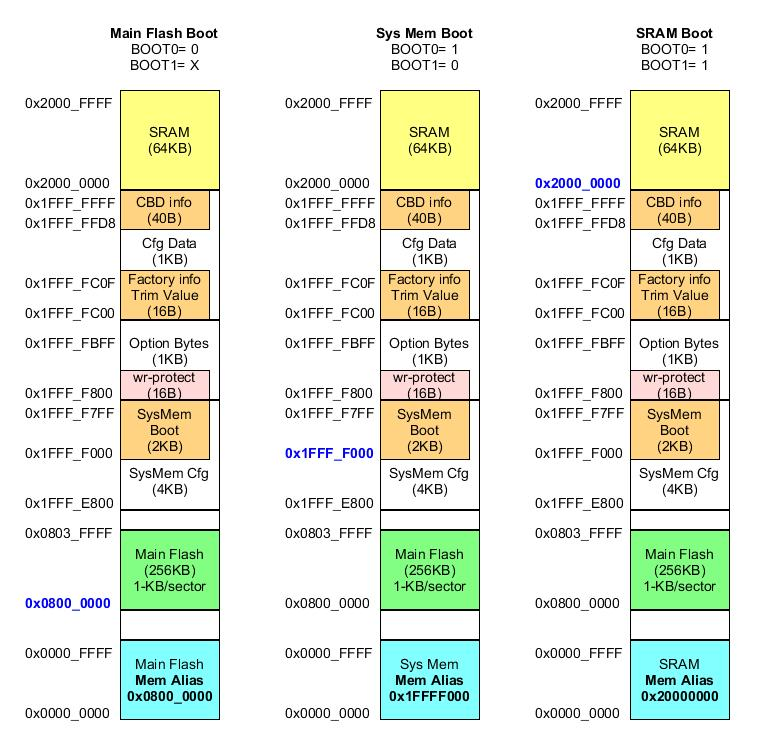

# STM32F103 Timer [[Back](note_stm32F103.md#Flash)]
---

## Flash

Embedded Flash is mapped to `0x0800_0000`

### Flash Organization

+ Main memory
    > STM32 Embedded flash 通常都是指 Main memory, 它是儲存App img 的區域

+ System memory
    > System memory 是 user 不能訪問的區域, 它在 IC 出廠時, 就已經燒入 ISP (In-System Program),
    負責實現 SerialPort/USB/SPI/I2C 或其他 communication protocol 的燒錄功能

+ OTP (One Time Program)
    > 指的是只能寫入一次的儲存區域, 寫入後資料就無法再更改. OTP 常用於儲存 App 的 Security Key

+ Option Bytes
    > Option Bytes 用於設定
    > + FLASH 的 Read/Write Protection
    > + 電源管理中的 BOR 等級
    > + Software/Hardware Watch Dog 等功能

    > 可以透過 `FLASH->OBR` Register 來確認設定值

### `Option Bytes`

在量產的產品中, 如果不作任何保護措施的話, 有心者可以用下載器, 直接把內部 FLASH 的內容拷貝出來, 並利用其 Bin file 來山寨產品.
因此, STM32 提供了多種方式保護 Embedded flash 的 img 不被非法讀取 (在默認情況下, 該保護功能是 Disable),
若要開啓該功能, 需要改寫 Embedded flash 中 `Option Bytes` 的設定值.

`Option Bytes` 是一段特殊的 **Flash** 空間, STM32 H/w 會根據其的內容, 進行 Read/Write Protection, 復位電壓等設定
> 修改 `Option Bytes` 設定後, 需要 system reset 讓 H/w 重新 latch

+ STM32F103

    - Option byte organization
        > `n` 表示為 `1's Complement`, H/w 用來驗證資料是否正確.
        當驗證不 match 時, 會強制設定為 `0xFF`; 資料和其補數都為 0xFF 時, disable 驗證功能.
        >> e.g. `nRDP` 為 `RDP` 的 1's Complement

        | Address     | [31:24] | [23:16] | [15:8]  | [7:0] |
        |:-:          | :-:     | :-:     | :-:     | :-:   |
        | 0x1FFF_F800 | nUSER   | USER    | nRDP    | RDP   |
        | 0x1FFF_F804 | nData1  | Data1   | nData0  | Data0 |
        | 0x1FFF_F808 | nWRP1   | WRP1    | nWRP0   | WRP0  |
        | 0x1FFF_F80C | nWRP3   | WRP3    | nWRP2   | WRP2  |

    - Bit-Field

        1. RDP[7:0] (Read protection option byte)
            > + `0xA5` or `0xAA` Disable read protection (**default**)
            > + `0xCC` Lv2 read protection (Chip protection)
            >> 禁止 Debug (Disable SWD) 也禁止從 SRAM boot
            > + others: Lv1 read protection (Register read protection)
            >> Debug 功能受限

        1. USER[16] => WDG_SW
            > + 0: H/w watchdog
            > + 1: S/w watchdog (**default**)

        1. USER[17] => nRST_STOP
            > + 0: Reset generated when entering Stop mode
            > + 1: No reset generated (**default**)

        1. USER[18] => nRST_STDBY
            > + 0: Reset generated when entering Standby mode.
            > + 1: No reset generated (**default**)

        1. Data0[7:0]
            > latch to FLASH_OBR[17:10]

        1. Data1[23:16]
            > latch to FLASH_OBR[25:18]

        1. WRPx, x= 0~3 (Write Protection option)
            > In `256-Kbyte Main Flash` case,
            > + WRP0[bit 7:0]: Write-protects pages 0 to 15.  (2-pages/bit)
            > + WRP1[bit 7:0]: Write-protects pages 16 to 31. (2-pages/bit)
            > + WRP2[bit 7:0]: Write-protects pages 32 to 47. (2-pages/bit)
            > + WRP3[bit 6:0]: write-protect pages 48 to 61 (2-pages/bit)
            > + WRP3[bit 7] : write-protects pages 62 to 127 (66-pages/bit)

            > latch WRPx to FLASH_WRPR register
            > + latch WRP0 to FLASH_WRPR[7:0]
            > + latch WRP1 to FLASH_WRPR[15:8]
            > + latch WRP2 to FLASH_WRPR[23:16]
            > + latch WRP3 to FLASH_WRPR[31:24]

### Reference

+ [STM32- PM0075 Programming manual](https://www.st.com/resource/en/programming_manual/pm0075-stm32f10xxx-flash-memory-microcontrollers-stmicroelectronics.pdf)

## FSMC (Flexible static memory controller)

用來連接 external memory
> + NOR Flash memory
> + PSRAM (4 memory banks)
> + NAND Flash
> + SRAM (Static random access memory)

