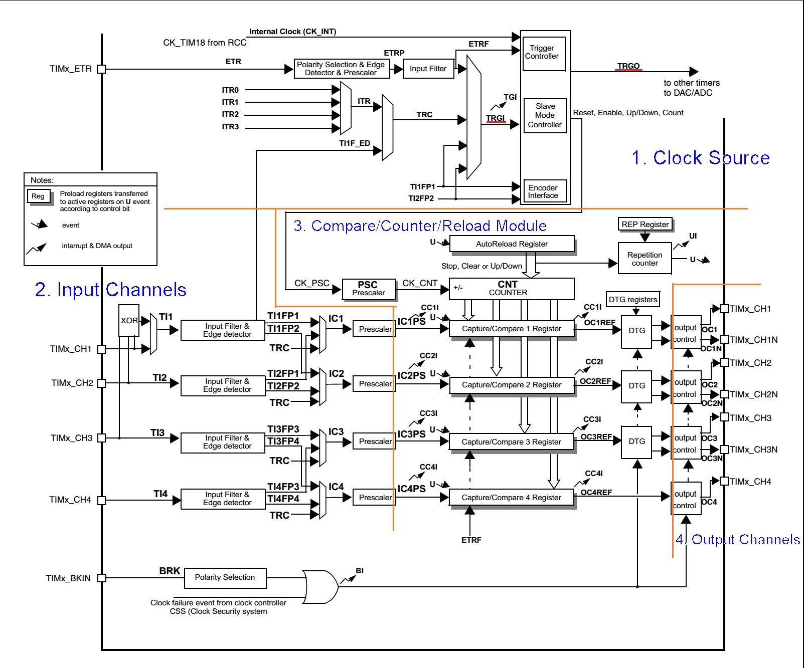

# STM32F103 Timer [[Back](note_stm32F103.md#Timer)]

+ Basic timer
    > 沒有任何對外 I/O, 主要用作**計數及定時**

+ General-purpose timer
    > 除了 Basic timer 的功能外, 還可對外做 **Input Capture (IC)**, **Output Compare (OC)**, 及**連接其它傳感器 (Encoder 和 霍爾傳感器)**

+ Advanced-control timer
    > 功能最為強大, 除了具備 General-purpose timer 的功能外, 還包含一些與**機電控制**和 Digital Power 應用相關的功能
    >> e.g. Complementary outputs (互補信號輸出), Dead-time insertion (死區控制), and Brake/Break (緊急剎車關斷輸入)

    - Dead-time (死區)
        > 通常`大功率電機`, `變頻器`等, 末端都是由`大功率管`, `IGBT` 等元件組成的 H 橋或 3 相橋. **每個橋的上半橋和下半橋是是絕對不能同時導通的**.
        但高速的 PWM 驅動信號在達到功率元件的控制極時, 往往會由於各種各樣的原因產生延遲的效果, 造成某個半橋元件在應該關斷時沒有關斷, 進而燒燬功率元件.
        死區就是**在上半橋關斷後, 延遲一段時間再打開下半橋** 或 **在下半橋關斷後, 延遲一段時間再打開上半橋**, 從而避免功率元件燒燬.
        這段延遲時間就是死區. (就是上/下半橋的元件都是關斷的)

    - Brake/Break (緊急剎車關斷輸入)
        > 目的是保護由 timer 生成的 PWM 信號所驅動的功率器件.
        當被故障觸發時, 剎車電路會關閉 PWM 輸出, 並將其強制設為預定義的安全狀態 (High or Low)

+ Reference

    - [stm32 死區剎車 pwm](https://www.twblogs.net/a/5efd91515352062f754e2847)
    - [STM32的hal庫 定時器剎車配置](https://icode.best/i/36158135567550)

## Block Diagram



主要分為四個部分, 需要各自設定
> 1. Clock Source Configuration
> 1. Input Channels Configuration,
> 1. Compare/Counter/Reload Configuration
> 1. Output Channels Configuration

### Clock Source Configuration

使用 Trigger Signal 當做 Timer 運行所需的 clock (Timer Clock, TCLK),
> + `TRGO` (Trigger Output) signal
>> 經過各種 configuration 後, timer 最終 output signal
> + `TRGI` (Trigger Input) signal
>> 經過各種 configuration 後, timer 最終 input signal

+ Internal

    - Internal clock (CK_INT)
        > 通常是 PCLK 或 APB bus clock

    - Internal trigger inputs (`ITRx`)
        > 由其它 TIMx 來 trigger 目前 timer (ITRx signal)

+ External

    - External clock mode1 (External input pin)
        > `TIx` (Timer/Trigger Input channel x)

        1. `TIxF_ED` (TIx Filtered and Edge Detector)
            > Channel x 的 input signal 經過 filter (`TIMx_CCMRx->ICF`) 後, Rising and Falling trigger (Both edge)

        2. `TIxFPx`
            > Channel x 的 input signal 經過 filter (`TIMx_CCMRx->ICF`) 後, 依照 Polarity (`TIMx_CCER->CCxP`) 來決定用 Rising 或是 Falling 來 trigger


    - External clock mode2 (External Trigger input pin)
        > ETR pin

        1. ETR pin 的 input signal 經過 Polarity (`TIMx_SMCR->ETP`), 除頻 (TIMx_SMCR->ETPS), 及 Filter (`TIMx_SMCR->ETF`) 後, 產生 `ETRF` signal


+ API

    ```
    HAL_StatusTypeDef HAL_TIM_ConfigClockSource(TIM_HandleTypeDef *htim, TIM_ClockConfigTypeDef *sClockSourceConfig);
    ```


### Function (Compare/Counter/Reload) Configuration

+ API

    ```
    HAL_StatusTypeDef HAL_TIM_Base_Init(TIM_HandleTypeDef *htim); // counter, reload
    HAL_StatusTypeDef HAL_TIM_IC_Init(TIM_HandleTypeDef *htim);   // input capture
    HAL_StatusTypeDef HAL_TIM_OC_Init(TIM_HandleTypeDef *htim);   // output compare
    HAL_StatusTypeDef HAL_TIM_PWM_Init(TIM_HandleTypeDef *htim);  // PWM output
    ```

### Input Configuration

+ API

    ```c
    HAL_StatusTypeDef HAL_TIM_IC_ConfigChannel(TIM_HandleTypeDef *htim, TIM_IC_InitTypeDef *sConfig, uint32_t Channel);
    ```

### Output Configuration

+ API

    ```
    HAL_StatusTypeDef HAL_TIM_PWM_ConfigChannel(TIM_HandleTypeDef *htim, TIM_OC_InitTypeDef *sConfig, uint32_t Channel);
    HAL_StatusTypeDef HAL_TIM_OC_ConfigChannel(TIM_HandleTypeDef *htim, TIM_OC_InitTypeDef *sConfig, uint32_t Channel);
    ```


## Basic concept

+ Prescaler
    > 對 PCLK 除頻

    ```
    TIMER_clk = PCLK / (Prescaler + 1)  # H/w 自動 +1

    假設 PCLK = 72MHz, Prescaler = (72 - 1)

    TIMER_clk = 72MHz / 72 = 1 MHz => 1us / sample
    ```

+ ARR (Auto-Reload Reg)
    > 設定多少個 samples (基於 TIMER_clk) 為一個週期 (Period)

    ```
    假設 TIMER_clk = 1MHz (1us/sample), ARR = (65536 - 1)

    65536 個 samples 為一個週期, 則一個周期的時間為 65536 us

    Period_us = ARR * (1000000 usec / (PCLK / Prescaler)) = 65536 us
    ```

+ Channel
    > 會綁定 Pin

    - Input Channel x (ICx, x= 1 ~ 4)

    - Output Channel x (OCx, x= 1 ~ 4)

+ CCRx (Capture/Compare Reg, channel x= 1 ~ 4)

+ Overflow
    > 已經過了一個週期 (Period)

## PWM

+ Prescaler 對 PCLK 除頻 (Get TIMER_clk)

+ ARR 決定 PWM 的週期

    ```
    FREQ_pwm = TIMER_clk / (ARR + 1)
             = PCLK / ((Prescaler + 1) * (ARR + 1))

    Period_us = 1000000 us / FREQ_pwm
              = (1000000 us * (Prescaler + 1) * (ARR + 1)) / PCLK
    ```

+ CCRx 決定了輸出有效信號的時間
    > 在一個週期 `(ARR + 1) 個 samples` 中, 連續幾個 samples 輸出有效信號

    ```
    // 設置 duty cycle (1 ~ 99%)
    pulse_width = (ARR + 1) * duty_cycle
    __HAL_TIM_SET_COMPARE(&htim1, TIM_CHANNEL_1, pulse_width);
    ```

+ PWM mode

    - mode 1
        > 不管是向上還是向下計數, 當計數值小於 ARR 時, 輸出 `HIGH`

    - mode 2
        > 不管是向上還是向下計數, 當計數值小於 ARR 時, 輸出 `LOW`


## Input capture

當檢測到 ICx signal 上相應的 edge 後, timer 的當前值被鎖存到 **捕獲/比較暫存器(TIMx_CCRx)**中. <br>
當 Capture Event 發生時, 相應的 `TIMx_SR->CCxIF` 被置 `1`, 進而觸發中斷, DMA, 或是其它操作.


+ Prescaler 相當於設定 Sample Rate (TIMER_clk)

+ ARR 相當於 Capturing Duration time

+ CCRx 紀錄 counter value (channel x= 1 ~ 4)


+ Reference

    - [話說定時器系列】之六：STM32定時器輸入捕獲話題](https://zhuanlan.zhihu.com/p/80251987)


### PWM input


## Output Compare

+ Reference

    - [【話說定時器系列】之七：STM32定時器比較輸出話題](https://zhuanlan.zhihu.com/p/87256894)

## Encoder interface mode

Encoder 是一種將相位變化轉換成一連串電子脈衝的旋轉式感測器, Timer encoder interface 可以用來測量相位變化及角速度.

+ Reference

    - [STM32和定時器：編碼器模式](https://kknews.cc/zh-tw/news/xb4p9yo.html)

## Master/Slave mode

### Slave mode

+ Reset
    > 當 vaild TRGI (Trigger Input) signal 出現時, timer 將 reset counter/prescale, 同時還會產生更新事件 (Update Event),
    所有的預裝載寄存器(TIMx_ARR, TIMx_CCRx)都會被更新.

    > timer 開始依據內部時鐘計數, 正常運轉直到 TI1 出現一個 Rising; 此時 timer 重新開始計數.
    同時觸發標志 `TIMx_SR->TIF位` 被設置, 根據 `TIMx_DIER->TIE`(Interrupt Enable) 和 `TIMx_DIER->TDE` (DMA Enable) 的設置, 產生一個 IRQ 或 DMA requeset.
    > + 如果 timer 向上計數或中央對齊模式的話, reset 後計數器從 `0` 開始計數
    > + 如果 timer 向下計數模式, reset 後計數器從 `ARR` 值開始計數

+ Gated
    > 只有當 TRGI (TIx) 為 High or Low level 時, timer 才開始計數, TRGI 反向則停止計數.
    >> high 計數, low 停止; 或是 High/Low 行為相反.

    > `TIMx_CR1->CEN = 1` 啟動 timer. 在 Gated mode 下, 如果 `TIMx_CR1->CEN = 0`, 不論 TRGI signal 如何, timer 都不能啟動.
    當 timer 開始或停止時, 都設置 `TIMx_SR->TIF`. TIx  Rising 和 timer 實際停止之間的 delay, 取決於 TIx input 的重同步電路

+ Trigger
    > 當 TRGI (TIx) 有 Rising 或 Falling 時, 啟動 timer 計數

+ External clock mode 2 with trigger mode

+ Reference
    - [【話說定時器系列】之三：STM32定時器的信號觸發與主從模式](https://zhuanlan.zhihu.com/p/74620029)

## Brake/Break

+ API
    ```
    HAL_StatusTypeDef HAL_TIMEx_ConfigBreakDeadTime(TIM_HandleTypeDef *htim,
                                                    TIM_BreakDeadTimeConfigTypeDef *sBreakDeadTimeConfig);
    ```
