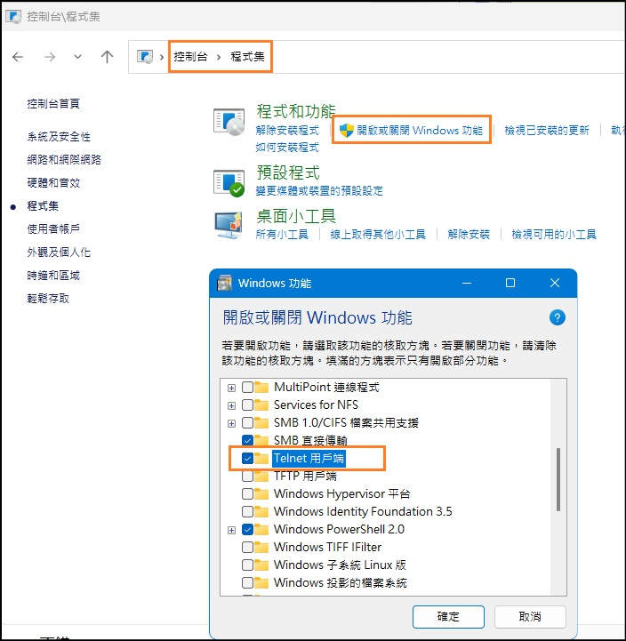

OpenOCD 實務 [[Back](note_openocd.md#實務範例操作)]
---

# Source code

## build source Cygwin (verified)

[Cygwin-64](https://www.gushiciku.cn/jump/aHR0cHM6Ly93d3cub3NjaGluYS5uZXQvYWN0aW9uL0dvVG9MaW5rP3VybD1odHRwcyUzQSUyRiUyRmN5Z3dpbi5jb20lMkZzZXR1cC14ODZfNjQuZXhl)
> + select `Install from Internet`
> + select `Use System Proxy Setting`

+ dependency
    > use `setup-x86_64.exe` to intall packages

    - autobuild
    - autoconf (all packages)
    - autoconf-archive
    - automake (all packages)
    - dos2unix
    - git
    - gcc-core
    - gcc-g++
    - libtool
    - libusb1.0
    - libusb1.0-devel
    - libusb-devel
    - libhidapi-devel (for cmsis-dap)
    - wget
    - make
    - pkg-config
    - Usbutils
    - patch
    - mingw64-x86_64-pthreads
    - mingw64-x86_64-winpthreads

+ Building

    ```shell
    $ git clone https://git.code.sf.net/p/openocd/code  openocd
    $ cd openocd
    $ git checkout f342aa   # released v0.11
    $ ./bootstrap
    $ mkdir build && cd build
    $ ../configure --disable-werror \
        --disable-aice --disable-ti-icdi \
        --disable-osbdm --disable-opendous \
        --disable-vsllink --disable-usbprog \
        --disable-rlink --disable-armjtagew \
        --disable-usb-blaster-2 \
        --enable-ftdi --enable-jlink --enable-stlink --enable-cmsis-dap
    $ make
    $ make install
    ```

+ Cygwin dll

    ```
    cp usr/bin/cygftdi1-2.dll         ~/my_openocd/bin/cygftdi1-2.dll
    cp usr/bin/cyghidapi-0.dll        ~/my_openocd/bin/cyghidapi-0.dll
    cp usr/bin/cygncursesw-10.dll     ~/my_openocd/bin/cygncursesw-10.dll
    cp usr/bin/cygusb-1.0.dll         ~/my_openocd/bin/cygusb-1.0.dll
    cp usr/bin/cygusb0.dll            ~/my_openocd/bin/cygusb0.dll
    cp usr/bin/cygwin1.dll            ~/my_openocd/bin/cygwin1.dll
    ```

+ Run OpenOCD server

    - `z_run_ocd_server.sh` **shell file**

        ```shell
        #!/bin/bash

        openocd -f interface/cmsis-dap.cfg -f target/stm32f1x.cfg
        ```

    - `z_run_ocd_server.bat` **batch file**
        > use **absolute path**
        >>

        ```
        > .\bin\openocd.exe -f C:\OpenOCD\share\openocd\scripts\interface\cmsis-dap.cfg -f C:\OpenOCD\share\openocd\scripts\target\stm32f1x.cfg
        ```

        1. path
            > `C:\OpenOCD\share\openocd\scripts\target\stm32f1x.cfg`

            ```
            source [find target/swj-dp.tcl]
            source [find mem_helper.tcl]

                modify to absolute path

            source [find C:/OpenOCD/share/openocd/scripts/target/swj-dp.tcl]
            source [find C:/OpenOCD/share/openocd/scripts/mem_helper.tcl]
            ```

## build source MSYS2

+ dependency

    ```bash
    $ pacman -S autoconf automake make pkg-config libtool git
    ```

+ build script
    > v0.11

    ```bash
    #!/bin/bash


    export LIBUSB1_CFLAGS="-I$HONE/OpenOCD/openocd/libusb-1.0.24/include"
    export LIBUSB1_LIBS="-L$HONE/OpenOCD/openocd/libusb-1.0.24 -lusb-1.0 -lpthread"

    export LIBUSB_1_0_CFLAGS="-I$HONE/OpenOCD/openocd/libusb-1.0.24/include"
    export LIBUSB_1_0_LIBS="-L$HONE/OpenOCD/openocd/libusb-1.0.24 -lusb-1.0 -lpthread"

    export LIBUSB0_CFLAGS="-I$HONE/OpenOCD/openocd/libusb-1.0.24/include"
    export LIBUSB0_LIBS="-L$HONE/OpenOCD/openocd/libusb-1.0.24 -lusb-1.0 -lpthread"
    export LIBUSB1_CFLAGS="-I$HONE/OpenOCD/openocd/libusb-1.0.24/include"
    export LIBUSB1_LIBS="-L$HONE/OpenOCD/openocd/libusb-1.0.24 -lusb-1.0 -lpthread"
    # export HIDAPI_CFLAGS="-I$HIDAPI_DIR/hidapi/"
    # export HIDAPI_LIBS="-L$HIDAPI_DIR/windows/.libs/ -L$HIDAPI_DIR/libusb/.libs/ -lhidapi"
    export CFLAGS="-DHAVE_LIBUSB_ERROR_NAME"


    export CPPFLAGS="$CPPFLAGS -D__USE_MINGW_ANSI_STDIO=1 -Wno-error"
    export CFLAGS="$CFLAGS -static -Wno-error"

    ./bootstrap
    export PKG_CONFIG_PATH=`pwd`
    ./configure --build=i686-w64-mingw32 --host=i686-w64-mingw32 --disable-werror --enable-static --enable-cmsis-dap --enable-cmsis-dap-v2 \
    --disable-doxygen-pdf --enable-ftdi --enable-jlink --enable-ulink --prefix=$HOME/OpenOCD/openocd/out

    make clean
    make
    ```

## Auto-build script

+ `build.sh`
    > **Ubuntu 16.04**

    ```shell
    #!/bin/bash

    # Parameter
    # $1: build-dir (must)
    # $2: source-dir (must)
    # $3: 1 for checkout source code (must)

    # How to run?
    if [ $# -lt 2 ]; then
        echo "<Usage>: $0 build-dir source-dir [need_clone 0/1?]"
        exit 1
    fi

    # Param
    BUILD_DIR=`readlink -f $1`
    SOURCE_DIR=`readlink -f $2`
    UNAMESTR=`uname`

    # Setup Source path
    LIBUSB_SRC_1=$SOURCE_DIR/libusb-1.0.18
    OPENOCD_SRC=$SOURCE_DIR/openocd

    # Clean build/source folder
    rm -rf $BUILD_DIR

    # Clone source or not
    if [ "$3" == '1' ]; then
        CLONE_FLAG="--recursive"

        rm -rf $SOURCE_DIR
        wget https://ncu.dl.sourceforge.net/project/libusb/libusb-1.0/libusb-1.0.18/libusb-1.0.18.tar.bz2 -P $SOURCE_DIR --no-check-certificate
        git clone $CLONE_FLAG https://github.com/riscv/riscv-openocd.git $OPENOCD_SRC
    else
        echo 'Do not clone openocd source codes'
    fi

    # Build libusb-1.0.18
    printf "\n\n\nBuild libusb-1.0.18\n"
    tar -jxf $SOURCE_DIR/libusb-1.0.18.tar.bz2 -C $SOURCE_DIR
    mkdir -p $BUILD_DIR/build/libusb
    cd $BUILD_DIR/build/libusb
    $LIBUSB_SRC_1/configure --prefix=$BUILD_DIR/usr PKG_CONFIG_LIBDIR=$BUILD_DIR/usr/lib/pkgconfig \
        --disable-shared \
        --disable-udev \
        --disable-timerfd

    make install -j8

    # Build RISC-V OpenOCD
    printf "\n\n\nBuild OpenOCD\n"
    cd $OPENOCD_SRC
    patch -p1 < openocd.patch
    ./bootstrap
    mkdir -p $BUILD_DIR/build/openocd
    cd $BUILD_DIR/build/openocd
    $OPENOCD_SRC/configure --prefix=$BUILD_DIR/usr PKG_CONFIG_LIBDIR=$BUILD_DIR/usr/lib/pkgconfig \
        --disable-aice \
        --disable-ti-icdi \
        --disable-jlink \
        --disable-osbdm \
        --disable-opendous \
        --disable-vsllink \
        --disable-usbprog \
        --disable-rlink \
        --disable-ulink \
        --disable-armjtagew \
        --disable-usb-blaster-2 \
        --enable-stlink \
        --enable-ftdi

    make -j8
    make install-strip
    ```

    - usage

        ```
        $ build.sh build src 1   # 包含 clone source code
        $ build.sh build src     # 純 build code
        ```

## reference

+ [OpenOCD-build-script](https://github.com/arduino/OpenOCD-build-script/tree/static)
+ [Building OpenOCD from Sources for Windows](https://docs.espressif.com/projects/esp-idf/en/latest/esp32/api-guides/jtag-debugging/building-openocd-windows.html)
+ [*如何搭建OpenOCD環境基於Window10+Cygwin?](https://www.gushiciku.cn/pl/gYov/zh-tw)
+ [系統架構秘辛：瞭解RISC-V 架構底層除錯器的秘密！ :: 2018 iT 邦幫忙鐵人賽](https://ithelp.ithome.com.tw/users/20107327/ironman/1359?page=3)
+ [Day 02: 簡介OpenOCD背景與編譯 - iT 邦幫忙::一起幫忙解決難題，拯救 IT 人的一天](https://ithelp.ithome.com.tw/articles/10192529)
+ [Day 05: OpenOCD 軟體架構 - iT 邦幫忙::一起幫忙解決難題，拯救 IT 人的一天](https://ithelp.ithome.com.tw/articles/10193390)
+ [Day 06: \[Lab\] 簡簡單單新增OpenOCD Command - iT 邦幫忙::一起幫忙解決難題，拯救 IT 人的一天](https://ithelp.ithome.com.tw/articles/10193537)
+ [Day 23: 您不可不知的FT2232H (1/3) - Overview - iT 邦幫忙::一起幫忙解決難題，拯救 IT 人的一天](https://ithelp.ithome.com.tw/articles/10196693)
+ [Day 27: 高手不輕易透露的技巧(1/2) - Flash Programming - iT 邦幫忙::一起幫忙解決難題，拯救 IT 人的一天](https://ithelp.ithome.com.tw/articles/10197190)
+ [Day 28: 高手不輕易透露的技巧(2/2) - Flash Driver & Target Burner - iT 邦幫忙::一起幫忙解決難題，拯救 IT 人的一天](https://ithelp.ithome.com.tw/articles/10197309)
+ [Day 29: 深藏不露的GDB - Remote Serial Protocol的秘密 - iT 邦幫忙::一起幫忙解決難題，拯救 IT 人的一天](https://ithelp.ithome.com.tw/articles/10197385)


# Embitz
---

Use Absolute path

+ Setting openocd with `Generic`
    > `Debug` -> `interfaces`

    - Target settings

        1. enable `Try to stopat valid source info`

    - GDB server

        1. Selected interface
            > Generic

        1. Ip address
            > localhost

        1. Port
            > 3333

        1. GDB server
            > + Path
            >> C:\OpenOCD-20210625-0.11.0

            > + executable
            >> z_ocd_server.bat

            ```batch
            rem  z_ocd_server.bat
            C:\OpenOCD-0.11.0\bin\openocd -f C:\OpenOCD-0.11.0\share\openocd\scripts\interface\cmsis-dap.cfg -f C:\OpenOCD-0.11.0\share\openocd\scripts\target\stm32f1x.cfg
            ```

            > + backoff time
            >> 1000

            > + `Settings`
            >> `Connect/Reset`

            ```
            monitor reset halt
            ```

    - GDB additionals

        1. after connect

            ```
            monitor reset halt
            monitor stm32f1x mass_erase 0
            load
            monitor reset halt
            ```

+ Setting openocd with `OpenOCD`
    > `Debug` -> `interfaces`

    - GDB server

        1. Selected interface
            > OpenOCD

        1. Ip address
            > localhost

        1. Port
            > 3333

        1. GDB server
            > + `Browse`
            >> select the OpenOCD with `Absolute Path`

            > + backoff time
            >> 1000

            > + `Settings`
            >> `Additional arguments OpenOCD`

            ```
            -f C:\OpenOCD-0.11.0\share\openocd\scripts\interface\cmsis-dap.cfg -f C:\OpenOCD-0.11.0\share\openocd\scripts\target\stm32f1x.cfg
            ```

    - GDB additionals

        1. after connect

            ```
            monitor reset halt
            # monitor stm32f1x mass_erase 0
            load
            # monitor reset halt
            ```


# RISC-V GD32VF103


## OpenOCD server side


```powershell
PS D:\portable_tool\> openocd -f .\openocd_gd32vf103.cfg       <------ 'openocd_gd32vf103.cfg' file is from Nuclei Studio
Open On-Chip Debugger 0.11.0+dev-02400-g1dac85c02 (2024-06-26-07:36)
Licensed under GNU GPL v2
For bug reports, read
        http://openocd.org/doc/doxygen/bugs.html
Info : libusb_open() failed with LIBUSB_ERROR_NOT_FOUND
Info : no device found, trying D2xx driver
Info : D2xx device count: 2
Info : Connecting to "(null)" using D2xx mode...
Info : clock speed 5000 kHz
Info : JTAG tap: riscv.cpu tap/device found: 0x1000563d (mfg: 0x31e (Andes Technology Corporation), part: 0x0005, ver: 0x1)
Info : JTAG tap: auto0.tap tap/device found: 0x790007a3 (mfg: 0x3d1 (GigaDevice Semiconductor (Beijing) Inc), part: 0x9000, ver: 0x7)
Warn : AUTO auto0.tap - use "jtag newtap auto0 tap -irlen 5 -expected-id 0x790007a3"
Info : [riscv.cpu] datacount=4 progbufsize=2
Info : coreid=0, nuclei debug map reg 00: 0x0, 16: 0x0, 32: 0x0
Info : Examined RISC-V core; found 1 harts
Info :  hart 0: XLEN=32, misa=0x40901105
[riscv.cpu] Target successfully examined.
Info : starting gdb server for riscv.cpu on 3333
Info : Listening on port 3333 for gdb connections
Info : device id = 0x19060410
Info : flash size = 128kbytes
semihosting is enabled

Info : Listening on port 6666 for tcl connections
Info : Listening on port 4444 for telnet connections    <----- telnet port
Info : accepting 'telnet' connection on tcp/4444

```

## Client side

> Enable telnet function in Win11 <br>
> 

Open On-Chip Debugger 使用 `>` 作為 prompt

+ Powershell

    ```
    PS C:\Users> telnet localhost 4444  <----- telnet port
    Open On-Chip Debugger
    >
    ```

+ tera-term

    - `File -> New connection -> TCP/IP`

        ```
        Host: localhost
        TCP port#: 4444
        ```

## 常用 Commands in Client side

+ list all commands

    ```
    > help
    ```

+ check a command

    ```
    > help <cmd>
    ```

### `halt`

```
> halt
```

暫停 DUT 運行
> 所有 Client 操作, 都必須在 DUT Core 停止的狀態下

### `resume`

```
> resume [address]
```

恢復 DUT 的運行 (停在 breadpointer 時, 使用 resume 再次運行)
> 如果指定了 `address`, 則從 address 處開始運行

### `reset`

```
> reset
```

reset DUT

### `bp`, `rbp`

Breakpointer (`bp`) and Remove Breakpointer (`rbp`)

+ `bp`

    - 在地址 addr 處設定斷點, 指令長度為 length, hw 表示使用硬體斷點

        ```
        > bp <addr> <length> [hw]
        # e.g.
        #   bp 0x84 4
        ```

    - list breakpointers

        ```
        > bp
        0x00000084, 0x4, 1, 0x0
        ```

+ `rbp`

    - 刪除地址 addr 處的斷點

        ```
        > rbp <addr>
        ```


### `step`

單步執行

### `exit`

離開 OpenOCD Client in Telnet

### Memory access commands

+ `mdw`
    > memory display words

    ```
    > mdw <addr> [word-cnt]  # 顯示從 addr 開始的 word-cnt (default:1) 個 word (4-bytes)
    ```

+ `mdh`
    > memory display hwords

    ```
    > mdh <addr> [hword-cnt]  # 顯示從 addr 開始的 hword-cnt (default:1) 個 hword (2-bytes)
    ```

+ `mdb`
    > memory display bytes

    ```
    > mdb <addr> [byte-cnt]  # 顯示從 addr 開始的 byte-cnt (default:1) 個 bytes
    ```

+ `mww`
    > memory (SRAM/IP-Register) write words

    ```
    > mww <addr> <value> 向 addr 寫入一個 word data, 值為 value
    ```

+ `mwh`
    > memory (SRAM/IP-Register) write hwords

    ```
    > mwh <addr> <value> 向 addr 寫入一個 hword data, 值為 value
    ```

+ `mwb`
    > memory (SRAM/IP-Register) write bytes

    ```
    > mwh <addr> <value> 向 addr 寫入一個 byte data, 值為 value
    ```

+ `load_image`
    > 將檔案 <file> 載入地址為 address 的 DUT SRAM, 格式有 `bin`, `ihex`, `elf`

    ```
    > load_image  <file>     <address>  ['bin'|'ihex'|'elf']

    e.g.
      load_image ./init/init.bin  0     bin
    ```

+ `dump_image`
    > 將 DUT Memory (Bus MMP) 從 address 開始的 <size> byts資料讀出, 保存到 <file> 中

    ```
    > dump_image  <file>  <address>  <size>
    ```

+ `verify_image`
    > 將檔案 <file> 與 DUT Memory Address (Bus MMP) 開始的資料進行比較, 格式有 `bin`, `ihex`, `elf`

    ```
    verify_image  <file>  <address>  ['bin'|'ihex'|'elf']
    ```

### Target Configuration in CPU Configuration

```
> $_TARGETNAME configure config_params...
```

+ config_params (常用)
    > Work Areas 是一小塊 SRAM 區域, 被用來加速 OpenOCD 下載 data 到 flash 中

    - `-work-area-backup ('0'|'1')`
        > 指定是否備份 work area; 默認情況是不備份的, 因為執行備份會導致操作變慢，

    - `-work-area-size size`
        > 指定 work area 大小 (unit: Bytes), 申請指定大小, 而不管物理或虛擬地址已經被使用

    - `-work-area-phys address`
        > 當 non-MMU 時, 用來設定 work area 基址

    - `-work-area-virt address`
        > 當有 MMU 時, 用來設定 work area 基址


+ Example

    ```
    > $_TARGETNAME configure -work-area-backup 0 -work-area-size $_WORKAREASIZE -work-area-phys 0x20000000
    ```


### `flash`

燒錄到 flash (e.g. eFlash, Nor-Flash, ...etc.)

> OpenOCD official
> ```
> > flash bank <name> <driver> <base> <size> <chip_width> <bus_width> <target> [driver_options]
> ```

+ `driver == custom` type 是由 Nuclei OpenOCD 自行實作
    > 當不想 re-build openocd, 但是想增加自己的 flash loader

    ```
    # openocd flash bank configure command(only parameters in parentheses can be modified)
    # For detail flash bank explaination, see openocd/doc/pdf/openocd.pdf
    #
    # flash bank  <name>    <driver>  <base>    <size> <chip_width> <bus_width>  <target>    <spi_base>  <flashloader_path> [simulation] [sectorsize=]
    > flash bank $FLASHNAME  custom  <xip_base>   0        0            0       $TARGETNAME  <spi_base>  <loader_path>      [simulation]


    # openocd flash bank configure example
    # Please change 0x20000000
    #   - the spiflash xip address to the real address of your spiflash xip address
    # please change 0x10014000
    #   - the spi base to access the spiflash to the real spi base to access your spiflash or some other value required by you
    #
    # please change </path/to/loader.bin> to the real path of your flash loader binary
    > flash bank $FLASHNAME custom 0x20000000 0 0 0 $TARGETNAME 0x10014000 </path/to/loader.bin>

    # while [simulation] exist, the loader's timeout=0xFFFFFFFF
    > flash bank $FLASHNAME custom 0x20000000 0 0 0 $TARGETNAME 0x10014000 /path/to/loader.bin simulation
    ```


## Reference

+ [OpenOCD-JTAG偵錯 - zongzi10010 - 部落格園](https://www.cnblogs.com/zongzi10010/p/9784797.html#%E5%90%AF%E5%8A%A8openocd)
+ [Day 28: 高手不輕易透露的技巧(2/2) - Flash Driver & Target Burner - iT 邦幫忙::一起幫忙解決難題](https://ithelp.ithome.com.tw/articles/10197309)
    - [*3.4 write (fespi_write)]
+ [Day 04: OpenOCD常用Commands簡介 - iT 邦幫忙::一起幫忙解決難題](https://ithelp.ithome.com.tw/articles/10193006)


